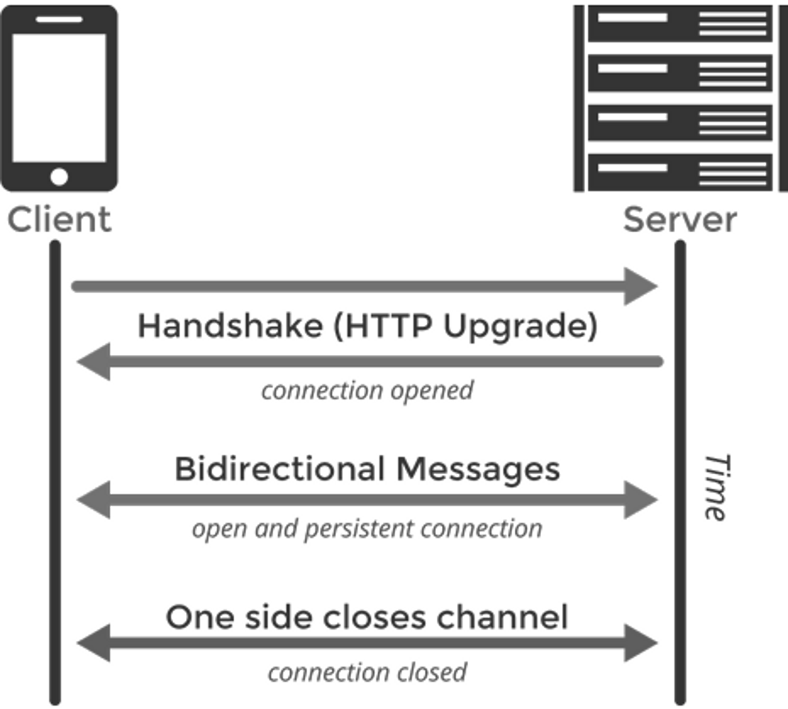

# with modern_peripherals: Python and Flask - Piotr Dyba

## Introduction

Auto-scrolling sites, glance-following ads, and gesture friendly web pages are
coming! Over the last few years three products emerged that enable interaction
with computer in a new way: Myo Armband, Leap Motion Controller and EyeTribe.
The integration between the aforementioned products, other devices and web
applications is based on the web sockets protocol. Let's start with a really short
introduction to the Web Sockets, after that I'll get through implementation,
wrappers and an imaginary application for each of the new devices.

## Web Sockets and Python socket solution

In short, web sockets is a protocol providing full-duplex communication channels
over a single TCP connection available in web browsers.



It starts with a handshake which upgrades the HTTP connection to use the Web Sockets protocol.
This enables message exchange to and from a server. Such exchange can be triggered
by a user or by some programmer defined event. It's what interests us most.
Communication channel is terminated after one of the sides sends a kill message.
Builtin Python library is nice but writing JS from scratch on front end would
be time consuming so I did not use it.
Because of that, I decided to use the Socket.IO which enables real-time
bidirectional event-based communication. It works on every platform,
browser or device. It's a powerful solution but it requires additional socket server.
Nevertheless
[Flask-SocketIO](https://github.com/miguelgrinberg/Flask-SocketIO)
was my choice for implementing sockets and serving the
application, all-in-one solution, and I really like using the simplicity of Flask.
The beauty of the @app.route decorators was applied to that extension, so
it is possible to use it in the similar way @socketio.on().

Flask decorator:

```python
@app.route('/')
def index():
    return render_template('leap_motion.html')
```

Event in backend activated from frontend and SocketIO decorator:

```python
@socketio.on(‘connect’, namespace='/test')
def disconnect():
    print('Client connected’)
```

Event on frontend activated from backend:

```python
def send_msg(msg):
    emit('msg_event', msg)
```

The front end is an out-of-the-box solution and usage is as simple as attaching
single `<script>` tag library. When using with Flask-SocketIO, we have to use
version 0.9.16 of JS SocketIO library, because of incompatibility with version 1.0.

Frontend code:

```javascript
$(document).ready(function() {
    var namespace = '/test';
    var socket = io.connect('http://' + document.domain + ':' +
        location.port + namespace);
    // connecting event
    socket.on('connect', function () {
        socket.emit('connect');
        $('#status').append('connected');
    });
    // event on frontend activated from backend
    socket.on('even_name', function (){
        console.log("hi");
        return 0;
    });
    // event in backend activated from frontend
    $('#some_button').click(function() {
        socket.emit('from_end_event');
        return 0;
    });
});
```

##Eye Tribe

EyeTribe is an eye tracker hardware that is advertised as a cheap solution,
despite the self-describing name, what is eye tracking?
Eye tracking is the process of using sensors to estimate where someone
is looking - a point of gaze. Eye tribe uses infrared sensors for that purpose.
Eye tracking can be used in a wide variety of applications typically
categorized as active or passive. Active applications involve device control,
for example aiming in games, eye activated login or hands-free typing.
Even in '80s and '90s there were a few photo cameras that used it, like Canon 1V for
choosing the camera's focus point.
Passive applications include performance analysis of design,
layout and advertising. The main usage of the eye tracking for web developers
is analysis of the web application that will improve ads, layout and design.
Controlling the site with eyes will be the next step. It will be especially useful
for handicapped people with severe body or mind damage. Think about
Steven Hawking, and how well he is doing despite his condition, but using eye
tracking in such a manner needs some level of focus. I think that when eye
trackers will get more popular, or using the built-in cameras for this purpose
will be more efficient and common. When we will get used to the technology,
its advantages, some people will start using it on daily basis, the eye
following ads will emerge. Closed only by blinking three times or roll eyes gestures.

#### Wrapper

The Python wrapper is straightforward and one file only.
[Eye Tribe wrapper](https://github.com/baekgaard/peyetribe)
connects directly to the Eye Tribe daemon. The Eye Tribe was the easiest
device to use with Python. The wrapper provides only information about point of gaze and
 eyes location for each eye separately, but that is all what we need.

#### JS vs Python

I've compared efficiency of Python solution against pure JavaScript one, during
two tests, the first one was displaying live data for each approach, the second
one was only collecting data. The main advantage of pure JS
solution was ability to use it live without major glitches.
The Python solution still relied on JS to display the current
location of gaze so it was disadvantage from the start. The situation
was quite opposite when I used Python only to gather the data and JS to display
the outcome overlaid on the survived website. As expected, the best solution
depends on the type of application and its requirements.

#### Hypothetical application

Imagine an application that would measure and rate user's art knowledge
by the way he looked at a picture or painting. What did he focus
on, and how long was he really looking at it. Wouldn't it be nice to be able
to grade the ones photographic skill not only by how he takes photos but also
how he looks at them.

## Myo Armband

The Myo Armband was introduced as a new way to interact with a  computer, but now it is
advertised more like presentation tool which it really excels in, I often use it
when presenting. If you desire stealth it is possible to go thorough the whole
presentation without audience knowing how the slides are being changed.
The armband reads your muscle activity using electromyography a
sensor to read electric impulses going through the muscles, it also have
accelerometer so you can control your software with gestures and motion.
The first possible use that comes to my mind is to
simply hand over the control over the application to Myo, it would be
handy when the application does not need text input. It would be really useful solution in
hostile environment where using keyboard would be problematic like extreme cold
or volcanic heat. The second use case would be when one would need gesture control
but without touching the screen for example surgeon or cook would benefit from
that. For navigation functions imagine to see the login screen on metal band
fun site you would have to make a 'bunny gesture". Last but not least it could
be an addition to an application that would require user to do few exercises when he
works too much by making him or her to do gestures to relax muscles.
By the way it is possible to use two armbands at once.

#### Wrapper

The wrapper is an active project with a very nice and
helpful initiator and it is bigger than the Eye Tribe's one.
[Myo Armband wrapper](https://github.com/NiklasRosenstein/myo-python)
It provides information about how we move our hand, its acceleration and if
one of the predefined gestures was made.

#### Hypothetical application

A "real tinder" (Tinder is and dating application where you can like or dislike
someone by swiping the screen) where you could dislike with a slap in the
face gesture or like her/him with grab or heart gesture. How cool is that?

## Leap Motion

Leap motion brings gestures known from tablets to notebooks and desktops.
The Leap Motion Controller tracks both hands in front of the screen.
From a developer's perspective, as Myo allows us to use gestures,
previously restricted to touch devices, on desktops.
Leap works using 2 infrared cameras with infrared lights.
The magic of converting to the 3d image/data is hidden within the algorithms,
but due to limits on usb 3.0 it is available in 60cm range only.
The only use for this device that I came with, was to control a web page or
extend it by adding additional features

#### Wrapper

The Leap manufacturer provides the Python wrapper for the device
which is really nice. The wrapper is really pretty and also provides a really
comprehensive example of use. This wrapper needs LeapPython.so and
dynamic library libLeap.dylib to work. It is really well made, it is
by far the best one out of this three. It gives all possible
information about what your hands are doing from bones joints up to defined gestures.

#### Hypothetical application

Imagine an application lets call it "Touch your pizza" that allows you to put
the ingredients you want on the pizza virtually on your desktop, because
Leap recognizes not only fingers but also tools like rice sticks or forks.

## Short summary

To sum up as all three devices can be implemented in similar way using
web sockets their usage will differ among the because of their different
purposes. I definitely had a lot of fun playing with
them and figuring the possible usages. I hope to see their usage becoming
more common.

## Sources

* Myo Armband \hyphenatedurl{https://www.thalmic.com/myo/}
* Leap Motion \hyphenatedurl{https://www.leapmotion.com}
* EyeTribe \hyphenatedurl{https://theeyetribe.com}
* flask-SocketIO documentation \hyphenatedurl{https://flask-socketio.readthedocs.org/en/latest/}
* Flask docs \hyphenatedurl{http://flask.pocoo.org/docs/0.10/}
* Socket.IO \hyphenatedurl{http://socket.io}
