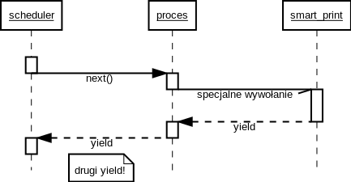

# Async pod maską - Michał Lowas-Rzechonek

## Wprowadzenie

Ostatnimi czasy wiele mówi się i pisze o programowaniu asynchronicznym i
pętlach zdarzeń. Pojawiają się takie słowa jak *event loop*, *promise*,
*future*, *deferred*, *greenlet* itp.

W tym artykule postaram się pokazać o co chodzi w pętli zdarzeń (*event loop*)
oraz że koncepcja nie jest wcale nowa - nowatorska jest jedynie jej
implementacja za pomocą generatorów w module `asyncio`.

Zacznę od omówienia mechanizmów wykonywania na jednym komputerze kilku
programów na raz, potem pokrótce zademonstruję obsługę komunikacji przez sieć,
a na koniec pokażę, jak napisać "od zera" prosty, asynchroniczny (i
kompatybilny z `asyncio`!), serwer TCP.

## Współbieżność i przełączanie kontekstu

Żeby zacząć rozmawiać o programowaniu asynchronicznym, wypadałoby
najpierw zająć się modelem wykonania programu na komputerze.

Dla uproszczenia załóżmy, że nasz komputer ma tylko jeden procesor, a
dokładniej jedną *jednostkę arytmetyczno-logiczną* (ALU - ang. *arithmetic-logic
unit*). Jest to centralna część procesora, odpowiedzialna za wykonywanie
instrukcji a jakich składa się nasz program.

ALU nie jest w swoim działaniu zbyt wyrafinowana - po prostu wykonuje po kolei
instrukcje programu umieszczone w kolejnych komórkach pamięci. Ważne jest to,
że wykonuje je bez przerwy i tak szybko, jak pozwala na to częstotliwość zegara.

Pojawia się zatem pytanie jak to możliwe, że na jednym komputerze wyposażonym w
jeden procesor działa jednocześnie kilka programów? W istocie, proste systemy
operacyjne (np. DOS, systemy operacyjne używane na małych urządzeniach typu
*embedded*) pozwalają uruchamiać jednocześnie tylko jeden program na raz.

Mechanizmem który pozwala kilku programom działać jednocześnie jest
*scheduler*. Scheduler jest częścią systemu operacyjnego która nadzoruje
działanie ALU i decyduje który proces jest w danym momencie wykonywany.

Oznacza to, że "tak naprawdę" ALU w dalszym ciągu wykonuje tylko jeden program
na raz, ale scheduler przełącza aktywne procesy tak szybko, że użytkownik nie
jest w stanie tego zauważyć. Formalna nazwa takiego model to *współbieżność*
(ang.  *concurrency*).

Wykonywana przez scheduler podmiana aktywnego procesu nazywa się
*przełączaniem kontekstu* (ang. context switching), a dokładniej opisana jest w
podręczniku "Operating Systems" [1].

## Wywłaszczanie

Kłopot w tym, że nasz scheduler też jest programem. Jak w takim razie go
uruchomić, skoro ALU zajęte jest wykonywaniem *innego* programu?

Można to zrobić na dwa sposoby: albo wymuszając na procesorze aby zatrzymał
wykonywany właśnie program, albo czekając aż dany program jawnie zgłosi, że
jest gotowy na przełączenie kontekstu.

Pierwszy z tych sposobów nazywamy *wywłaszczaniem* (ang. *preemption*). Aby
wymusić przełączenie, scheduler korzysta z mechanizmu *przerwania
zegarowego* (ang. *timer interrupt*). Przerwanie to specjalny układ
elektroniczny, który pozwala zainstalować wewnątrz procesora krótką funkcję,
która będzie uruchamiana przez ALU z zadaną częstotliwością, niezależnie od
głównego programu. Przerwanie, jak sama nazwa wskazuje, zatrzymuje "w pół
kroku" aktualnie wykonywany program, wykonuje zainstalowaną funkcję (nazywaną
*funkcją obsługi przerwania*, ang. *interrupt service routine*) a następnie wznawia
główny program. Przykładowo, Linux uruchamia scheduler 100 razy na sekundę.

Drugi sposób wymaga, aby wszystkie(!) procesy co jakiś czas jawnie wołały
funkcję schedulera. Tym modelem zajmiemy się za chwilę.

Obie metody mają swoje wady i zalety. W ogólnym przypadku lepiej jest
wywłaszczać, bo wtedy jeden błędny program nie zawiesi całego systemu. Z
drugiej strony, programy mogą nie być przygotowane na przełączenie kontekstu w
dowolnym momencie (np. w połowie zapisywania danych do pliku), co może
powodować subtelne błędy związane z faktyczną kolejnością wykonywania operacji.

Dodatkowym minusem jest fakt, że przełączanie kontekstu jest operacją
stosunkowo czasochłonną, a zbyt częste jej wykonywanie zmniejsza wydajność
całego systemu, bo mniej czasu pozostaje na wykonanie faktycznych programów.

W Pythonie mechanizm wywłaszczania dostępny jest za pośrednictwem *wątków*
(ang.  *threads*). Jeśli w programie uruchomimy kilka wątków, to system
operacyjny będzie je dla nas automatycznie przełączał:

    import itertools
    import time

    from threading import Thread

    def this_is_a_thread(pid):
        for i in itertools.count():
            print(pid, i)
            time.sleep(0.5)

    threads =  [
        Thread(target=this_is_a_thread, args=(1,), daemon=True),
        Thread(target=this_is_a_thread, args=(2,), daemon=True),
    ]

    # uruchamiamy wątki
    for t in threads:
        t.start()

    # i czekamy na ich zakończenie
    for t in threads:
        t.join()

Jeśli pozostawimy ten program uruchomiony przez jakiś czas, to zaobserwujemy,
że nasze dwa wątki nie zawsze uruchamiane są na zmianę - czasem pierwszy wątek
wykona kilka iteracji swojej pętli zanim zostanie wywłaszczony. Co gorsza,
Python nie ma nad tym żadnej kontroli, bo w modelu wątkowym przełączaniem
kontekstu zajmuje się system operacyjny.

Ten brak determinizmu i kontroli bywa problematyczny. Przyrzyjmy się zatem
drugiemu modelowi, czyli przełączaniu na żądanie.

## Współbieżność kooperacyjna

Patrząc na interpreter Pythona jak na system operacyjny, można zauważyć, że w
sam język wbudowany jest mechanizm przełączania kontekstu. Tym mechanizmem są
generatory.

Dokładniej, użycie instrukcji `yield` zmienia funkcję w obiekt generatora (de
facto *proces*) który możemy uruchomić lub zatrzymać. To czego brakuje aby
uruchomić kilka procesów współbieżnie, to scheduler. Na początek wystarczy nam
prosta implementacja, przełączająca procesy po kolei:

    import itertools
    import time

    def this_is_a_process(pid):
        for i in itertools.count():
            print(pid, i)
            yield

    processes = [ this_is_a_process(1), this_is_a_process(2) ]

    while True:
        for process in processes:
            next(process)

Ten program wykonuje nasze dwa "procesy" na zmianę, a przełączanie następuje na
ich jawne żądanie - jeśli któryś nie zawierałby instrukcji `yield`, cały nasz
miniaturowy system operacyjny zawiesiłby się, wykonując bez przerwy tylko jego:

    def rogue_one(pid):
        yield # żeby stać się generatorem

        while True:
            print(pid, "I rebel!)
            # nie wołamy "yield" wewnątrz pętli

    processes = [ this_is_a_process(1), this_is_a_process(2), rogue_one(3) ]

    while True:
        for process in processes:
            next(process)

Taki model wykonania nazywa się *współbieżnością kooperacyjną* (ang.
*cooperative multitasking*). Przełączanie procesów jest deterministyczne, ale
wymaga aby programy napisane były w specyficzny sposób: muszą co jakiś czas
wykonywać instrukcję `yield.`.

Jawne wołanie `yield` w ciele funkcji byłoby jednak bardzo uciążliwe oraz
znacznie zmniejszyłoby czytelność programu. Spróbujmy zatem nieco to ułatwić.

## Kompozycja generatorów

Jednym ze sposobów aby zapewnić, by program zachowywał się "grzecznie" w
modelu kooperacyjnym, jest uruchamianie schedulera za każdym razem, gdy program
prosi system operacyjny o jakiś rodzaj operacji wejścia-wyjścia, np. o
odczytanie stanu klawiatury albo wyświetlenie tekstu na ekranie. W tym celu
dostarczymy specjalne warianty tych funkcji, w naszym przykładzie funkcji
`print`:

    def smart_print(*args, **kwargs):
        print(*args, **kwargs)
        # tutaj chcemy uruchomić scheduler

    def process(pid):
        for i in itertools.count():
            smart_print(pid, i)

Pozostaje zatem pytanie, jak uruchomić scheduler. Jeśli po prostu zawołamy
go jako funkcję, to po jej zakończeniu wrócimy najpierw do `smart_print` a
potem do tego samego procesu. Z kolei jeśli w `smart_print` użyjemy
`yield`, to przerwiemy tylko funkcję `smart_print`, znów wracając do `process`.
Potrzebujemy mechanizmu, który pozwoli poprosić inny generator, aby wykonał
`yield` za nas i zatrzymać działanie głównego generatora. Wykonanie programu
powinno przebiegać jak na poniższym diagramie:

Jest to wykonalne, ale kod który realizuje taką operację jest niezwykle
skomplikowany, gdyż musi brać pod uwagę, że `os_print` może rzucić wyjątkiem,
zawierać kilka `yield`ów (np. w pętli) i tak dalej. Ostatecznie jest to ponad
30 linii kodu [2] które musielibyśmy umieszczać w programie przy *każdej* funkcji
wejścia-wyjścia. Byłoby to skrajnie niepraktyczne.

Python 3.4 rozwiązuje ten problem dostarczając nowe słowo kluczowe `yield
from`, które wykonuje całą sekwencję za nas.

    def os_print(*args, **kwargs):
        print(*args, **kwargs)
        yield

    def this_is_a_process(pid):
        for i in itertools.count():
            yield from os_print(pid, i)

Na marginesie, warto zauważyć, że `yield from` bywa użyteczne też w innych
kontekstach, na przykład gdy chcemy napisać rekurencyjny generator:

    def walk(dir):
        for i in os.listdir(dir):
            path = os.path.join(dir, i)
            yield path
            if os.path.isdir(path):
                yield from walk(path)

Programy wyświetlające napisy na ekranie nie są jednak zbyt ekscytujące, a o
programowaniu asynchronicznym rozmawia się zazwyczaj w konktekście obsługi
sieci. Żeby zobaczyć związek między jednym a drugiem, musimy odłożyć na chwilę
problem przełączania procesów, a zająć się obsługą wejścia-wyjścia na
poziomie systemu operacyjnego.

## Deskryptory plików i gniazda sieciowe

Praktycznie wszystkie systemy operacyjne udostępniają operacje wejścia-wyjścia
za pośrednictwem *deskryptorów plików*. Deskryptor jest zazwyczaj po
prostu liczbą, którą dostajemy od systemu w momencie otwarcia pliku, a
przekazujemy go jako argument do funkcji, które z tego pliku czytają bądź do
niego piszą.

W ten sposób deskryptor jednoznacznie identyfikuje plik, który chcemy obsłużyć.
Nie interesuje nas za to jego wartość liczbowa deskryptora, używamy go raczej
jak bloczka w szatni.

    import os

    file_descriptor = os.open('plik.txt', os.O_RDONLY)
    print(file_descriptor)
    print(os.read(file_descriptor, length=100))
    os.close(file_descriptor)

Python ukrywa przed nami takie szczegóły implementacyjne za pomocą obiektu
`file`, ale ciągle pozwala dostać się do deskryptora za pomocą metody
`fileno()`:

    with open('plik.txt') as file_object:
        file_descriptor = file_descriptor.fileno()
        print(file_descriptor)

Z naszego punktu widzenia intresujący jest fakt, że pod deskryptorem pliku może
kryć się dużo więcej niż tylko zwykłe pliki na dysku.  Deskryptor pliku jest
pewną abstrakcją, pozwalającą odnosić się w ten sam sposób to różnych
urządzeń wejścia-wyjścia: dysku, karty sieciowej, a nawet ekranu.

Dzięki temu komunikację przez sieć można obsługiwać za pomocą tego samego
mechanizmu, co zwykłe pliki. Co prawda sposób uzyskania takiego sieciowego
deskryptora (nazywanego *gniazdem*, ang. *socket* [3]) jest bardziej
skomplikowany niż proste `open()`, ale sam odczyt i zapis działają tak samo:
`accept()` jest odpowiednikiem `open()`, `send()` to `write()`, a `recv()` to
`read()`.

Prosty serwer akceptujący połączenia na porcie 1234 wygląda następująco:

    import os
    import socket

    server = socket.socket()
    server.setsockopt(socket.SOL_SOCKET, socket.SO_REUSEADDR, 1)
    server.bind(('', 1234))
    server.listen(1)

    while True:
        connection, address = server.accept()
        print(connection.fileno(), "is a connection from", address)
        connection.send("Enter your name: ")
        name = connection.recv(100)
        connection.send("Hello, %s" % name)
        connection.close()

Po uruchomieniu, jego działanie można sprawdzić z drugiego terminala np.
poleceniem `nc` (od `netcat`):

    $ nc localhost 1234
    Enter your name: khorne
    Hello, khorne

## Gniazda sieciowe jako źródła zdarzeń

Nasz serwer ma jednak spory mankament: obsługuje tylko jedno połączenie na raz.

Dzieje się tak dlatego, że funkcje `accept()` i `recv()` blokują program do
momentu kiedy nie pojawi się nowe połączenie lub nasz klient czegoś nie wyśle.
Jeśli nowy klient podłączy się w momencie, kiedy serwer czeka aż `recv()` się
zakończy, nie wyślemy do nowego klienta nic, dopóki poprzednie połączenie nie
zostanie zamknięte.

Zamiast tego, chcielibyśmy poczekać aż na *którymkolwiek* z naszych
połączeń (reprezentowanych przez deskryptory) pojawią się nowe dane, a
następnie przełączyć kontekst do funkcji je obsługującej.

Wiemy jak zaimplementować przełączenie kontekstu: funkcja obsługi powinna być
generatorem, który wykona `yield` (lub `yield from`) jeśli zamierza czekać na
nowe dane.

Jak natomiast obserwować kilka deskryptorów na raz?

## Funkcje `select()` i `poll()`

Szczęśliwie dla nas, większość systemów operacyjnych dostarcza API realizujące
właśnie taką operację, nazywaną *zwielokrotnianiem zdarzeń* (ang. *event
multiplexing*). System operacyjny pozwala zgrupować wiele deskryptorów, dla
każdego z nich definiując rodzaj zdarzenia na jaki chcemy czekać (gotowość
do odczytu, gotowość do zapisu lub błąd). Mając taką grupę możemy zawołać jedną
funkcję, która zaczeka aż na deskryptorach z grupy pojawią się zadane wcześniej
zdarzenia. To, co dokładnie się stało, otrzymamy z systemu w postaci listy par
`(deskryptor, zdarzenie)`.

Najstarszym mechanizmem tego typu jest funkcja `select()`: pojawiła się w 1983
roku w odmianie Uniksa nazywanej Berkeley System Distribution (BSD) w wersji
4.2. `select()` miał sporo ograniczeń, głównym problemem był limit ilości
jednocześnie obserwowanych deskryptorów - 1024. Między innymi z tego powodu
pojawiła się druga funkcja - `poll()` - i to nią się zajmiemy.

W Pythonie, `poll()` używa się następująco:

    import select

    poller = select.poll()

    # słownik mapujący deskryptor na odpowiadający mu generator
    tasks = { descriptor1: generator1, ... }

    while True:
        for fileno, task in tasks.items():
            # czekamy na zdarzenia "E(vent) POLL IN", czyli gotowość do odczytu
            poller.register(fileno, select.EPOLLIN)

        for fileno, event in poller.poll():
            task = tasks[fileno]
            next(task)

Jak łatwo zauważyć, ten program zawiera jedną pętlę `while True` która
obserwuje deskryptory i uruchamia zdefiniowane zadania-procesy. Jest to w
gruncie rzeczy scheduler, bazujący na operacjach wejścia-wyjścia.

Taką konstrukcję nazywamy *główną pętlą* lub *pętlą zdarzeń* (ang. *event
loop*).

Jeszcze jedna uwaga: aby uniknąć przypadkowego zablokowania głównej pętli,
wszystkie deskryptory powinny być przełączone w *tryb nieblokujący* (ang.
*non-blocking mode*) za pomocą metody `setblocking(False)`. Spowoduje to, że
wywołanie `read()` lub `recv()` w momencie gdy deskryptor nie jest jeszcze
gotowy do odczytu nie zablokuje systemu, ale natychmiast zakończy się błędem.

## Główna pętla

Wygląda na to, że mamy już w tym momencie wszystkie elementy potrzebne do
napisania asynchronicznego serwera!

Zacznijmy od podstawowych operacji wejścia-wyjścia. Musimy podmienić funkcje
`accept()`, `send()` i `recv()` na wersje realizujące współbieżność
kooperacyjną, analogicznie jak zrobiliśmy poprzednio dla funkcji `print`.
Różnica będzie taka, że dodamy do wywołania `yield` informację na jakie
zdarzenie chcemy czekać:

    def sock_accept(sock):
        # czekaj na gotowość do odczytu, czyli nowe połączenie
        yield sock.fileno(), select.EPOLLIN
        return sock.accept()

    def sock_recv(sock, nbytes):
        # czekaj na gotowość do odczytu, czyli nowe dane
        yield sock.fileno(), select.EPOLLIN
        return sock.recv(nbytes)

    def sock_sendall(sock, buffer):
        # jeśli mamy dużo danych do wysłania, mogą się nie zmieścić
        # w jednym send(), stąd pętla
        while buffer:
            # czekaj na gotowość do zapisu
            yield sock.fileno(), select.EPOLLOUT
            written = sock.send(buffer)
            buffer = buffer[written:]

Następnie tworzymy listę zadań oraz obiekt `poll`, który będzie monitorował
deskryptory zwrócone z naszych funkcji wejścia-wyjścia:

    poll = select.poll()
    tasks = {}

    def create_task(task):
        fileno, eventmask = next(task)

        tasks[fileno] = task
        poll.register(fileno, eventmask)

Oraz implementujemy procesy-zadania. Najpierw odbieranie nowych połączeń:

    def server(address):
        sock = socket.socket(socket.AF_INET, socket.SOCK_STREAM)
        sock.setsockopt(socket.SOL_SOCKET, socket.SO_REUSEADDR, 1)
        sock.bind(address)
        sock.listen(16)
        sock.setblocking(False)

        print("Waiting for connections", address)
        while True:
            client, address = yield from sock_accept(sock)
            create_task(echo(client, address))

A następnie obsługę pojedynczego klienta:

    def echo(client, address):
        print("Client connected", address)

        for i in count():
            yield from sock_sendall(client, b"%i> " % i)

            buffer = yield from sock_recv(client, 1024)
            if not buffer:
                break

            yield from sock_sendall(client, buffer)

        print("Client disconnected", address)

I na koniec główna pętla:

    create_task(server(('localhost', 1234)))

    while tasks:
        for fileno, event in poll.poll():
            poll.unregister(fileno)

        try:
            task = tasks.pop(fileno)
            create_task(task)
        except StopIteration:
            pass

Et voilà!

## Zakończenie

Uważny czytelnik zapewne zauważy, że funkcje `sock_*` i `create_task` mają
nieprzypadkowe nazwy. Dokładnie to samo API występuje w klasie `MainLoop`
modułu `asyncio` - w rzeczy samej, nasz serwer będzie działał tak samo dobrze
używając implementacji wbudowanej w Pythona. Dodatkowo, główna pętla też jest
już gotowa i nazywa się `MainLoop.run_forever()`

Na koniec zaznaczę, że Python w wersji 3.5 wprowadził nową składnię: aby
zadeklarować zadanie nie trzeba już umieszczać w ciele funkcji słowa `yield` -
zamiast tego deklaruje się ją za pomocą `async def`. Druga zmiana dotyczy
słowa `yield from`, które w funkcjach tak zadeklarowanych nazywa się `await`.
Mimo to, poprzednia składnia nadal działa.

Pełny kod przedstawiony w tym artykule, dodatkowo rozbity na mniejsze kroki,
dostępny jest na GitHubie [5].

## Linki

1. Sibsankar Haldar, Alex Alagarsamy Aravind "Operating Systems", rozdział 5, "CPU Management": https://books.google.pl/books?id=orZ0CLxEMXEC&pg=PA118
2. PEP-380, Syntax for Delegating to a Subgenerator: https://www.python.org/dev/peps/pep-0380/
3. FreeBSD Developers Handbook, rozdział 7 "Sockets": https://www.freebsd.org/doc/en_US.ISO8859-1/books/developers-handbook/sockets.html
4. Sangjin Han, "Scalable Event Multiplexing": https://people.eecs.berkeley.edu/~sangjin/2012/12/21/epoll-vs-kqueue.html
5. Philip Roberts, "What the hack is the event loop anyway?", JSConf EU 2014: https://www.youtube.com/watch?v=8aGhZQkoFbQ
6. David Beazley, "Python Concurrency From the Ground Up", PyCon 2015: https://www.youtube.com/watch?v=MCs5OvhV9S4
7. Github, "Ghetto Asyncio": 
