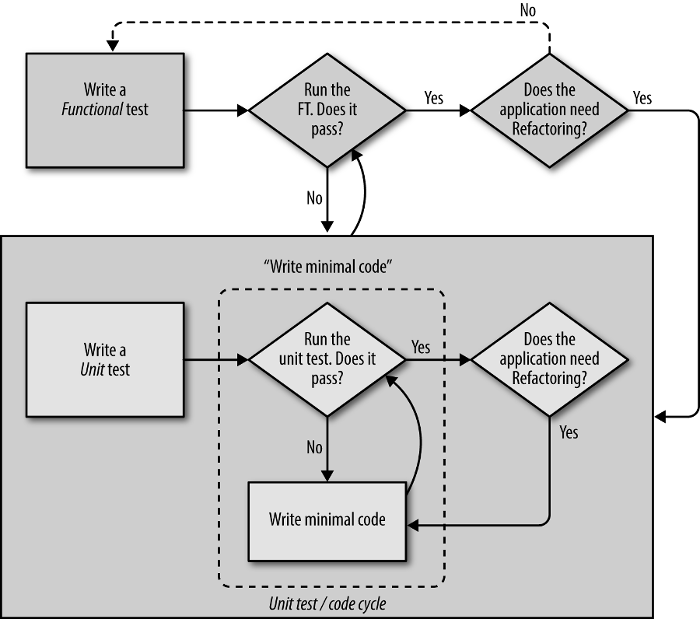
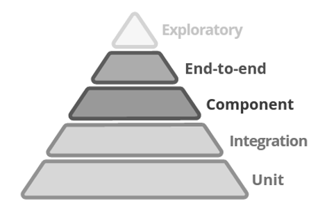
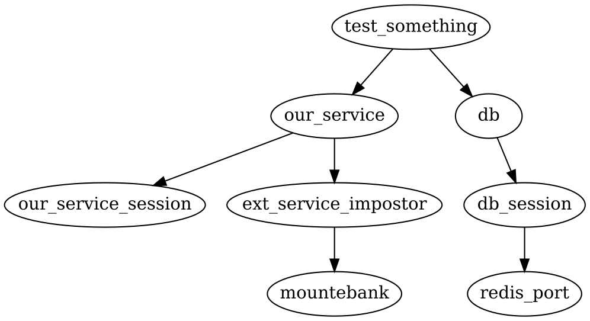

# TDD of Python microservices - Michał Bultrowicz

## Abstract
To have a successful microservice-based project you might want to start testing early on,
shorten the engineering cycles, and provide a more sane workplace for the developers.
Test-driven development (TDD) allows you to have that.

Except for the stalwart unit tests, proper TDD also requires functional tests.
This article shows how to implement those tests (using the
[Mountepy] (https://github.com/butla/mountepy) library I made, Pytest and Docker),
how to enforce TDD (using multi-process code coverage) and good code style (with automated
Pylint checks) within a team.

Furthermore, contract tests based on Swagger interface definitions are introduced as a safeguard
of the microservices' interoperability.

The focus is on services communicating through HTTP, but some general principles will also apply to
all web or network services.


## Service tests
### Their place in TDD and microservice development
To have TDD and thus a maintainable microservice project we need tests that can validate
the entirety of a single application.
These tests are essential for implementing the "real TDD", that is the "double loop"
or "outside-in" TDD (shown on the diagram below, taken from "Test-Driven Development with Python).
The term used to describe them can be "service tests", which I prefer, "functional tests"
or "component tests".



Service tests are necessary to check if units of code work together as planned,
if it won't just crash when starting in a real environment.
They can do that because they run against a process with no special test flags,
no fake database clients, etc.
The application under test should have no idea that it's not in a "real" environment.

It's also important to remember that as they take longer to run and are more complex
than unit tests, they should only be used to cover a few critical code paths.
Full validation of the application's logic (code coverage) should be achieved with unit tests.

In his presentation about testing microservices, Martin Fowler places service tests
in the middle of the tests pyramid.



The general idea is that the higher you get in the pyramid, the tests:

* become more complex and hard to maintain,
* have greater response time (run longer),
* should be fewer.

All of those kinds of tests are important for a microservice-based system, but due to limited
space I can't get into detail about all of them.

### Necessary tools
To have local service tests that can run in isolation from the production or staging environment
(allowing for parallel development of multiple microservices), the service's run-time dependencies
must somehow be satisfied.
Assuming we're building HTTP microservices, the dependencies most probably are:

* databases
* other microservices (or any other HTTP applications)

#### Handling databases
*Naively* - just by installing on the machine running the tests.
This is tiresome and unwieldy.
Development of every microservice would either require long manual setup or
maintaining installation scripts (what can also require a lot of work).
What's more, if someone works on a few projects they'll get a lot of junk on their OS.

*Verified Fakes* are test doubles of some system (let's say a database) that are created
by the maintainers (or other contributors) of said system.
They are also tested (verified) to ensure that they behave like the real version during tests.
They can make tests faster and easier to set up, but require effort to develop, and since time
is a precious resource, are rarely seen in the real world.

Using *Docker* is my preferred approach. With it, almost every application can be downloaded as an
image and run as a container in a uniform way.
Without messy or convoluted installation processes.

#### Handling other microservices
The problem here is that if we'd want to simply set up the other services that are required by the
service under tests, we would also need to set up their dependencies as well.
This chain reaction could go on until we had a large chunk (if not all) of the platform on our
development machine.
Even if not absolutely cumbersome, this could prove impossible.

Fortunately, HTTP services can be mocked (or stubbed) out.
There are a few solutions (mock servers) I came across that can be configured to start imitating
HTTP services on selected ports.
The imitation is about responding to a defined HTTP call, e.g. POST on path /some/path with body
containing the string "potato", with a specific response, e.g status code 201
and a body containing string "making potatoes".
Those mock servers are:

* *WireMock* is a Java veteran that can run as a standalone application and be configured with
HTTP calls.
* *Pretenders*, a Python library and a server (like WireMock) that can be used from test code.
It requires manually starting the server before running the tests.
* *Mountebank* is similar in principle to the previous two, but has more features, including
faking TCP services (which can be used to simulate broken HTTP messages).
It's written in NodeJS, but it can be downloaded as a standalone package not requiring a Node
installation.
I chose it as my service mocking solution.

To use Mountebank in tests comfortably and not be required to start it manually before
tests, I created Mountepy.
It's a library that gracefully handles starting and stopping Mountebank's process.
It also handles configuration of HTTP service imitations, which Mountebank refers to as "imposters".
Since Mountepy required implementation of management logic for an HTTP service process
(which Mountebank is),
it also has the feature of controlling the process of the application under tests,
thus providing a complete solution for framework-agnostic service tests.

### Test anatomy
Because of its conciseness and due to its powerful and composable fixture system,
I've picked Pytest as a test framework.
An example service test created with it can look like any other plain and simple unit test:

```python
# Fixtures are test resource objects that are injected into the test
# by the framework. This test is parameterized with two of them:
# "our_service", a Mountepy handler of the service under test
# and "db", a Redis (but it could be any other database) client.
def test_something(our_service, db):
    db.put(TEST_DB_ENTRY)
    response = requests.get(
        our_service.url + '/something',
        headers={'Authorization': TEST_AUTH_HEADER})
    assert response.status_code == 200
```

It's quite clear what's happening in the test: some test data is put in the database,
the service is called through HTTP, and finally, there's an assertion on the response.
Such straightforward testing is possible thanks to the power of Pytest fixtures.
Not only can they parameterize tests, but also other fixtures.
The two top-level ones presented above are themselves composed of others
(as shown in the diagram below) in order to fine-tune their behavior to our needs.



Let's now trace all the elements that make up our test fixtures.
First, `db`:

```python
import docker
import pytest
import redis

# "db" is function scoped, so it will be recreated on each test function.
# It depends on another fixture - "db_session".
@pytest.yield_fixture(scope='function')
def db(db_session):
    # "yield" statement in "yield fixtures" returns the resource object
    # to the test.
    # "db" simply returns the object returned from "db_session".
    yield db_session
    # Code after "yield" is executed when the tests go outside
    # of the fixture's scope,
    # in this case - at the end of a test function.
    # This is the place to write cleanup code for fixtures,
    # no callbacks required.
    # Here the cleanup means deleting all the data in Redis.
    db_session.flushdb()

# "session" scope means that the object will be created only once
# for the entire test suit run.
@pytest.fixture(scope='session')
def db_session(redis_port):
    return redis.Redis(port=redis_port, db=0)

# This fixture simply returns a port number for Redis, but has the side
# effect of creating and later destroying a Docker container (with Redis).
# Thanks to being session-scoped it doesn't need to spawn a new container
# for each test, thus cutting down the test time.
# This practice may be looked down upon by people paranoid
# about test isolation, but if Redis creators did their job well,
# cleaning the database in "db" should be enough
# to start each service test on a clean slate.
@pytest.yield_fixture(scope='session')
def redis_port():
    docker_client = docker.Client(version='auto')
    # Developers don't need to download required images themselves,
    # they only need to run the tests.
    # Pulling an image will, of course, takes some time and
    # freeze the tests, but it's one-time.
    download_image_if_missing(docker_client)
    # Creates the container and waits for Redis
    # to start accepting connections.
    container_id, redis_port = start_redis_container(docker_client)
    yield redis_port
    docker_client.remove_container(container_id, force=True)
```

...and next, `our_service`:

```python
import mountepy

@pytest.fixture(scope='function')
def our_service(our_service_session, ext_service_impostor):
    return our_service

# Creates (and later destroys) the process of the service under test.
# The same as with "db" fixture, it's created once
# for the whole test session to save time.
# The risk of tests influencing each other is present, but any improper
# behavior shows that the application is not stateless (which it should
# be if follows the tenets of 12-factor app), so the tests do their job
# of finding bugs that we are writing and not something that the whole
# community depends on, like Redis.
@pytest.yield_fixture(scope='session')
def our_service_session():
    # Starting a service process with Mountepy requires a shell command
    # in Popen format. The app will run in Waitress (a WSGI container,
    # an alternative to gunicorn, uWSGI, etc.).
    service_command = [
        WAITRESS_BIN_PATH,
        '--port', '{port}',
        '--call', 'data_acquisition.app:get_app']

    # Spawning the service is straightforward.
    service = mountepy.HttpService(
        service_command,
        # Configuration is passed through environment variables.
        env={
            'SOME_CONFIG_VALUE': 'blabla',
            'PORT': '{port}',
            'PYTHONPATH': PROJECT_ROOT_PATH})

    service.start()
    yield service
    service.stop()

@pytest.yield_fixture(scope='function')
def ext_service_impostor(mountebank):
    # Impostor is created in Mountebank, the object able to communicate
    # with it is returned. The configured behavior is simple in this case,
    # it will respond to a POST on the given port and path (e.g.
    # "/some/resource") with an empty response body and status code 204.
    impostor = mountebank.add_imposter_simple(
        port=EXT_SERV_STUB_PORT,
        path=EXT_SERV_PATH,
        method='POST',
        status_code=204)
    yield impostor
    # After each tests the impostor is destroyed and all the requests
    # it received are forgotten.
    impostor.destroy()

# The Mountebank instance is also created once for the test suite.
@pytest.yield_fixture(scope='session')
def mountebank():
    mb = Mountebank()
    mb.start()
    yield mb
    mb.stop()
```

Real code demonstrating the solutions presented in this article can be found in
[PyDAS](https://github.com/butla/pydas), which was my guinea pig for microservice TDD experiments.

### Remarks about service tests
Tests that start a few processes and send real HTTP requests (even through the loopback interface)
tend to be orders of magnitude slower than (proper) unit tests.
But in the case of PyDAS, which has 8 service tests, 3 integrated ones
(almost like a unit test, but interact with a real Redis), and 40 unit tests,
they take around 3 seconds (on Python 3.4).
That's quite fast. In my opinion, you can run tests that take that long after every few lines of
written code.

Short test runs have the advantage of people actually running them.
Developers can shy away from tests with run-time long enough to break their flow.
And when tests are not run, the entire effort and good intentions put into them go to waste.

A word of advice - even if the whole suit is quite fast (like 3 seconds), it's good to keep
the longer tests (integrated and service ones) in a directory separate from unit tests,
to still be able to sometimes run only the fastest subset
(e.g. when checking really small tweaks one after another).

There's also a small caveat about service test failures.
When a test fails in Pytest, all of its output is printed in addition to the test stack trace.
Service tests start a few processes, probably all of which print quite a few messages,
so when they fail you'll be hit with a big wall of text.
The upside is that it this text will most probably state somewhere what went wrong.
Breaking a fixture sometimes happens when experimenting with and refactor the tests (which I encourage).
This can yield even crazier logs that simply failed service tests.

And the last thing - tests won't save you from all instances of human incompetence.
When I created PyDAS using TDD and wanted to deploy it to our staging environment, it kept crashing.
It turned out that I was ignoring Redis IP from configuration and had hard-coded localhost,
which was fine with the tests, but didn't at all do in a real environment.
So be confident in your tests, but never a hundred percent.


## Enforcing TDD
Even if your team knows how to do TDD, they sometimes want to cut corners, which isn't good
for anyone in the long run.
Luckily, there are ways to keep them (and you, and me) in line.

### Measuring code coverage
Let's take a look at my recommended minimal `.coveragerc` file
(configuration for python "coverage" library)

```Ini
[run]
source = your_project_source_directory
; This enables (with a few other tricks documented at
; http://coverage.readthedocs.io/en/coverage-4.0.3/subprocess.htm
; and done in PyDAS) test coverage measurement from multiple processes.
; That is, when Mountepy runs the tested service and requests are fired
; against it, the coverage information from the code hit when handling
; the requests will be added to overall coverage data.
; Now there's no need to duplicate scenarios from service tests
; into unit tests for coverage measurement.
parallel = true

[report]
; All code needs to be tested. Especially in a dynamic language
; like Python, which does almost no static validation.
; If even one untested statement is written, the tests will fail.
; With parallel coverage, there's no need to write meaningless tests
; of glue-code that run almost 100% on mocks to ramp up to absolute
; coverage, because the code will be hit by the service test.
fail_under = 100
```

### Mandatory static code analysis
To keep code quality high it's good to use static code analysis tool like Pylint.
To keep it even higher, any meaningful complaints can cause the test suite to fail.

In PyDAS, I've used [Tox](https://tox.readthedocs.io) to automate test runs.
Below is an abbreviated version of Tox configuration (`tox.ini`).

```Ini
[testenv]
commands =
    ; Pylint is run before tests.
    ; If it returns any output, which happens when it finds errors,
    ; the whole Tox run fails.
    /bin/bash -c "pylint data_acquisition --rcfile=.pylintrc"
    ; Running the tests with coverage measurement.
    coverage run -m py.test tests/
    coverage report -m
```

Remember that Pylint's config can be tweaked to lower its standards,
which can be too high at times.
Specific code lines can also be annotated to ignore a Pylint check if you're absolutely
sure that what you're doing is the best way and Pylint is wrong to scold you.

## Contract tests with Swagger and Bravado
Sometimes slight changes in code, like adding a field to some unremarkable data container type
or adding a small "if" in some REST controller can accidentally:

* change the expectation a service has of its functions' parameters or
* change the shape (schema) of the data returned by the service.

Those changes breach the contract the service has with the outside world,
and can cause bugs in a microservice system, so precautions are necessary.
They come in the form of contract tests.

### Swagger
[Swagger](http://swagger.io/) is an interface definition language.
It will serve us as a contract definition language description.

An example Swagger document written in YAML format (JSON also happens) is below.

```
swagger: '2.0'
info:
  version: "0.0.1"
  title: Some interface
paths:
  /person/{id}:
    get:
      parameters:
        -
          name: id
          in: path
          required: true
          type: string
          format: uuid
      responses:
        '200':
          description: Successful response
          schema:
            title: Person
            type: object
            properties:
              name:
                type: string
              single:
                type: boolean
```

It defines a HTTP endpoint on path /person/{id} on the service's location
(e.g. http://example.com/person/zablarg13).
This endpoint will respond to a GET request.
It has one parameter, `id`, that is passed in the path and is a string.
The endpoint can respond with a message with status code 200 containing the representation of
a person's data - and object with their name as a string and the information if they are single (boolean).

### Contract/service tests
[Bravado](https://github.com/Yelp/bravado) is a library that can dynamically create client
objects for a service based on its Swagger contract.
It can do contract tests by automatically validating the types (schemas) of both parameters
and the values returned from services.
Can verify HTTP status codes. Status code and response schema combinations that don't exist
in Swagger are treated as invalid, e.g. if we can return a Person object with code 200 and
an empty body with code 204, returning a Person with 204 will cause an error.

It's worth noting that Bravado can be configured to enable or disable different validation checks.
This is helpful in testing the unhappy path through your service.

```python
# Contract is in a file separate from code
# (definitely not generated from it, which is sometimes done),
# so that when changes break the contract it can be detected.
@pytest.fixture()
def swagger_spec():
    with open('api_spec.yaml') as spec_file:
        return yaml.load(spec_file)

def test_contract_service(swagger_spec, our_service):
    # Bravado client will be used instead of "requests" to call
    # the service. Service tests using Bravado clients double as contract
    # tests with practically no added effort except for maintaining
    # the Swagger spec.
    client = SwaggerClient.from_spec(
        swagger_spec,
        origin_url=our_service.url))

    request_options = {
        'headers': {'authorization': A_VALID_TOKEN},
    }

    # Running and validating the request with a body, a path parameter
    # "worker" and with an authorization header containing
    # a valid security token.
    resp_object = client.v1.submitOperation(
        body={'name': 'make_sandwich', 'repeats': 3},
        worker='Mom',
        _request_options=request_options).result()

    assert resp_object.status == 'whatever'
```

### Contract/unit tests
It's unfeasible to cover the entire contract with service/contract tests,
because they take too long.
It would be great to give unit tests that simulate HTTP calls
(I think all HTTP/REST frameworks have a facility to do that) the Bravado's validation abilities.
That's what I did for [Falcon](https://falconframework.org/) with
[bravado-falcon](https://github.com/butla/bravado-falcon), thanks to Bravado's extensibility.
Such integration can probably be easily developed for other web frameworks.

```python
from bravado.client import SwaggerClient
from bravado_falcon import FalconHttpClient
import yaml
import tests # our tests package

# swagger_spec is the same fixture as in the contract/service test.
def test_contract_unit(swagger_spec):
    # Client doesn't need an URL now, but it needs
    # the alternative HTTP client.
    client = SwaggerClient.from_spec(
        swagger_spec,
        http_client=FalconHttpClient(tests.service.api))

    resp_object = client.v1.submitOperation(
        body={'name': 'make_sandwich', 'repeats': 3},
        worker='Mom').result()

    assert resp_object.status == 'whatever'
```

## Conclusion
Solutions presented here will help keep you sane when working on a microservice-based system,
but are far from being everything you need to know to about microservice development.
Further things to consider are:

* end-to-end tests,
* performance tests,
* operations automation (deployment, data recovery, service scaling, etc.),
* monitoring of services and infrastructure,
* and more.

## References
1. Gary Bernhardt. Fast Test, Slow Test. https://youtu.be/RAxiiRPHS9k
2. Sam Newman. Building Microservices. O'Reilly Media, Inc., February 10, 2015
3. Harry J.W. Percival. Test-Driven Development with Python. O'Reilly Media, Inc., June 19, 2014
4. Tobias Clemson. Microservice Testing. http://martinfowler.com/articles/\crlf microservice-testing/
5. Testing in production comes out of the shadows. http://sdtimes.com/testing-production-comes-shadows/
