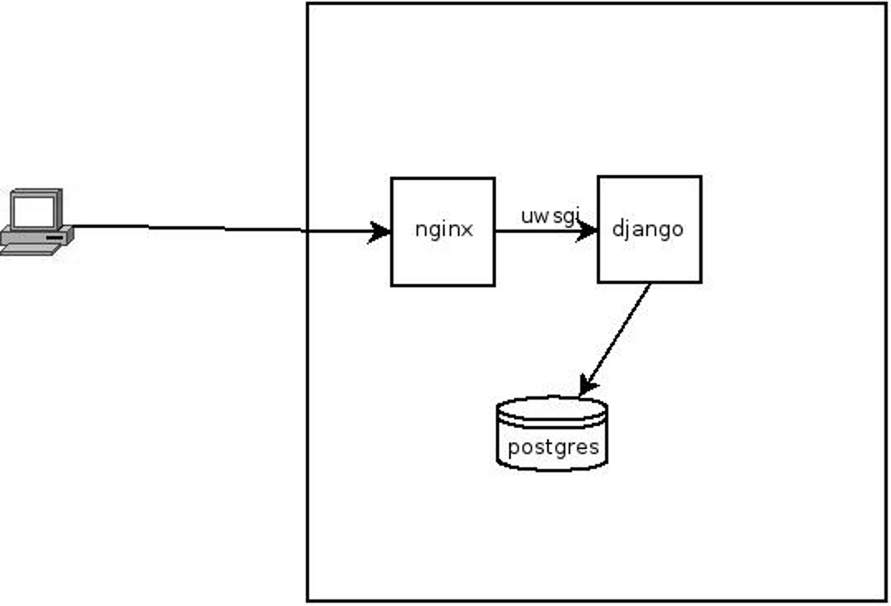

# Django in the Real World - Israel Fermín Montilla

## Introduction
There are hundreds of Django-based projects running out there,
in most of the cases, the default setup is enough. Some others need to scale
so they can serve thousands of requests per minute. Even though there's
no recipe for optimization, there are some strategies you can implement
to take your project to that level, some of them are very simple, some others
are very complex.

Optimizing a system isn't always related to the technology or the tools
you're using. Of course, there are efficient and inefficient ways of using
certain language or framework, but it's usually more about having some
Software Engineering concepts clear and knowing how to apply them to your
current technology of choice after measuring your performance metrics.

## Basic Concepts
* **Performance:** is the amount of work accomplished by a computer system.
There are several metrics to measure how a system performs, depending on the
case, the most common metrics are:
    * **Response time:** total amount of time it takes to a system to respond
    to a request for service;
    * **Throughput:** is the maximum rate at which *something* can be
    processed. For web systems it's usually measured in *requests per minute*;
    * **High availability:** it's a characteristic of systems which aims to
    ensure a certain level of operational performance, usually *uptime*, for
    a higher period of time;
    * Low utilization of available resources;

* **Scalability:** the capability of a system to process or handle
a **growing** workload or its potential to be **enlarged** to accommodate that
growth is known as Scalability. We say a system is **scalable** if its
performance improves after adding more hardware proportionally to the added
capacity;

* **Bottleneck:** a *bottleneck* occurs when the capacity of an application is
severely limited by a single component. The *bottleneck* has the lowest
*throughput* of all the parts of the transaction;

* **Pareto principle:** the *pareto principle* states that, for many events,
roughly 80% of the effects come from 20% of the causes, so, by fixing that
20%, we could achieve an 80% improvement.

## Basic Django deployment
The usual Django stack runs Django with either *uwsgi* or *gunicorn* behind
a web server that could be either Apache or nginx and uses *postgres*
(PostgreSQL) for
database persistence, the architecture is presented on rys. 1.

This would be how you'd deploy your personal project to your VPS for the first
time.

## Profile first
Before optimizing anything, you'll have to measure what's going on and where
the true bottlenecks are, you can use tools like `django-debug-toolbar` to have
an overall idea about the performance and even the raw `SQL` queries being ran.

To measure code performance in terms of CPU and memory usage, you can use
a combination of `cProfile` and `snakeviz` or `vprof` which offers
visualization tools out of the box. If you have some budget to invest, a tool
like `newrelic` is extremely useful.

## Common bottlenecks
However, you can't keep that architecture forever, as traffic grows, some
parts of the system will suffer and you'll have to use some strategies to
relief that pain.

### Database level
Usually the first part of your system showing some symptoms will be your
database, this will usually be your first bottleneck and the first thing
you'll have to optimize.

#### Increased response times
This is the main symptom, and it could be the product of either slow reads or
slow writes, which leads to slow reads due to resource locking.

- **Slow writes:** usually product of over-indexing a table, all indexes are
updated on write time on `INSERT`, `UPDATE` and `DELETE`. Too many indexes on
a table will produce slow writes, no indexes at all might end up on slow
reads, you need to know your data model and the questions it needs to answer
and index based on workload. Premature optimization is bad.

- **Slow reads:** could be the product of a sub-optimal data model for the
type of queries it needs to answer, solutions will depend on the traffic on
the tables and the relations between them.
    - **Add indices:** a good hint about which fields to index is to check
    the ones that appear the most on the `WHERE` clauses of the executed SQL
    queries. It's usually a good idea to index foreign keys.
    - **Denormalize:** usually it's a bad idea to add `ManyToMany` relations
    between model we know will grow indefinitely and quick, consider
    denormlizing them into `JSONField` or `ArrayField` if using PostgreSQL or
    just duplicate the data, this will drastically improve the performance on
    those queries.
    - **Database caching:** recommended for tables with a low modification
    rate, here you can make use of a tool like `django-cachalot` which will
    handle everything by you with few lines of code and supports several
    caching backends with some limitations with documented solutions depending
    on the chosen cache backend.
    - **Replication:** this is usually the first step you take, separate
    the write operations from the read operations, this way both operations
    are handled by different instances. You might have some replication delay
    depending on traffic and write contention. Using Django's database routers
    is highly recommended here to abstract the upper layers from handling the
    databases for write and read.
    - **Know your ORM:** one of the most powerful libraries within Django
    framework is the `ORM`, `django.db.models.Model` class is really powerful
    and efficient but so underused in most cases that is surprising, first of
    all they have lazy evaluation, which means it only hits the database when
    it needs to and gives you only the data you need to retrieve, so, it is
    highly convenient to have a look at the aggregation framework and the
    `Q()` and `F()` expressions if you need to build complex querysets as well
    as the aggregation framework if you need to perform some grouping and
    calculations over the data, the I/O overhead of loading a whole set of
    rows into memory is considerably higher than getting your DBMS to give you
    the result of a computation which would be only an `integer` or a `float`
    number.

### Caching
Caching and database caching are two different things, when we talk about
database caching we keep a cache of the results of the most common queries or
the ones where the data doesn't change a lot, whereas when we talk about
caching, what we want to achieve is to speed up the system's response time
by keeping a copy of something in a place where we can retrieve it quickly.

- **Static files:** stylesheets, JavaScript files, images, icons, everything
your site needs to look nice and have a great UX (User Experience)
can be cached using
memcached, for example, or using a Content Delivery Network (CDN) if you know
it will be accessed from different and distant places. This way you can
offload some work from your web server and avoid hitting the disk and having
to load all those assets on every request.
- **Templates:** one of Django's coolest features is its templates system,
which allows you to cache either a whole view or certain blocks of a template
that are highly demanded, it only takes you to add one templatetag and you're
good to go, you can cache static blocks that won't change or blocks that are
associated to a dynamic piece of information like a session or user id.
- **Session storage:** Django offers several session storage backends, file
based and database backed, but sessions are something you're going to be
accessing a lot, so, it is recommended to have a fast storage backend, Redis
can be really handy for this and it's easy to setup, you only need to make
sure that your whole dataset fits into memory which won't be a problem at all
if you use it only for sessions.

## Conclusion
Django is a full stack framework, which means it provides an entire
development platform to build your whole system, a lot of out of the box
behavior and middlewares. You need to develop and plan smart to make it scale
easily by measuring, prioritizing and taking the right action. Optimization
and performance tuning are hard to do, but if you back your hypothesis with
data from your monitoring system, you can achieve favorable results.
