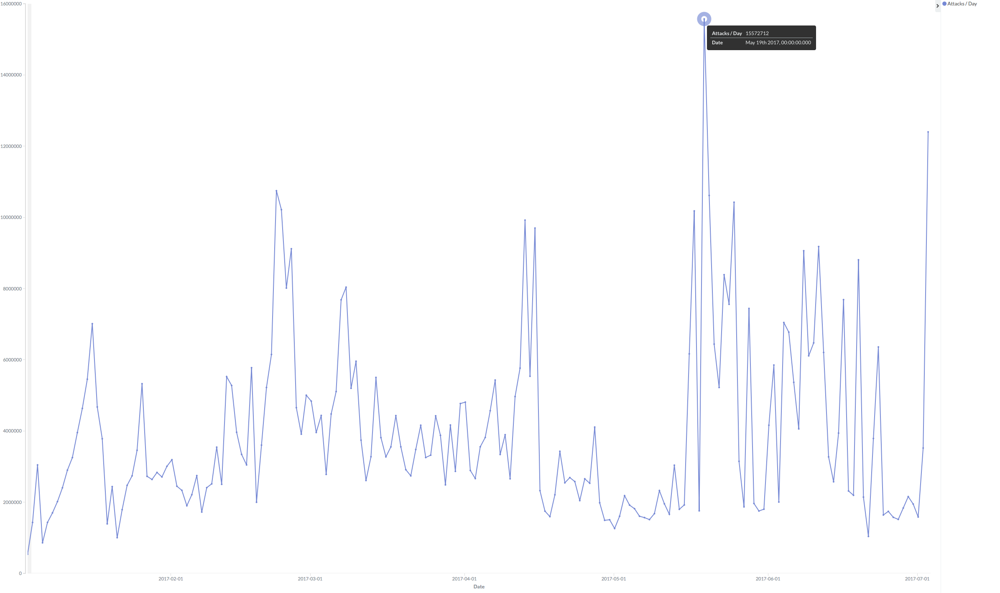

# with python: security() - Piotr Dyba


#### Disclaimers:
The views and opinions expressed in this article focus on the developer's perspective an are solely those of the author.
I have received no payments for mentioning any of the open-source or commercial products mentioned in this article.


## What is cybersecurity and why is it so important nowadays?

Cybersecurity encompasses means and protocols to defend resources and devices (computer systems, IoT devices, smartphones) from disruption, damage or theft.
It is not only about firewalls and antivirus software, but rather it starts with the hardware,
including policies for handling computers and servers at a company,
access rights to server rooms and even which devices are allowed to be brought into the company building. For instance, it is common to ban external pen-drives.
To be able to assume that our hardware is safe, we need to harden our software on both workstations and servers and impose
proper policies for the users, data handling, access.

[Data leaks in time](http://www.informationisbeautiful.net/visualizations/worlds-biggest-data-breaches-hacks/)

Looking at the number and severity of leaks over time, it is easy to observe a huge increase in their occurences over the years and severity rising from 1 000 to above 1 000 000 000 user's data.


Remember that screen from just two weeks ago? NotPetya laid waste on many companies across the globe in just one day, some of which are still recovering.
The most known cases were companies such as TNT and Raben.
Raben is a good example of well prepared recovery that took less than 24 hours. In that time, Raben moved their whole server infrastructure from Windows to Linux, which was quite an achievement.



The graph above shows the number of attackers per day in the last 6 months, which varied from 2 to almost 16 millions per day.
An attack means an action against one of F-secure's research honeypots deployed on the public internet.
A honeypot is a server that pretends to be an easy target for an attacker, where all his or her actions can be monitored
and registered, but which cannot crucially affect the critical parts of the broader infrastructure.
It’s just a trap that pretends to exposes services like ssh, mysql, smtp etc., in our case written in pure python.


| O.No. | username | password  | count   |
|-------|----------|-----------|---------|
| 1     | root     | root      | 1165236 |
| 2     | admin    | admin     | 66522   |
| 3     | user     | user      | 23994   |
| 4     | test     | test      | 13302   |
| 5     | pi       | raspberry | 35938   |
| 6     | support  | support   | 35331   |
| 7     | ubnt     | ubnt      | 33170   |
| 8     | oracle   | oracle    | 9294    |
| 9     | guest    | guest     | 23524   |
| 10    | git      | git       | 10829   |

It was deducted that a lot of the above attacks were conducted by bots trying to log in, using a few default username-password combinations.
It could be assumed that such attacks are sometimes successful, otherwise the attackers would stop scanning in such a manner.


## Threat modeling

Threat modeling is a process for analyzing the security of an application or a system.
It is a structured approach that enables you to identify, quantify, and address the security risks associated with the target of the modeling.

#### 1. Identification of assets

Let's conduct an example threat modeling from Batman's perspective and identify our assets, which are: the bat cave, our butler Alfred and information in form of emails and texts.

#### 2. Identification and quantification of threats

Next, let's distinguish threats, so: the police, our arch enemy joker and the press.
Now, let's quantify those threats. Alfred is irreplaceable and has access to all our other assets, so he is our highest risk and thus has the highest priority for defense.
Our bat cave is also precious, but it can be rebuilt.
Lastly, information included in emails and text messages could allow our actions and position to be tracked, but we can handle the journalists and the police ourselves.

#### 3. Addressing

For our main asset, Alfred, we can obscure his location and his identity which is not that easy in the modern world.
The bat cave is a much simpler task, as we can install security systems, traps, misleading bases of operations etc. There is a ton of possibilities here.
For emails and texts, encryption and caution when writing something delicate should be enough.


#### 1. Identification of assets - decompose the application

So, as in the batman example shows, the first step is identifying assets, their purpose and use cases.
The next step is to specify entry points to each asset and then how it interacts with external parts of the service or 3rd party services.
The last step is defining the Access Control Lists (ACL), for example which actions are allowed for an anonymous user, a registered user and an admin to do.
If development of an application is already in progress, there is a high chance that part of the work is already done by reusing data flow diagrams or application UML.
An even better source of how an application should work are behavioural or integration tests.


#### 2. Identification and quantification of threats

There are few frameworks that we can work with, such as STRIDE
(which stands for Spoofing identity, Tampering with data, Repudiation, Information disclosure, Denial of service, Elevation of privilege)
and ASF (Application Security Frame), both of which should give us reliable information regarding:
* auditing and logging
    * auditing is used to answer the question "Who did what?" and possibly why.
    * logging is more focused on what's happening.
* authentication and authorization
    * authentication is the a process of ascertaining that somebody really is who he or she claims to be
    * authorization is a process to determine who is allowed to do what
* configuration management – how and where do we store configs
* data validation and protection in storage and transit
    * where do we store the data
    * where do we validate it before recording
        * backend side
        * both backend and frontend side
        * only frontend (highly not advised)
    * protection in transit
        1. basic approach: have all communication over TLS, so encrypted
        2. advanced approach: have the data additionally encrypted before sending it, which is becoming the corporate level security standard
        3. expert approach: send it over a dedicated VPN tunnel, government level security
* exception management – how do we track exception occurrence and what are the procedures to handle them

Now we just need to measure the severity of the threats we have.
We can try approaching that by ourselves, determining which assets are the most important for us or, for example, use CVSS.
CVSS, or Common Vulnerability Scoring System, is based on factors such as:
* Attack vector
* Attack complexity (hard to measure)
* Privileges
* User interaction
* Scope
* Confidentiality
* Integrity
* availability

All of the above together can give a reference rating, but if one of the parameters is hard to define,
like in the case of attack complexity, try both and either calculate an average or leave it as a range from two edge CVSS outcomes.
It is important to remember that this is just a reference point, not an oracle for what should be done.
As mentioned before, having use case UMLs or, even better, abuse case UMLs may come in handy here.

#### 3. Addressing

We can address issues in 4 ways, by:
1. Completely removing the threat
2. Reducing/mitigating the threat
3. Acknowledging it and doing nothing
4. Pretending there is no issue

Obviously, the best options is to remove the threat, but sometimes it's either impossible or the costs of removing it are too high. In such cases we can try to mitigate it.
Taking the risk by leaving it as is or marking it as "address later", where it does not affect our business nor customers,
maybe fine in some cases, for instance when an attacker is able to traverse over a directory with long and random file names of non important pictures of
other users' cats. So, there is a chance that someone will type some random gibberish and they will see the picture of a user's cat but they still won't
know whose cat it is and we don’t really care if that happens.
But if the attacker can traverse not only over cat pictures, but also over config files etc, and we still do nothing about it, then we are asking to be hacked.


## Common attack vectors on frontend application

How can we hack our app? We can start from analysing it on our own, but probably someone else has already thought about it.

Of course they had, and it was not someone but thousands of people. There is a huge project called Open Web Application Security Project – OWASP in short.
OWASP is not only gathering all common threats but also offers examples of attacks, ways to measure their severity and much more.
It can be used both by technical and less technical personnel, such as a Project Manager, as most of the vulnerabilities also have a business level explanation.

OWASP offers a vast repository of cybersecurity knowledge, encompassing not only on threats, but also on tools, books, events and other interesting sites.

Every few years, OWASP publishes a list of most common attacks. The last one is from 2013 and a fresh one is coming up this year,
but if you compare between the recent lists, the changes are minimal over time, which leads to a sad conclusion that many people still have not yet learned from other's mistakes.

OWASP TOP 10 from 2013:
1. A1 Injection
2. A2 Broken Authentication and Session Management
3. A3 Cross-Site Scripting (XSS)
4. A4 Insecure Direct Object References
5. A5 Security Misconfiguration
6. A6 Sensitive Data Exposure
6. A7 Missing Function Level Access Control
8. A8 Cross-Site Request Forgery (CSRF)
9. A9 Using Components with Known Vulnerabilities
10. A10 Unvalidated Redirects and Forwards

Try all of the OWASP TOP10 and more using one of the projects:
* [BeeBox project](https://sourceforge.net/projects/bwapp/files/bee-box/)
* [OWASP Broken Web Applications Project (OWASP BWAP)](https://www.owasp.org/index.php/OWASP_Broken_Web_Applications_Project)


## Common attack vectors on a Python application

Attackers can try injecting code into our Python application, but this can only happen if they have found a new loophole in Python itself,
or if we are using eval/exec or pickle, especially for user input.

Example of Python payload (not in one line for readability)
```python
import subprocess
subprocess.Popen([
	'/bin/bash',
	'-c',
	'rm -rf --no-preserve-root /'
])
```

SQL injection… Again, we are quite safe here, unless we are using our own SQL engine instead of mature ORMs such as SQLalchemy or djangoORM.

Example of SQL payload:
```SQL
admin; DROP DATABASE users;
```

The main threat to a Python application is located between chair and keyboard… the developer.
Fortunately, we can also mitigate this to a point, using security static code analysis which is described later on.
If you are interested in how to exploit pickle there is a link that can explain this really well on an example of an already fixed bug in the Twisted framework.
[Exploiting pickle](https://blog.nelhage.com/2011/03/exploiting-pickle/)

But why people would even use eval or exec if it is so dangerous ?

```bash
python2 -m timeit -s 'code = "a,b =  2,3; c = a * b"' 'exec(code)'
10000 loops, best of 3: 18.7 usec per loop
```

```bash
python2 -m timeit -s 'code = compile("a,b =  2,3; c = a * b", "<string>", "exec")' 'exec(code)'
1000000 loops, best of 3: 0.664 usec per loop
```

```bash
python3.5 -m timeit -s 'code = "a,b =  2,3; c = a * b"' 'exec(code)'
10000 loops, best of 3: 22.3 usec per loop
```

```bash
python3.5 -m timeit -s 'code = compile("a,b =  2,3; c = a * b", "<string>", "exec")' 'exec(code)'
1000000 loops, best of 3: 0.544 usec per loop
```

It can make a simple script much faster on python 2.7 ~30 (18.7usec vs. 0.664usec)
times and, what is interesting, over 40 times faster on python 3.5 (22.3usec vs. 0.544usec).

Eval may simplify code. A known example of string calculator shows that really well.

String calculator:
```python
def count(equation):
	a, sign, b = equation.split(' ')
	a, b = int(a), int(b)
	if sign == '+':
		return a + b
	elif sign == '-':
		return a - b
	elif sign == '*':
		return a * b
	elif sign == '/':
		return a / b
	else:
		return 'Unsuported sign'

print(count('2 + 3'))
```

String calculator using only eval:
```python
print(eval('2 + 3'))
```

From 12 lines of code for the most basic example of a equation, it can be reduced to just one line using eval, which will work even with more complex equations.

## Threat Model of a simple blog app

#### Specification

A threat model of a simple app using AngularJS for frontend, Sanic for backend and SQL database with a few simple endpoints such as:
* /                 - static home for serving the JavaScript and HTML parts
* /api/login        - dedicated authentication endpoint
* /api/blog         - blog list view
* /api/blog/<id>   - detail post view
* /api/user         - user list view
* /api/user/<id>    - detail user view

#### 1.1 Use cases to understand how the application is used

So let's get back to our Blog app. We have 3 basic uses cases for our app:
* Everyone can enter the site and view the blog and blog posts
* Registered users can add new posts
* Admins can manage users and delete posts


#### 1.2 Interactions with external entities

Let's now project these use cases on interactions with the database.

| DB Action | Login | Logout | Read blog | Write blog | Delete blog | Manage Users |
|-----------|-------|--------|-----------|------------|-------------|--------------|
| DB Read   | Yes   | No     | Yes       | Yes        | No          | Yes          |
| DB Write  | Yes   | Yes    | No        | Yes        | No          | Yes          |
| DB Delete | No    | No     | No        | No         | Yes         | Yes          |

The important fact is that only the admin can manage users and delete blog posts, which means it is quite easy to defend the application against data lose.

#### 1.3 Identifying entry points

| Method | /   | /api/login | /api/blog | /api/blog/<id> | /api/user | /api/user/<id> |
|--------|-----|------------|-----------|----------------|-----------|----------------|
| GET    | Yes | No         | Yes       | Yes            | Yes       | Yes            |
| POST   | No  | Yes        | Yes       | Yes            | Yes       | Yes            |
| DEL    | No  | No         | No        | Yes            | No        | Yes            |

#### 1.4 Identifying trust levels – Access Control Lists

| user type | Login | Logout | Read Blog | Write blog | Delete blog | Manage Users |
|-----------|-------|--------|-----------|------------|-------------|--------------|
| Anonymous | Yes   | No     | Yes       | No         | No          | No           |
| User      | No    | Yes    | Yes       | Yes        | No          | No           |
| Admin     | No    | Yes    | Yes       | Yes        | Yes         | Yes          |

Let's think about our database actions on API layer and focus on Get, Post, Delete methods shown in  those two tables.

| User type | / | /api/login | /api/blog | /api/blog/<id> | /api/user | /api/user/<id> |
|-----------|---|------------|-----------|----------------|-----------|----------------|
| Anonymous | G | P          | G         | G              | -         | G              |
| User      | G | -          | GP        | GP             | -         | G              |
| Admin     | G | -          | GP        | GPD            | GP        | GPD            |

G - Get | P - Post | D - Delete

We know we can disable del and post methods for home, and for login we can only accept the post method.
Note that the other endpoint's specification will depend on the project's approach to creating proper endpoints, so it may differ from the example above.

#### 1.5 Identifying assets

what is the most precious thing we have in our app ?

In case of a blog, it is the information, that is, our users and blog posts, but depending on our business model, it can also be confidentiality. These can be affected by:

* Someone getting admin access and deletes everything.
* Someone getting user access and creates spam or spreads malware.

Our second most valued asset may be our code base, which can be targeted in different ways than the information itself by
getting open sourced or sold, following which even read only access will allow an attacker to more easily find vulnerabilities and exploit them.

At this point we have completed all points of the Decomposition phase of threat modeling.

#### 2.1 Identification and quantification of threats: Frontend

So, for our Front end we can expect six of OWASP top 10,

1. A2 Broken Authentication and Session Management
2. A3 Cross-Site Scripting (XSS)
3. A5 Security Misconfiguration
4. A7 Missing Function Level Access Control
5. A8 Cross-Site Request Forgery (CSRF)
6. A10 Unvalidated Redirects and Forwards

We are using a well know framework, which is really good, unless we or our developers do something stupid, because AngularJS mitigates or even handles all of those issues.

#### 2.2 Identification and quantification of threats: Python Backend


OWASP TOP 10:
1. A1 Injection
2. A2 Broken Authentication and Session Management
3. A4 Insecure Direct Object References
4. A5 Security Misconfiguration
5. A6 Sensitive Data Exposure
6. A7 Missing Function Level Access Control
7. A8 Cross-Site Request Forgery (CSRF)

From Threat Modeling of a python app, we can see that we can have even more vulnerabilities than on the frontend side, but most of them are mitigated out
of the box, as long as we follow three important rules during development:
1. Use common sense
2. Do not use uncommon external libraries without proper check up, for example if they are not sending the data to NSA/KGB/ETC, but most importantly they are not sending the data to a unknown attacker and being sold later on.
3. Do not use outdated libraries as it may open code to vulnerabilities


#### 3.0 Addressing issues

Someone gets admin access and deletes all data - we can mitigate or even remove this threat by:
* Adding multifactor authentication at least for Admins
* Moving the admin part of an application to a separate microservice with access only from specific IPs/IP ranges

Someone gets user access and creates spam - we can mitigate that by:
* Limiting post per day
* Edits per hour
* Shorter sessions
* Captcha

Part of mitigation is also having proper testing at unit level - having not only happy paths but including edge cases helps.


#### OK so we got hacked, but how bad can it be ?

The are four circles of being owned:
1. Being hacked by a bot or a script kiddie
2. Being hacked using one of the well known and documented threats
3. Being hacked using a known vulnerability
4. Being hacked using an unknown vulnerability – 0 day

The 1st and 2nd circle are really bad as it means we have almost no security and we should really change priorities.
It will most probably be picked up by the internet media and we will be lampooned for how easy and fun it was hacking our app. Really shame on you!
The 3rd level means that protocols regarding emerging threats should be better and faster.
Last but not least, getting owned by a new, shiny vulnerability is obviously bad for business but at least not that shameful.
At the same time, it shows how serious the attackers needs to be and how good were the defences, as it drew the attacker to the last resort he/she had.
For the fourth circle, the attacker will try to keep their actions unnoticed as long as possible, thus there should not be a fallback in the press about it.

"The smart thing is to learn from other's mistakes."

Not seeing the destructive outcome of an attack does not necessarily mean that you were not hacked.
There is a chance that you have been owned long time ago and you still do not know about it!
Apart from invisible actions such as gathering data or some increased trolling, an attacker may also install some nasty ransomware and demand a high ransom.

Gartner report from 2016 says that it takes on average 200 days since a hack for a company to find about it. (citation needed)
Imagine what an attacker can do during that time!

### Tooling

Source Code Analysis (Reading through the abstract syntax tree and looking for possible security bugs) tools:
* Bandit – a tool designed to find common security issues in Python code, it is written in Python and can be easily extended with custom security policies. It works in a similar manner to pylint or pep8 tool. You can get it directly from PyPi.
* SonarQube – more advanced than bandit, comes with a plugin for Jenkins and support for JS, HTML and 20 other languages. The tool has an integrated web ui and many more useful features. You can spawn your own instance or buy it as a service. Jenkins read - “Continuous Inspection”.

Automatic Scanning tools:
* ZAP (Zed Attack Proxy) – Free, Open Source, Jenkins ready
Zap is an open source alternative to burp, developed under the OWASP project and it already has a dedicated Jenkins plugin
* Burp – Free/Paid, Jenkins ready in ~2017
Burp can Scan for vulnerabilities, intercept browser traffic and automate custom attacks, it does not have a Jenkins plugin yet, but it was announced that this year something should be ready for continuous development.
Both of them can also be used manually, so you can define your own attack patterns and payloads
* Metasploit – Free, OpenSource, Jenkins ready, framework that focuses on system level scans but can be extended with custom ones
* SQLMap - Free, OpenSource, scans application only for SQL injections

* scapy - Free, OpenSource, Python, if want you to test a custom protocol, you will probably need to use scapy, which is a python library for preparing dedicated TCP, ICMP packages and UDP Datagrams.

Commercial solutions and managed services:
The advantage of the service approach is quite nice, as the report from a cybersecurity consultant does not include false-positives from the scans.
There are three major players in this filed:
* Qualys
* Nessus
* F-Secure Radar


## Useful terminology

#### Penetration Testing

A penetration test is an authorized attack on a system, application and/or infrastructure.
The reasoning behind undergoing pentesting is quite obviously to find security weaknesses or to fulfil a compliance needed by a 3rd party.
There are usually two main objectives for a pentester to achieve: get privileged access and/or obtain restricted information.
Even when having an on site pentesting team, it is still recommended to use a 3rd party company as well.
Penetration tests should be considered before major releases or periodically after a longer development cycle.
In the best case scenario automated security tests using for example Zap are also in place.

A penetration tester is a person who performs a penetration test.
They can also be called by: Pentester, Hacker, White Hat or Security consultant, just remember not to call them Black Hat or Cracker which
basically means a criminal and will make them really sad and you do not want that to happen.

There are three major approaches when pentesting: white, grey and black box.

White box means full transparency and full access for a pentester to our production systems, especially:
* A pentester has full access to the application and systems they are testing
* The test covers the widest range of attack vectors
* A pentester has access to our source code and documentation

Grey box narrows the access, but still requires source code and sometimes a developer instance before starting the main pentest,
the pentesting becomes targeted and works within boundaries:
* A pentester does not have access to the system
* A pentester has different types of accounts such as user and/or moderator, but not admin-level application access
* A pentester has access to our source code and documentation

Black box, as the name suggests, limits access, so the pentester's perspective is similar to a real attacker:
* A pentester does not have knowledge about the system or only knows its basics
* A pentester has no access to source code, but obtaining the source code may be one of the steps when executing an attack or be one if its goals
* A pentester has no initial access to the app above end-user level


#### CISO

Chief Information Security Officer is a person responsible for
* Computer security/incident response team
* Disaster recovery and business continuity management
* Identity and access management
* Information privacy
* Information regulatory compliance PCI, Data Protection Act, GIODO in Poland
* Information risk management
* Security architecture and development, so process and tools
* IT Security
* Security awareness in the company
* Managing pentests and red teamings

#### Red Teaming

A red teaming drill is usually a multi-level attack on a company that only CEO, CISO or CTO are aware of. A Red Teaming Exercise may consist of:
* Physical security testing like breaking into the office, server rooms, conference rooms, planting bugs or lock picking
* Network and IT security testing done by, for example, planting raspberryPI on the net, routing data through a sniffer or leaving behind some rubberducky
* Phishing and social engineering
* Software pentesting

If the red timing finishes undetected, it means the company that undergoes the test has huge security problems as the attacker during
the drill, after achieving all goals, starts being “noisy” till a point someone should notice…


### Bibliography and follow up recommendations

* [owasp.org](http://owasp.org)
* [vulnhub.com](https://vulnhub.com)
* [awesome-security](https://github.com/sbilly/awesome-security)
* [pentest-wiki](https://github.com/nixawk/pentest-wiki)

* [safeandsavvy.f-secure.com](https://safeandsavvy.f-secure.com/)
* [reddit.com/r/netsec/](https://reddit.com/r/netsec/)
* [blogs.cisco.com](https://blogs.cisco.com/)
* [youtube.com/channel/UClcE-kVhqyiHCcjYwcpfj9w](https://youtube.com/channel/UClcE-kVhqyiHCcjYwcpfj9w)
* [gynvael.coldwind.pl](http://gynvael.coldwind.pl/)
* [nakedsecurity.sophos.com](https://nakedsecurity.sophos.com/)
* [risky.biz](https://risky.biz/netcasts/risky-business/)
* [badcyber.com](https://badcyber.com/)
* [packetstormsecurity.com](https://packetstormsecurity.com)
* [labs.mwrinfosecurity.com/](https://labs.mwrinfosecurity.com/)
* [ctftime.org](https://ctftime.org/ctf-wtf/)
* [overthewire.org](http://overthewire.org/wargames/)
* [picoctf.com](https://picoctf.com/)
* [microcorruption.com](https://microcorruption.com/)
* [offensive-security.com](https://www.offensive-security.com/when-things-get-tough/)
* [Batman threat modeling](https://mobilisationlab.org/wp-content/uploads/2015/08/batman-threat-model-1200.png)
* [sshttp - hiding SSH servers behind HTTP](https://github.com/stealth/sshttp)

* Justin Mayer's talk from EuroPython 2017: "Replacing passwords with multiple factors: email, otp, and hardware keys"


### About author

Piotr Dyba is a Team Leader and software engineers at F-Secure’s Rapid Detection Service where he and
his Python team are developing a distributed network of honeypots, network sensors and tooling for RDS.
In his spare time he is a leading mentor and teacher at PyLadies Poznan.
Pythonically in love with asyncio and personally with hiking.
The last interesting fact about Piotr is that he used to be a photojournalist and visited Afghanistan as war photographer.