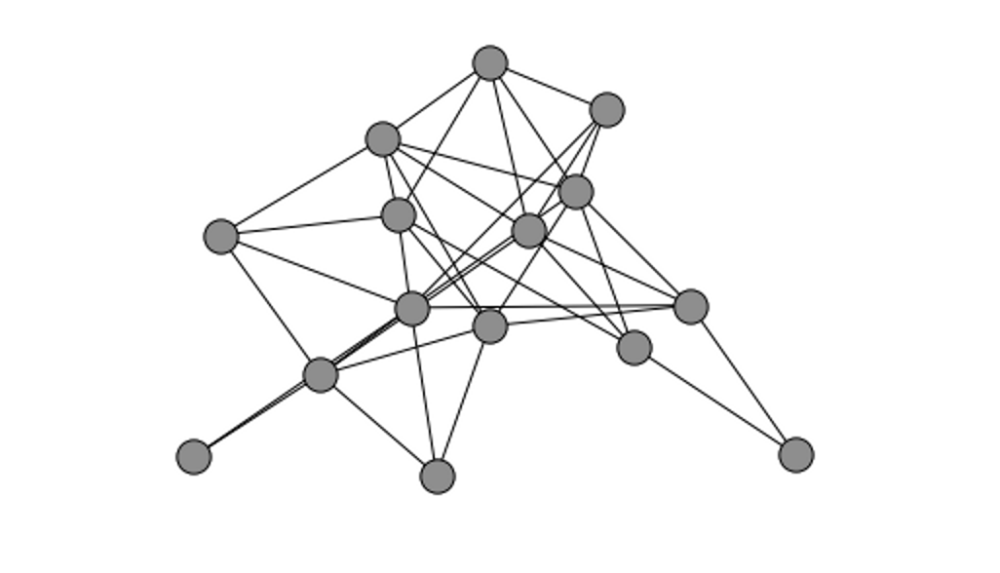

# Network Analysis using Python

Politics, Mathematics, Law, Biology, Computer Science, Finance - all of these
subjects have one thing in common:
they can be modeled using networks. NetworkX is a Python language software
package for the creation, manipulation and study of the structure, dynamics,
and functions of complex networks.
This workshop will introduce the basics of network theory and working with
graphs using Python and the NetworkX package.
This will be a hands on tutorial and will require writing a lot of code snippets.
The participants should be comfortable with basic Python (loops, dictionaries,
lists) and some(minimal) experience with working inside a Jupyter Notebook.

Broadly the tutorial is divided into four parts:

1. Introduction

    - Basics of graph theory and various examples of networks in real life.
    - Introduction to the NetworkX API and various data structures
2. Tools usage
    - Work with small synthetic networks (generated using random graph
    generators) to understand the structure of the network.
    - Analyse the network and study various properties of the network
    like centrality, connectivity, shortest paths, cliques.
3. Analyze data

    - We'll use the various techniques we have learnt so far and model a network
    out of real world data like co-authorship
    network( http://www-personal.umich.edu/~mejn/netdata/cond-mat-2005.zip)
    or a similar network and study the structure and properties of this network.
4. Real world data

    - We'll work on some interesting problems like temporal networks
    and visualisation of networks.
    - We'll model the US Airport Network with respect to time and will try
    to make sense out of it.


By the end of the tutorial everyone should be comfortable with hacking
on the NetworkX API, modelling data as networks and basic analysis
on networks using Python.

This text gives a brief overview of the content of the workshop.

### Packages and other requirements

You should have python3 and pip installed, and using
[virtualenv](https://virtualenv.pypa.io/en/stable/) is recommended
and the following Python packages should be installed.

- Jupyter
- matplotlib
- networkx
- pandas
- numpy

You can also use [conda](https://conda.io/docs/) to install these packages.

The workshop will also require datasets to work on which will be uploaded
on GitHub repository https://github.com/MridulS/pyconpl-2017-networkx.

The repo will contain the Jupyter notebooks that will be required
during the workshop.

## Introduction

##### What are Networks (Graphs) and how can we use NetworkX and Python to represent them?

A graph G is represented by a set of nodes and a set of edges.
An edge between two nodes in a graph signifies a relationship between those
two nodes. Edges can be directed or undirected.



NetworkX uses dictionaries underneath to store node and edge data.
It's dict-o-dict-o-dict-o-dict to be precise.
```
G['node1']
G['node1']['node2']
G['node1']['node2']['some_id']['some_attrb'] # multigraphs
```

##### Basics of NetworkX

There are multiple graph classes implemented in NetworkX:

- Graph - a graph object which only allows single edges (undirected) between
nodes.
- DiGraph - a graph object which only allow single edges (directed) between
nodes, i.e. an edge from 'A' to 'B' doesn't mean that there exists
an edge from 'B' to 'A'.
- MultiGraph - a graph object which allows multiple edges(undirected)
between two edges.
- MultiDiGraph - a graph object which allows multiple edges(directed)
between two edges.

Hybrid graphs? Not yet available in NetworkX.

``` python
# Create an empty graph object with no nodes and edges.
G = nx.Graph() # DiGraph, MultiGraph, MultiDiGraph
```

``` python
# Add nodes to our graph object
# In NetworkX, nodes can be any hashable object e.g. a text string, an image,
# an XML object, another Graph, a customized node object, etc.

G.add_node('1')
G.add_node(1)
G.add_node('second')
```

`G.nodes()` will give a list of nodes.

``` python
# Now let's talk about edges.
# Edge between two nodes means that they share some property/relationship
# G.add_node(H)
G.add_edge(0, 'second')
G.add_edge(2, 3)
G.add_edge('second', 'node4')
```
`G.edges()` will give a list of edges.

##### Measures and properties of a network

Finding the important nodes in a network is a task frequently encountered
by network scientists.
There are various approaches to this like using the nodes with highest degree,
i.e connections. or nodes which have a high number of paths going through them
as removing that node can impair mobility in the network.
Deciding the measures to use depends on the applications and the requirements
of the network scientist.

Usually one of the most important tasks in network analysis is to find
the shortest path and there are various algorithm to dot that.
We will use the algorithms implemented in the NetworkX package to study
the network.

Structures in a network is also a major network analysis tool like finding
triangles, cliques, open triangles. A rudimentary recommendation engine can be
made by looking for open triangles in a network.

From wikipedia,
A connected component (or just component) of an undirected graph is a subgraph
in which any two vertices are connected to each other by paths, and which
is connected to no additional vertices in the supergraph.

NetworkX has algorithms implemented to help us with finding components
of a network.
``` python
print [len(c) for c in sorted(nx.connected_components(authors_graph), key=len, reverse=True)]
```
This piece of code gives us the components of a network `authors_graph` where
`authors_graph` is the Arxiv GR-QC (General Relativity and Quantum Cosmology)
collaboration network.

source:  http://snap.stanford.edu/data/index.html#canets

The output:
```
[4158, 14, 12, 10, 9, 9, 8, 8, 8, 8, 8, 8, 7, 7, 7, 7, 7, 7, 7,
7, 6, 6, 6, 6, 6, 6, 6, 6, 6, 6, 6, 6, 5, 5, 5, 5, 5, 5, 5, 5,
5, 5, 5, 5, 5, 5, 5, 5, 5, 4, 4, 4, 4, 4, 4, 4, 4, 4, 4, 4, 4,
4, 4, 4, 4, 4, 4, 4, 4, 4, 4, 4, 4, 4, 4, 4, 4, 4, 4, 3, 3, 3,
3, 3, 3, 3, 3, 3, 3, 3, 3, 3, 3, 3, 3, 3, 3, 3, 3, 3, 3, 3, 3,
3, 3, 3, 3, 3, 3, 3, 3, 3, 3, 3, 3, 3, 3, 3, 3, 3, 3, 3, 3, 3,
3, 3, 3, 3, 3, 3, 3, 3, 3, 3, 3, 3, 3, 3, 3, 3, 3, 3, 3, 3, 3,
3, 3, 3, 3, 3, 3, 3, 3, 3, 3, 3, 3, 3, 3, 3, 3, 3, 3, 3, 3, 3,
3, 3, 3, 3, 3, 3, 3, 3, 3, 3, 3, 2, 2, 2, 2, 2, 2, 2, 2, 2, 2,
2, 2, 2, 2, 2, 2, 2, 2, 2, 2, 2, 2, 2, 2, 2, 2, 2, 2, 2, 2, 2,
2, 2, 2, 2, 2, 2, 2, 2, 2, 2, 2, 2, 2, 2, 2, 2, 2, 2, 2, 2, 2,
2, 2, 2, 2, 2, 2, 2, 2, 2, 2, 2, 2, 2, 2, 2, 2, 2, 2, 2, 2, 2,
2, 2, 2, 2, 2, 2, 2, 2, 2, 2, 2, 2, 2, 2, 2, 2, 2, 2, 2, 2, 2,
2, 2, 2, 2, 2, 2, 2, 2, 2, 2, 2, 2, 2, 2, 2, 2, 2, 2, 2, 2, 2,
2, 2, 2, 2, 2, 2, 2, 2, 2, 2, 2, 2, 2, 2, 2, 2, 2, 2, 2, 2, 2,
2, 2, 2, 2, 2, 2, 2, 2, 2, 2, 2, 2, 2, 2, 2, 2, 2, 2, 2, 2, 2,
2, 2, 2, 2, 2, 2, 2, 2, 2, 2, 2, 2, 2, 2, 2, 2, 2, 2, 2, 2, 1]
```

As we can see from the output there are a lot of authors who work in pairs
(they haven't collaborated with anyone other than their partner) and triangles.
But the majority, 4158, work in a big collaboration network, even though
we have a lone wolf there.

We can find many other interesting properties of a dataset by doing
exploratory analysis of the network.

##### Real world data

There are multiple sources to find real word network datasets like
[SNAP](http://snap.stanford.edu/data/index.html) and
[KONECT](http://konect.uni-koblenz.de).
We will use a real world network and analyse the network using the various
tools and measures we learn in this tutorial.

## References

1. Official NetworkX tutorial. https://github.com/networkx/notebooks/blob/master/tutorial.ipynb
2. NetworkX documentation. https://networkx.readthedocs.io/en/stable/
3. EuroSciPy 2016 tutorial. https://github.com/MridulS/euroscipy-networkx
4. PyCon/SciPy 2017 tutorial. https://github.com/ericmjl/Network-Analysis-Made-Simple
5. Video Tutorial. https://www.youtube.com/watch?v=E4VKzFmByhE`&`t=3139s
6. DataCamp course. https://www.datacamp.com/courses/network-analysis-in-python-part-1
7. Datasets (Social Network Analysis project at Stanford). http://snap.stanford.edu/data/index.html
8. KONECT (KONECT project at UNamur). http://konect.uni-koblenz.de
