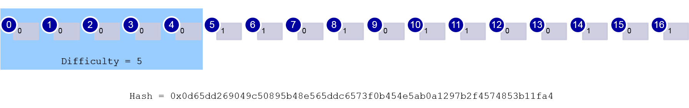
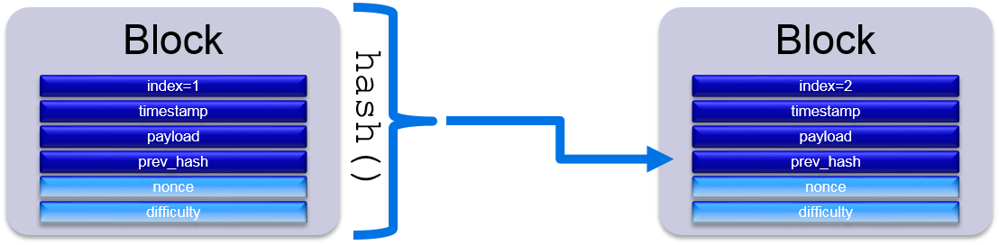

# Let's build a Blockchain

Lukasz Szweda  
<lukasz.szweda@gmail.com>  
  
Pycon PL 2018

### Abstract
The blockchain technology has been with us for some time now. Next year we will celebrate the 10-th anniversary of the first commonly available blockchain implementation that is called Bitcoin. Yet few people know the magic behind it. The best way to learn something is to build it ourselves.

In this session we will walk through the implementation of a simplistic blockchain in Python and see how all the pieces fit together. Seeing something so simple, yet powerful in the works, unfolds the ingenuity of the whole solution and allows to fuller grasp the next steps in the evolution of the blockchain.

### Introduction

How many of you heard of the blockchain? Probably the majority...  
How many understand how it works or what it takes to put a transaction on the blockchain? How long did it take you to understand that?  

What if I tell you that all the ideas that lay underneath blockchain technology are pretty simple and have been quite well known to computer scientists for a long time. Things like public-key cryptography, one-way functions, consensus or computationally-intensive proof of work are not hard to comprehend, yet combined they form one of the most convoluted creations that the world had seen in the last years.

The simplicity allows us to decompose the technology to individual pieces and try to reconstruct it. Thanks to that we will be able to better understand the mechanisms that orchestrate Bitcoin and its alikes.

Let's get started.

### The Block

First ingredient is the Block. It is a fundamental construct of the blockchain that stores the payload, i.e. transactions.


The minimalistic block consists of the following attributes:  
- index - which defines the height of the blockchain  
- timestamp - when the block was created  
- payload - the data that the block holds  

The block is "chained" to its ancestor and once added to blockchain, it cannot be altered or forged. To achieve that, all block attributes are combined and transformed with a one-way function in a process called "hashing". The hash of a previous block is stored alongside other attributes and is hashed during creation of next block.

Let's define a class that does that:


```python
import time

class Block:
    def __init__(self, index, payload, prev_hash):
        self.index = index
        self.timestamp = time.time()
        self.payload = payload
        self.prev_hash = prev_hash
```

We also need a function to calculate the hash of the block. We will use the same function as Bitcoin - SHA256.


```python
import time
import hashlib
import json
from datetime import datetime as dt

class Block:
    def __init__(self, index, payload, prev_hash):
        self.index = index
        self.timestamp = time.time()
        self.payload = payload
        self.prev_hash = prev_hash

    def __repr__(self):
        return f'[Block #{self.index}, payload={self.payload}, ' \
               f'hash={self.hash()}, datetime={dt.fromtimestamp(self.timestamp)}]'

    def _sha(self):
        sha = hashlib.sha256()
        sha.update(bytes(self.index))
        sha.update((str(self.timestamp) + json.dumps(self.payload) +
                    self.prev_hash).encode('utf-8'))
        return sha

    def hash(self):
        return self._sha().hexdigest()
```

### The Chain


Second ingredient is the Blockchain. It stores a sequence of blocks and creates a link between them during addition to the chain.

Blockchain class looks like this:


```python
class Blockchain(object):
    def __init__(self):
        self.index = 0
        self.blocks = []
        self.last_hash = ''
```

We need a method to create a new block with payload and add it to the chain, linking it to the last one.


```python
class Blockchain(object):
    def __init__(self):
        self.index = 0
        self.blocks = []
        self.last_hash = ''

    def __repr__(self):
        return f'[Blockchain, height={len(self.blocks)}, ' \
               f'last 5 blocks={str(self.blocks[-5:])}]'

    def add_block(self, payload):
        block = Block(self.index, payload, self.last_hash)
        self.blocks.append(block)
        self.index += 1
        self.last_hash = block.hash()
        return block
```

The first block that was added to Bitcoin is called Genesis Block. It contained a following message in the payload:

> The Times 03/Jan/2009 Chancellor on brink of second bailout for banks

This was probably intended as proof that the block was created on or after January 3, 2009, as well as a comment on the instability caused by fractional-reserve banking.

Let's add a similar genesis block to our blockchain:


```python
>>> blockchain = Blockchain()
>>> blockchain.add_block('The Times 03/Jan/2009 Chancellor on brink of second bailout for banks')
```


    [Block #0, payload=The Times 03/Jan/2009 Chancellor on brink of second bailout for banks, hash=0fb226ea85f0618595145a7948967c7f9cab5d2e507d75a7e082e717b8040a21, datetime=2018-07-12 21:36:13.655980]


Great! Now we have an established blockchain. Let's add some more blocks with some payload:


```python
>>> for i in range(0, 10):
...    block = blockchain.add_block(f'Payload #{i}')
...    print(f"Added block: {block}")
```

    Added block: [Block #1, payload=Payload #0, hash=fd065acb4110b9023c81b2da242f2e052f67ad0828b96a71dc225f86131e024c, datetime=2018-07-12 21:36:13.676981]
    Added block: [Block #2, payload=Payload #1, hash=6a5b76102807cfc445ac60af774db55bd16c4267640b53f11ae15433c1b5c9d7, datetime=2018-07-12 21:36:13.676981]
    Added block: [Block #3, payload=Payload #2, hash=03f2ff78ea29d15b8b7d0572d2bd0c70a14946332cf3c8f78cef72a26ba9a570, datetime=2018-07-12 21:36:13.676981]
    Added block: [Block #4, payload=Payload #3, hash=4df9f2e93acb4a9a49985b09e3636f78aa9c10e77e8d590eabf1ca0886c871d8, datetime=2018-07-12 21:36:13.676981]
    Added block: [Block #5, payload=Payload #4, hash=2a79627bc070cd4ff6016961bc94000091b8f92a9fe92332eb307bc969273f23, datetime=2018-07-12 21:36:13.676981]
    Added block: [Block #6, payload=Payload #5, hash=e47b57db4c5e4f6a2dd0dae79bc3e148e6ba54a8cd9852c341cd3a567f076d92, datetime=2018-07-12 21:36:13.676981]
    Added block: [Block #7, payload=Payload #6, hash=66e54715d81a317f3519647d3253cb9d6d88eb0eb2a2b4943aea5c2f64bfcdcb, datetime=2018-07-12 21:36:13.676981]
    Added block: [Block #8, payload=Payload #7, hash=b068b811d8793360c136c53ddc2e454c60c1221ae8ec002d16ab3e614c46ccbe, datetime=2018-07-12 21:36:13.676981]
    Added block: [Block #9, payload=Payload #8, hash=d1efbf1a6d95afa15daab6affeed8429dcdeab09d071271b7576929a4c792f40, datetime=2018-07-12 21:36:13.676981]
    Added block: [Block #10, payload=Payload #9, hash=9297bb34ea66f7bc58270649d3d1a522f45ffb3c61da6a304cd0e409e6a93036, datetime=2018-07-12 21:36:13.676981]
    

Let's verify if the blockchain is proper. To do so we need to iterate over all blocks, calculate last block's hash and check if it matches the one stored in the current block.


```python
def verify(blockchain):
    for block, prev_block in zip(blockchain.blocks[1:], blockchain.blocks):
        if block.prev_hash != prev_block.hash():
            print(f'!!! Blockchain verification FAILED on block #{block.index} !!!')
            break
    else:
        print('Blockchain verification PASSED')
```


```python
>>> verify(blockchain)
```

    Blockchain verification PASSED
    

Let's see what happens when we alter the payload slightly.


```python
>>> blockchain.blocks[5].payload += '.'
>>> verify(blockchain)
```

    !!! Blockchain verification FAILED on block #6 !!!
    

### The Transaction

Now that we have lay the ground for storing the data on the blockchain, let's add support for transactions.


```python
from collections import namedtuple

Transaction = namedtuple('Transaction', 'addr_from, addr_to, amount')
```

Let's create a fresh blockchain once again and add some blocks and transactions to it.


```python
def add_test_transactions(blockchain):
    blockchain.add_block([Transaction('1FDHiLF1CLnFZ2BZtPakPTY2sk2M8AJkiA',
                                  '19PcPjKGiwdcTwMibqJVRAPY9sGx4XcRAx',
                                  1.0)])

    blockchain.add_block([Transaction('12vi3T1DifT4y7tyz5TGbyFQwj2opmmaia',
                                      '1Gdw1B4dMTZHQUzv7ggnPmZWap9pjzyn4d',
                                      2.3), 
                          Transaction('1PTTZ2gKWBKPuC8JKtFd5sDbT4XQgEzvSL',
                                      '12FuBeX5Ruyd4UxeCeHuAABuQ9cD2aGQKo',
                                      10.0)])

    blockchain.add_block([Transaction('19PcPjKGiwdcTwMibqJVRAPY9sGx4XcRAx',
                                      '1FDHiLF1CLnFZ2BZtPakPTY2sk2M8AJkiA',
                                      1.0)])
```


```python
>>> blockchain = Blockchain()
>>> blockchain.add_block('The Times 03/Jan/2009 Chancellor on brink of second bailout ' \
...                     'for banks')
>>> add_test_transactions(blockchain)
>>> print(blockchain)
```

    [Blockchain, height=4, last 5 blocks=[[Block #0, payload=The Times 03/Jan/2009 Chancellor on brink of second bailout for banks, hash=8d7f8189786e5ebe8125a711fa3fbe4c3945a18908df44e69bb0e966dc2c3e23, datetime=2018-07-12 21:36:13.767987], [Block #1, payload=[Transaction(addr_from='1FDHiLF1CLnFZ2BZtPakPTY2sk2M8AJkiA', addr_to='19PcPjKGiwdcTwMibqJVRAPY9sGx4XcRAx', amount=1.0)], hash=21898cca9b38561ec9bd794a991d97fe30b50a415e939b2edf3395a3b215ed8f, datetime=2018-07-12 21:36:13.767987], [Block #2, payload=[Transaction(addr_from='12vi3T1DifT4y7tyz5TGbyFQwj2opmmaia', addr_to='1Gdw1B4dMTZHQUzv7ggnPmZWap9pjzyn4d', amount=2.3), Transaction(addr_from='1PTTZ2gKWBKPuC8JKtFd5sDbT4XQgEzvSL', addr_to='12FuBeX5Ruyd4UxeCeHuAABuQ9cD2aGQKo', amount=10.0)], hash=2722de07650c7d9b8dd323eb77e5e721850340f4a59481d55ff65d6b7fe5e031, datetime=2018-07-12 21:36:13.767987], [Block #3, payload=[Transaction(addr_from='19PcPjKGiwdcTwMibqJVRAPY9sGx4XcRAx', addr_to='1FDHiLF1CLnFZ2BZtPakPTY2sk2M8AJkiA', amount=1.0)], hash=6430f9d154ad4da67476e8d8acefbc09996d9079327bc22947f484cccb599a7e, datetime=2018-07-12 21:36:13.767987]]]
    

We can verify the chain again to check if everything is fine.


```python
>>> verify(blockchain)
```

    Blockchain verification PASSED
    

### The Mine

In such form the blockchain is very vulnerable. Anyone can alter it and recompute all the blocks back to the Genesis Block to make it perfectly valid. In order to prevent it, each block has to be "strenghten" to hinder the tampering of the history. This is achieved in a process called "mining".

Mining is a computationally-intensive task. For each block a "miner" tries to find a solution such that when applied to a block, its hash will fit into an expected characteristic. Specifically - there is a dedicated field (called a "nonce") in the block that is being constantly increased. Upon each iteration, the block's hash changes unpredictably. If the first _k_ bits of the hash come out as _0's_ then the solution is found and the block is "mined". The _nonce_ is included in the block, so that others can easily verify that the work was done (this is called "proof-of-work").





The process was designed that way to provide a steady inflow of blocks each day. The probability of finding the solution is constant, so the only factor that controls the mean time between blocks is _k_ (number of 0-bits). It's called the "difficulty" of mining and can be adjusted when the hashing power of the whole network changes. For Bitcoin the process is designed to produce one block roughly every 10 minutes. After every 2016 blocks, which corresponds to ~2 weeks, the algorithm compares the time it took to mine them against the expected 2 weeks and increases/decreases the difficulty accordingly.

Mining is also a way to introduce new coins to the system. Every miner who start solving a block is allowed to add a special first transaction that transfers some amount of coins from thin air straight to her address. It's called a "coinbase" transaction. When the block is successfully minted, the coinbase transaction becomes valid and the coins are collected by the lucky miner, alongside any fees that come from included transactions. This design incentivises people to join the mining and collectively make the network more secure.

Let's add the mining to our blockchain.


```python
class Block:
    def __init__(self, index, payload, prev_hash):
        self.index = index
        self.timestamp = time.time()
        self.payload = payload
        self.prev_hash = prev_hash
        self.nonce = 0
        self.difficulty = 0

    def __repr__(self):
        return f'[Block #{self.index}, payload={self.payload}, ' \
               f'hash={self.hash()}, nonce={self.nonce}, diff={self.difficulty}, ' \
               f'datetime={dt.fromtimestamp(self.timestamp)}, ' \
               f'prev_hash={self.prev_hash}]'

    def _sha(self):
        sha = hashlib.sha256()
        sha.update(bytes(self.index) + bytes(self.nonce) + bytes(self.difficulty))
        sha.update((str(self.timestamp) + json.dumps(self.payload) + 
                    self.prev_hash).encode('utf-8'))
        return sha

    def hash(self):
        return self._sha().hexdigest()

    def difficulty_matches(self):
        bits = ''.join(f"{c:08b}" for c in self._sha().digest())
        prefix = bits[:self.difficulty]
        mask = '0' * self.difficulty
        return prefix == mask

    def mine(self, difficulty):
        self.difficulty = difficulty
        while not self.difficulty_matches():
            self.nonce += 1


class Blockchain(object):
    def __init__(self):
        self.index = 0
        self.last_hash = ''
        self.blocks = []
        self.difficulty = 0
        self.add_block('The Times 03/Jan/2009 Chancellor on brink of second bailout ' \
                       'for banks')

    def __repr__(self):
        return f'[Blockchain, height={len(self.blocks)}, ' \
               f'last 5 blocks={str(self.blocks[-5:])}]'

    def add_block(self, payload):
        block = Block(self.index, payload, self.last_hash)
        block.mine(self.difficulty)
        self.blocks.append(block)
        self.index += 1
        self.last_hash = block.hash()
        return block
    
    def verify(self):
        for block, prev_block in zip(self.blocks[1:], self.blocks):
            if block.prev_hash != prev_block.hash():
                print(f'Verification FAILED on block #{block.index}')
                break
        else:
            print('Verification PASSED')
```

Let's see how this works.


```python
>>> blockchain = Blockchain()
>>> t = time.time()
>>> add_test_transactions(blockchain)
>>> print(f'Time elapsed: {time.time() - t}')
```

    Time elapsed: 0.0
    


```python
>>> blockchain.verify()
```

    Verification PASSED
    


```python
>>> print(blockchain)
```

    [Blockchain, height=4, last 5 blocks=[[Block #0, payload=The Times 03/Jan/2009 Chancellor on brink of second bailout for banks, hash=0b16d597617d776b9bdb33e82bf811911d101ba2dfff8f6f18130bba5723ab1d, nonce=0, diff=0, datetime=2018-07-12 21:36:13.929996, prev_hash=], [Block #1, payload=[Transaction(addr_from='1FDHiLF1CLnFZ2BZtPakPTY2sk2M8AJkiA', addr_to='19PcPjKGiwdcTwMibqJVRAPY9sGx4XcRAx', amount=1.0)], hash=08611385dcf723ec8c43dbc373800cb44b8e988b2472a993197cf056d7b63b77, nonce=0, diff=0, datetime=2018-07-12 21:36:13.929996, prev_hash=0b16d597617d776b9bdb33e82bf811911d101ba2dfff8f6f18130bba5723ab1d], [Block #2, payload=[Transaction(addr_from='12vi3T1DifT4y7tyz5TGbyFQwj2opmmaia', addr_to='1Gdw1B4dMTZHQUzv7ggnPmZWap9pjzyn4d', amount=2.3), Transaction(addr_from='1PTTZ2gKWBKPuC8JKtFd5sDbT4XQgEzvSL', addr_to='12FuBeX5Ruyd4UxeCeHuAABuQ9cD2aGQKo', amount=10.0)], hash=bba895bca1e834a1ffa1e38650609f0c79fece73955b2951afa3e71fa7dae048, nonce=0, diff=0, datetime=2018-07-12 21:36:13.929996, prev_hash=08611385dcf723ec8c43dbc373800cb44b8e988b2472a993197cf056d7b63b77], [Block #3, payload=[Transaction(addr_from='19PcPjKGiwdcTwMibqJVRAPY9sGx4XcRAx', addr_to='1FDHiLF1CLnFZ2BZtPakPTY2sk2M8AJkiA', amount=1.0)], hash=25256cdc31a13c30ae14e15660554eab703f07898494c3cd077d8befdcd71dd5, nonce=0, diff=0, datetime=2018-07-12 21:36:13.929996, prev_hash=bba895bca1e834a1ffa1e38650609f0c79fece73955b2951afa3e71fa7dae048]]]
    

That was easy, but let's see what happens when the difficulty gets harder.


```python
>>> blockchain = Blockchain()
>>> blockchain.difficulty = 14
>>> t = time.time()
>>> add_test_transactions(blockchain)
>>> print(f'Time elapsed: {time.time() - t}')
```

    Time elapsed: 7.792445659637451
    


```python
>>> blockchain.verify()
```

    Verification PASSED
    


```python
>>> print(blockchain)
```

    [Blockchain, height=4, last 5 blocks=[[Block #0, payload=The Times 03/Jan/2009 Chancellor on brink of second bailout for banks, hash=b0fce38874d4ef867ea2d0847f64da2ca66e175ac1c232e03bf025c8e5b2bd61, nonce=0, diff=0, datetime=2018-07-12 21:36:13.975998, prev_hash=], [Block #1, payload=[Transaction(addr_from='1FDHiLF1CLnFZ2BZtPakPTY2sk2M8AJkiA', addr_to='19PcPjKGiwdcTwMibqJVRAPY9sGx4XcRAx', amount=1.0)], hash=0001f9b472b70003492f3f046639ab6efb175ffcc26d2152621dcc6996b352c4, nonce=54874, diff=14, datetime=2018-07-12 21:36:13.976998, prev_hash=b0fce38874d4ef867ea2d0847f64da2ca66e175ac1c232e03bf025c8e5b2bd61], [Block #2, payload=[Transaction(addr_from='12vi3T1DifT4y7tyz5TGbyFQwj2opmmaia', addr_to='1Gdw1B4dMTZHQUzv7ggnPmZWap9pjzyn4d', amount=2.3), Transaction(addr_from='1PTTZ2gKWBKPuC8JKtFd5sDbT4XQgEzvSL', addr_to='12FuBeX5Ruyd4UxeCeHuAABuQ9cD2aGQKo', amount=10.0)], hash=0001aca6b6d1f903cd634327845d31b57e488c4f1fdb40f3741af2ca83bc004e, nonce=9920, diff=14, datetime=2018-07-12 21:36:20.407366, prev_hash=0001f9b472b70003492f3f046639ab6efb175ffcc26d2152621dcc6996b352c4], [Block #3, payload=[Transaction(addr_from='19PcPjKGiwdcTwMibqJVRAPY9sGx4XcRAx', addr_to='1FDHiLF1CLnFZ2BZtPakPTY2sk2M8AJkiA', amount=1.0)], hash=00001bd4f672fda44c4883f61612a84cccfe9a5486467d26fad464b5f52d1a46, nonce=16306, diff=14, datetime=2018-07-12 21:36:20.869393, prev_hash=0001aca6b6d1f903cd634327845d31b57e488c4f1fdb40f3741af2ca83bc004e]]]
    

Notice the time it took to mine the blocks, the _nonce_ values and the hash of Block #1 and the next ones (there should be at least fourteen 0-bits at the beginning of each hash).

If someone tampers with difficulty this again is detected.


```python
>>> blockchain.blocks[2].difficulty = 1
>>> blockchain.verify()
```

    Verification FAILED on block #3
    

Hash tampering works as previously. Let's try to add an evil transaction.


```python
>>> blockchain.blocks[1].payload.append(Transaction('victim address', 'hackers address', 1000000.0))
>>> blockchain.verify()
```

    Verification FAILED on block #2
    


```python
>>> print(blockchain)
```

    [Blockchain, height=4, last 5 blocks=[[Block #0, payload=The Times 03/Jan/2009 Chancellor on brink of second bailout for banks, hash=b0fce38874d4ef867ea2d0847f64da2ca66e175ac1c232e03bf025c8e5b2bd61, nonce=0, diff=0, datetime=2018-07-12 21:36:13.975998, prev_hash=], [Block #1, payload=[Transaction(addr_from='1FDHiLF1CLnFZ2BZtPakPTY2sk2M8AJkiA', addr_to='19PcPjKGiwdcTwMibqJVRAPY9sGx4XcRAx', amount=1.0), Transaction(addr_from='victim address', addr_to='hackers address', amount=1000000.0)], hash=9ff7b850b2cd498dd76d0d62658251eb09181606ae8c346b97adff585f3e5eed, nonce=54874, diff=14, datetime=2018-07-12 21:36:13.976998, prev_hash=b0fce38874d4ef867ea2d0847f64da2ca66e175ac1c232e03bf025c8e5b2bd61], [Block #2, payload=[Transaction(addr_from='12vi3T1DifT4y7tyz5TGbyFQwj2opmmaia', addr_to='1Gdw1B4dMTZHQUzv7ggnPmZWap9pjzyn4d', amount=2.3), Transaction(addr_from='1PTTZ2gKWBKPuC8JKtFd5sDbT4XQgEzvSL', addr_to='12FuBeX5Ruyd4UxeCeHuAABuQ9cD2aGQKo', amount=10.0)], hash=cd66e303b496eb8dd50a93c306467691a0045aa88c6b1ffe3b867a4fdaada687, nonce=9920, diff=1, datetime=2018-07-12 21:36:20.407366, prev_hash=0001f9b472b70003492f3f046639ab6efb175ffcc26d2152621dcc6996b352c4], [Block #3, payload=[Transaction(addr_from='19PcPjKGiwdcTwMibqJVRAPY9sGx4XcRAx', addr_to='1FDHiLF1CLnFZ2BZtPakPTY2sk2M8AJkiA', amount=1.0)], hash=00001bd4f672fda44c4883f61612a84cccfe9a5486467d26fad464b5f52d1a46, nonce=16306, diff=14, datetime=2018-07-12 21:36:20.869393, prev_hash=0001aca6b6d1f903cd634327845d31b57e488c4f1fdb40f3741af2ca83bc004e]]]
    

### The Conclusion

That summarizes the presentation. Now, there are a lot more details to consider when it comes to Bitcoin and the blockchain protocol implementation.

Those of you who are eager to explore further can look into:  
- how the addresses are created and validated using public-key cryptography;  
- how the distributed consensus is achieved;  
- how transaction hashing actually works (i.e. Merkle trees instead of raw transaction hashing); or  
- how scripting language works for creating Bitcoin "smart transactions"  

Finally, there are other, more advanced implementations of the blockchain, which enhance on the idea. Smart Contracts (Ethereum, NEO) or the Tangle (IOTA) are only few examples of where the technology is taking its next steps.

I am keen on taking a part of that journey and hopefully you are as well.

### The End...

#### Email: <lukasz.szweda@gmail.com>
#### GitHub: https://github.com/qkiss
#### LinkedIn: https://www.linkedin.com/in/łukasz-szweda-48255a39/


### References
1. Bitcoin Wiki, https://en.bitcoin.it/. Accessed on 2018-07-12.
2. Nakamoto, S. (2008). _Bitcoin: A Peer-to-Peer Electronic Cash System._ https://bitcoin.org/bitcoin.pdf
