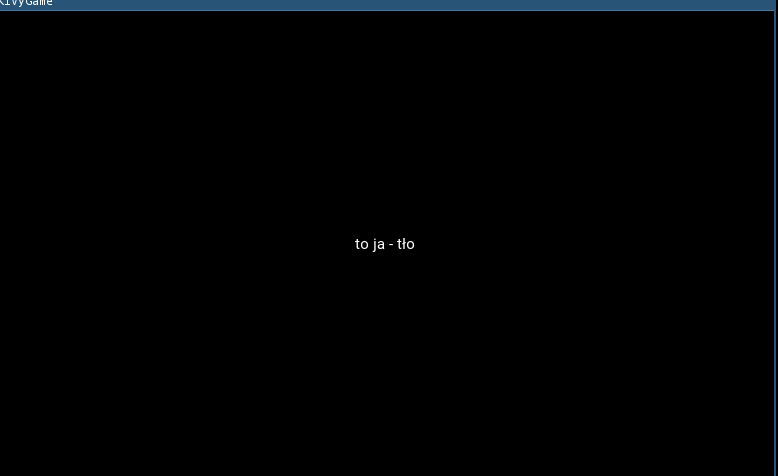
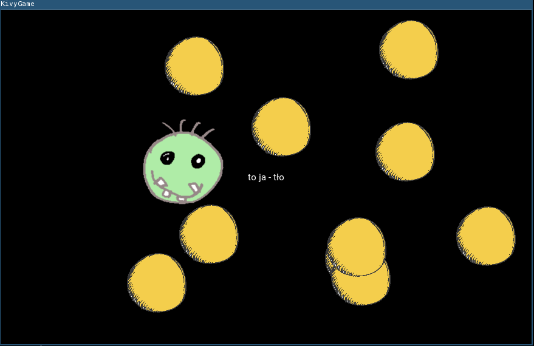
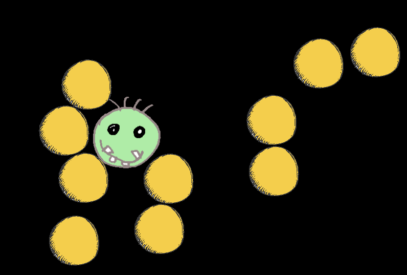
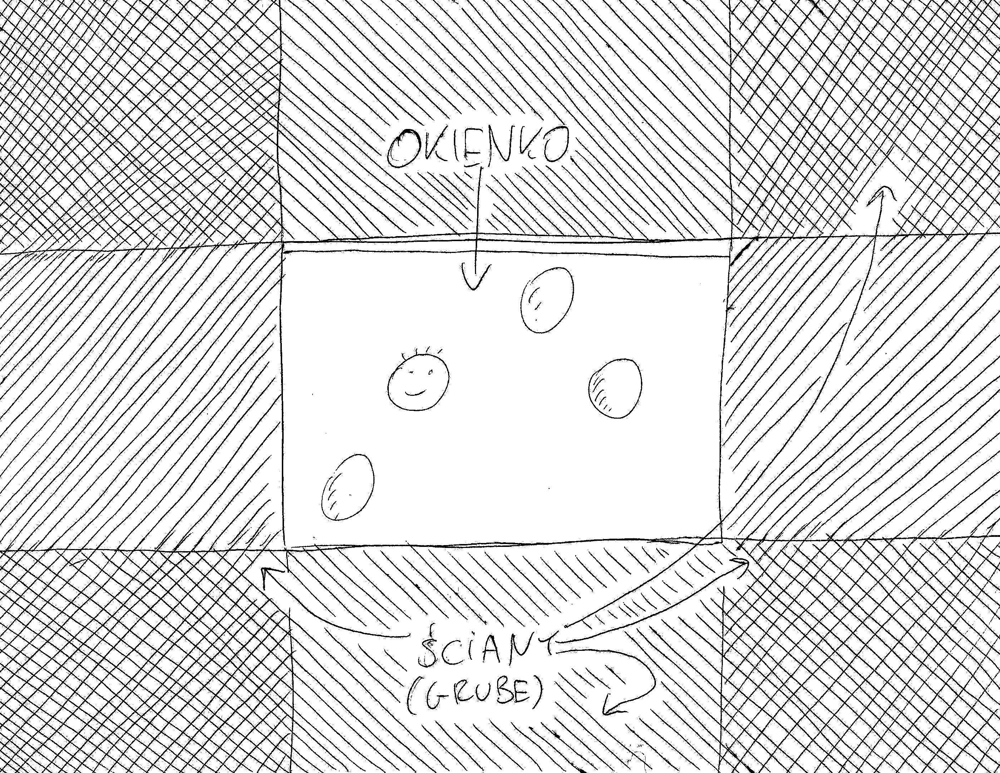
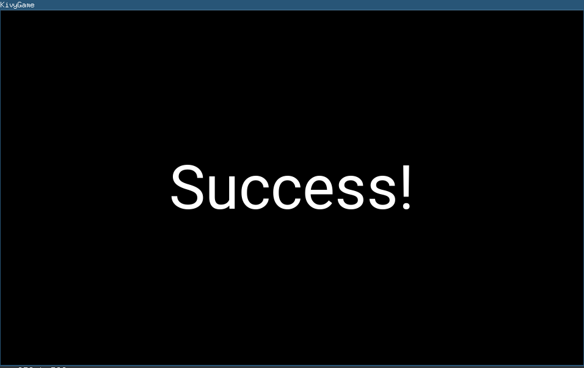
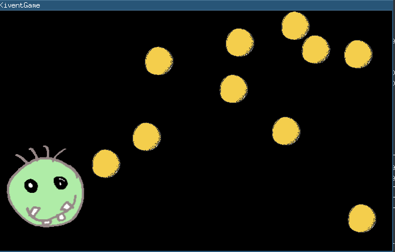
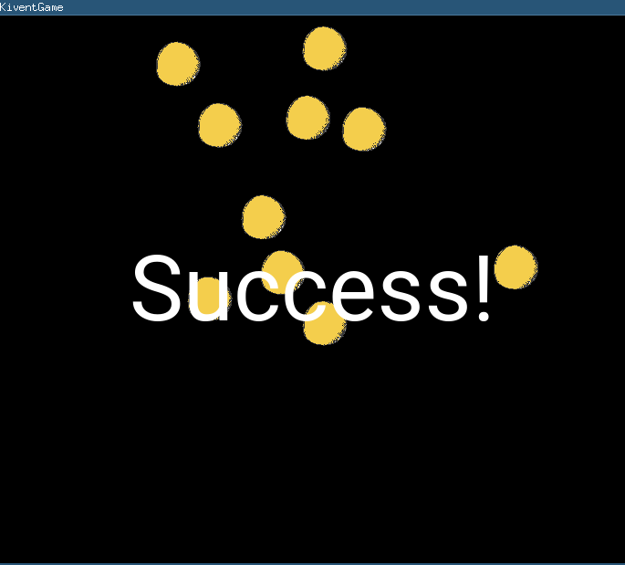
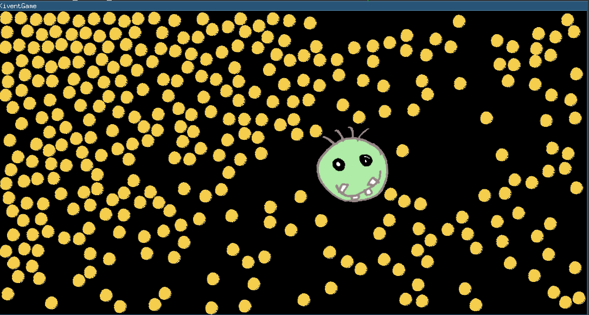
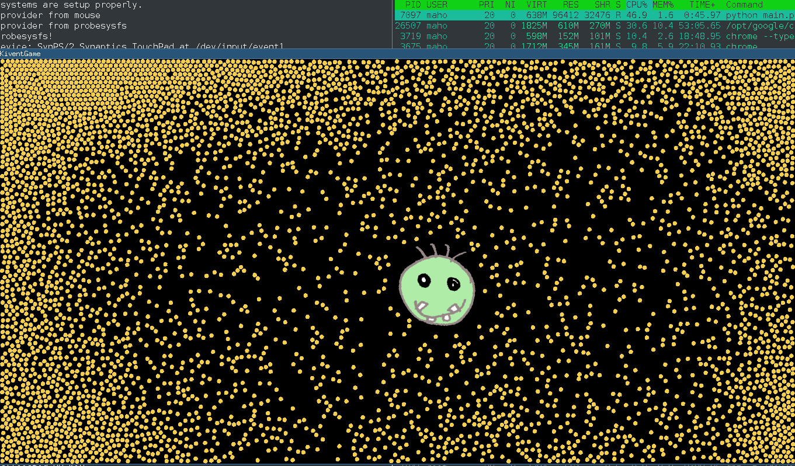

Tworzenie Gier w Kivy i Kivent
==============================

Zarówno Kivy jak i Kivent mogą służyć do pisania prostych gier w Pythonie. W
tym artykule, na przykładzie **bardzo** prostej aplikacji gropodobnej, porównam
podstawowe aspekty tworzenia gier w jednym i drugim.


Kivy - omówienie
----------------

Kivy (http://kivy.org) jest wieloplatformową (Linux, Windows, macOS, Android, iOS) biblioteką do tworzenia UI. 

Napisana jest w Pythonie i Cythonie. Obsługuje zarówno Pythona 2.x jak i 3.x. 

Zalety Kivy
-----------

* wieloplatformowość. Aplikacja którą stworzymy będzie działała (prawie) tak samo pod linuksem jak i pod androidem, z zastrzeżeniem różnic w rozdzielczości. 
* przejrzysty i bogaty język KV opisujący nam UI aplikacji (i nie tylko), bogactwo layoutów
  szczegóły składni języka można znaleźć pod adresem (http://kivy.org/docs/guide/lang.html) 
* buildozer (o którym niżej)


Wady Kivy
---------

* mimo bogactwa layoutów, do szału człowieka może doprowadzić konieczność umieszczenia buttona o zadanych rozmiarach w rogu ekranu, 
  albo przycisku który dopasuje się do zawartości i jednocześnie będzie miał konkretne proporcje. 
* inicjalizacja biblioteki, okienek i w ogóle całej warstwy pod spodem jest w momencie `import kivy` a nie w momencie uruchomienia mainloop. Co czasem wkurza. 
* twórcy kivy mieli własny pomysł na mechanizmy logowania. Czyli `Logger.info` zamiast `logging.info`, defaultowy handler jest na ekran i do plików tekstowych w katalogu domowym. 
  Co prawda jest to oparte na pythonowy moduł `logging`, ale próba wpięcia się w to albo wręcz przekierowania tego zupełnie np. do własnego `logging.basicConfig(...)` jest trudne i nieintuicyjne. 


Kilka słów na temat buildozera
------------------------------
Tworząc aplikację w Kivy, niemal na pewno mamy możliwość uruchomienia jej na androidzie bez większego wysiłku, za pomocą *Buildozera*. 
Buildozer jest to skrypt/nakładka na P4A
(`https://github.com/kivy/python-for-android`) która robi za użytkownika całą
niewdzięczną robotę, polegająca na ściąganiu odpowiednich SDK, NDK i innych
*DK. 

Przy odrobinie szczęścia, można odpalić aplikację napisaną w Kivy bez wnikania
w to jakie paczki do siebie pasują, gdzie je (są gigantyczne przecież)
rozpakować i w ogóle jakie rodzaje *DK w ogóle występują. 

Tworzenie gry w Kivy
--------------------

W artykule opiszę najprostszą grę w kivy. (gra to dużo powiedziane ... coś co może być podstawą do gry :). Niech to to będzie przeciskanie się między balonowatymi obiektami do prawej ściany, która będzie celem gry.

Źródło aplikacji jest pod adresem `https://gitlab.com/mahomahomaho/pycon-kivygame`

### Instalacja kivy, kadłubek aplikacji

```bash

maho@..kivygame$ mkvirtualenv --python=/usr/bin/python3 kivygame
[...]

maho@..kivygame$ pip install cython
Collecting cython
  Downloading https://files.pythonhosted.org/packages/93/a3/213a6106aed3d51f5fb6aa0868849b6a3afe240e019f6586c52cac3bbe7b/Cython-0.28.4-cp35-cp35m-manylinux1_x86_64.whl (3.3MB)
    100% |████████████████████████████████| 3.3MB 1.4MB/s
Installing collected packages: cython
Successfully installed cython-0.28.4
```

Niestety nie da się tego załatwić pojedynczym plikiem req.txt, bo pakiety muszą być instalowane w osobnych krokach. 

```bash

maho@..kivygame$ pip install kivy
Collecting kivy
[...]
Successfully built kivy
Installing collected packages: urllib3, idna, certifi, chardet, requests, Kivy-Garden, docutils, pygments, kivy
Successfully installed Kivy-Garden-0.1.4 certifi-2018.4.16 chardet-3.0.4 docutils-0.14 idna-2.7 kivy-1.10.1 pygments-2.2.0 requests-2.19.1 urllib3-1.23

```

Aplikację zacznijmy od pliku .py - nazwijmy go `main.py`. Można go nazwać dowolnie, ale jeżeli zechcemy użyć *buildozera* 
do zbudowania paczki na Androida, to musi się nazywać `main.py` i koniec. 


main.py:
```python
from kivy.app import App
from kivy.uix.widget import Widget


class KivyGame(Widget):
    pass


class KivyGameApp(App):
    pass


if __name__ == '__main__':
    KivyGameApp().run()
```

Jest zadeklarowana klasa `KivyGame`, dziedzicząca po `Widget`, która jest używana w `KivyGameApp`. 

`KivyGameApp` domyślnie ładuje jako *root widget* to co jest pierwsze w odpowiednim pliku .kv. A odpowiedni plik .kv to to jest `<nazwa aplikacji bez "App", lowercase>.kv`

kivygame.kv
```python
KivyGame:
    BoxLayout:
        pos: root.pos
        size: root.size
        Label:
            text: "to ja - tło"
            size_hint: 1, 1
```

Tutaj mamy `Widget`, który w sobie zawiera `BoxLayout`, domyślnie rozciągający się na całe `KivyGame` i zawierający w sobie `Label` z tekstem *to ja - tło*, rozciągający się na całego rodzica, czyli `BoxLayout` w tym przypadku.



#### Dodajemy postaci

Do root widgeta dodaję informację o postaci, nazwijmy ją *Fred*, w [kivygame.kv](https://gitlab.com/mahomahomaho/pycon-kivygame/blob/02-fred-and-baloons/kivygame.kv):

```python
    Widget:
        size: 145, 145
        center: 300, 300
```

Widget jest poza  `BoxLayout`, bo layout ma za zadanie rozmieścić elementy UI wg jakiegoś algorytmu, a postać ma być dokładnie w określonym miejscu. 
Goły widget jednak nie zawiera nic, więc trzeba coś do niego wsadzić. Najprościej narysować coś na jego płótnie:

```python
    Widget:
        canvas:
            Rectangle:
                pos: self.pos
                size: self.size
                source: 'img/fred.png'
```

Żeby móc zidentyfikować Freda wewnątrz aplikacji, trzeba nadać mu id, umieścić referencję do tego id w `KivyGame`...

```python
KivyGame:
    fred: fred
    [...]

    Widget:
        [...]
        id: fred
```

i od teraz w KivyGame pojawia się `self.fred`.

#### Dodanie balonów #####

Balony dodaję w inny sposób: nie moge ich zadeklarować w pliku .kv, bo nie wiem dokładnie ile ich będzie. Dlatego, w pliku .kv definiuję wygląd klasy `<Baloon>` zaś dodanie jej będzie odbywać się w kodzie.

plik [kivygame.kv](https://gitlab.com/mahomahomaho/pycon-kivygame/blob/03-randommoves/kivygame.kv):

```python
<Baloon>:
    canvas:
        Rectangle:
            pos: self.pos
            size: self.size
            source: 'img/baloon.png'

    size: 100, 100
    
```

oraz [main.py](https://gitlab.com/mahomahomaho/pycon-kivygame/blob/03-randommoves/main.py):

```python

class Baloon(Widget):
    pass
```

dodanie 10 balonów w losowych miejscach na arenie o pozycjach

```python

class KivyGame(Widget):
    def __init__(self, *a, **kwa):
        super().__init__(*a, **kwa)

        self.baloons = []

        for _ in range(defs.num_baloons):
            baloon = Baloon(center=(randint(200, 800), randint(100, 500)))
            self.add_widget(baloon)

```

Efekt jak poniżej:



#### Apka z losowymi przemieszczeniami się balonów

W `KivyGame.__init__` uruchamiamy wywoływanie metody `update` 30 razy na sekundę:

```python
class KivyGame(Widget):
    def __init__(self, *a, **kwa):
        [...]
        Clock.schedule_interval(self.update, 1.0 / 30)
```

A tam, modyfikujemy pozycje balonów w sposób losowy:

```python
    def update(self, dt):
        for b in self.baloons:
            x, y = b.pos
            b.pos = (x + randint(-5, 5), y + randint(-5, 5))
```

W repozytorium kod jest oznaczony tagiem [03-randommoves](https://gitlab.com/mahomahomaho/pycon-kivygame/blob/03-randommoves)

#### Dodany input, można sterować, nadal brak interakcji

Najprościej dodać obsługe myszki, wystarczy tylko przeciążyć metody `on_touch_*`. W naszym przypadku - będzie to `on_touch_up`.
Przyśpieszamy Freda  w kierunku punktu kliknięcia. 

```python
class KivyGame(Widget):
    def __init__(self, *a, **kwa):
        [...]
        self.fred_speed = Vector(0, 0)
        [...]

    def update(self, dt):
        [...]
        self.fred.pos = Vector(self.fred.pos) + self.fred_speed
```

i samo przyśpieszenie:

```python

    def on_touch_up(self, touch):
        vdir = Vector(touch.pos) - self.fred.center  # wynik to Vector
        self.fred_speed += vdir / 100

```

Klawiatura jest ciutkę mniej oczywista: 

```python
from kivy.base import EventLoop
[...]
from kivy.core.window import Keyboard

[...]
class KivyGame(Widget):
    def __init__(self, *a, **kwa):
        [...]
        EventLoop.window.bind(on_key_up=self.on_key_up)

    [...]
    def on_key_up(self, __window, key, *__, **___):
        # code = Keyboard.keycode_to_string(None, key) # można tak, ale to brzydki hack
        dx, dy = 0, 0
        if key == Keyboard.keycodes['up']:
            dy = 5
        elif key == Keyboard.keycodes['down']:
            dy = -5
        elif key == Keyboard.keycodes['left']:
            dx = -5
        elif key == Keyboard.keycodes['right']:
            dx = +5

        self.fred_speed += Vector(dx, dy)
```

Czyli, możemy sterować już Fredem, ale nadal jest zero interakcji między Fredem a balonami. 

#### Fizyka: jest interakcja, ale wszystko nam ucieka

Do fizyki mamy 2 świetne biblioteki: **pymunk** (http://pymunk.org ) i
**cymunk** (http://github.com/kivy/cymunk ) - obie oparte na **Chipmunk**
(http://chipmunk-physics.net ). 

Do niedawna tylko *Cymunk* wchodził w grę, jeżeli trzeba było zbudować grę na
androida. Od ponad roku *Pymunk* ma także swoją receptę w *Python4android* więc należy sądzić że też jest używalny. 

Cymunk jest nieco do tyłu w stosunku do Pymunka jeżeli chodzi o funckcjonalność
i obsługiwaną wersję *Chipmunka*, użyję jednak Cymunka w tym przykładzie, jako
że *Kivent*, o którym jest w dalszej części artykułu, używa właśnie *Cymunka*. 

Instalacja cymunk:
```bash
   maho@dlaptop:~/workspace/kiventgames/kivygame$ pip install git+https://github.com/kivy/cymunk
```

I wkładam *cymunka* do aplikacji:

```python
from cymunk import Space

[...]
class KivyGame(Widget):
    def __init__(self, *a, **kwa):
        [...]
        self.init_physics()

    def init_physics(self):
        self.space = Space()  # cała fizyka dzieje się w ramach obiektu Space()

    def update(self, dt):
        [...]
        self.space.step(1.0 / 30)
```

W update robimy `tick` fizyki - mówimy jej że minęło `1/30` sekundy. Można podać zmienną `dt` zamiast sztywnego `1/30`, 
ale problem jest taki że jeżeli coś się przytka w systemie i np. następne
update zrobi się nie za `1/30` sekundy a za jedną sekundę, to może się np. okazać
że jakiś obiekt przeleciał przez ścianę. Lepiej więc poświęcić zgodność czasu
fizyki *chipmunka* z czasem rzeczywistym, niż narazić się na fantastycznie
wielkie przyśpieszenia osiągane przez obiekty. 

Trzeba powiązać obiekty z `self.space`:

```python
    def init_physics(self):
        self.space = Space()  # cała fizyka dzieje się w ramach obiektu Space()

        self.init_body(self.fred, 72)
        for b in self.baloons:
            self.init_body(b, 50)

    def init_body(self, widget, r):
        """ initialize cymunk body for given widget as circle
            of radius=r
        """
        widget.body = Body(defs.mass, defs.moment)
        widget.body.position = widget.center
        self.widgets_with_bodies.append(widget)

        shape = Circle(widget.body, r)
        shape.elasticity = defs.elasticity
        shape.friction = defs.friction
        shape.collision_type = defs.default_collision_type

        self.space.add(widget.body)
        self.space.add(shape)
```

następnie sprawić, żeby aplikacja śliedziła pozycje obiektów

```python
    def update(self, dt):
        [...]
        for w in self.widgets_with_bodies:
            w.center = tuple(w.body.position)
```

Jest jeden drobny szkopuł: `self.fred` nie ma w `KivyGame.__init__`, całe procesowanie rzeczy zdefiniowanych w `kivygame.kv` dzieje się "tuż po" `__init__`. Dlatego trzeba odłożyć operacje na tych obiektach na "tuż po". W tym celu:

```python
class KivyGame(Widget):

    def __init__(self, *a, **kwa):
        super().__init__(*a, **kwa)

        Clock.schedule_once(self.init_widgets)  # tutaj przekazujemy do "tuż po"

    def init_widgets(self, dt):  # a to się wykona "tuż po"
        [...]

        self.init_physics()

    def init_physics(self):
        [...]
        self.init_body(self.fred, 72)
        for b in self.baloons:
            self.init_body(b, 50)
```

Po uruchomieniu wygląda tak:



Balony się pięknie rozsunęły. Ale, widać że nie da się już sterować Fredem, zaś balony przestały się ruszać. To oczywiste, wszelkie zmiany do `self.fred.pos` są kasowane poprzez ustawianie tej pozycji do fizycznego ciała. Dlatego, trzeba od tej pory operować tylko na ciałach fizycznych. 

Dlatego to:

```python
            b.pos = (x + randint(-5, 5), y + randint(-5, 5))
```

zamieniam na 

```python
            b.body.apply_impulse((randint(-10, 10), randint(-10, 10)))
```

Zaś sterowanie Fredem zamieniam na:

zamieniam tym:

```python
    def on_key_up(self, __window, key, *__, **___):
        # code = Keyboard.keycode_to_string(None, key) # można tak, ale to brzydki hack
        dx, dy = 0, 0
        if key == Keyboard.keycodes['up']:
            dy = 500
        elif key == Keyboard.keycodes['down']:
            dy = -500
        elif key == Keyboard.keycodes['left']:
            dx = -500
        elif key == Keyboard.keycodes['right']:
            dx = +500

        self.fred.body.apply_impulse(Vector(dx, dy))

    def on_touch_up(self, touch):
        vdir = Vector(touch.pos) - self.fred.center  # wynik to Vector
        self.fred.body.apply_impulse(vdir * 5)
```

Kod pod tagiem [05-physics-02](https://gitlab.com/mahomahomaho/pycon-kivygame/tree/05-physics-02)

#### Dodajemy ściany

Balony i główny bohater nam uciekają, trzeba zrobić ściany. Ściany będą na granicy okienka, a więc i tak niewidoczne, a więc tworzymy te obiekty tylko w `Space` cymunka. 

Żeby się nie okazało że zmniejszając okienko, "przelecimy" ścianą przez obiekt, ściany zrobimy naprawdę bardzo grube, jak na obrazku:



Korzystamy ze kształtu `Segment`, któremu nadamy bardzo dużą grubość (400px). 

```python
class KivyGame(Widget):

    def __init__(self, *a, **kwa):
        [...]
        self.walls = []

    [...]
    def init_physics(self):
        [...]
        self.create_walls()

    def create_walls(self):
        segments, R = self.wall_segments()
        for v1, v2 in segments:

            wall = Segment(self.space.static_body, v1, v2, R)
            wall.elasticity = defs.elasticity
            wall.friction = defs.wall_friction
            wall.collision_type = defs.default_collision_type

            self.space.add_static(wall)
            self.walls.append(wall)
    [...]
    def wall_segments(self):
        w, h = self.size
        R = 200
        return [(Vec2d(-2 * R, -R), Vec2d(w + 2 * R, -R)),
                (Vec2d(-R, -2 * R), Vec2d(-R, h + 2 * R)),
                (Vec2d(-2 * R, h + R), Vec2d(w + 2 * R, h + R)),
                (Vec2d(w + R, h + 2 * R), Vec2d(w + R, -2 * R))], R
```

`Segment` jest dodany jako ciało statyczne, nie domyślne -- dynamiczne. Ciało statyczne jest to ciało które uczestniczy w odbiciach z innymi ciałami, ale nie podlega siłom/nie zmienia położenia. 

Dodatkowo, reagujemy na zmianę rozmiaru okna (po zmianie parametrów kształtów ciała dynamicznego, reindeksujemy przestrzeń)

```python
class KivyGame(Widget):

    def __init__(self, *a, **kwa):
        [...]
        Window.bind(on_resize=self.on_resize)
    [...]
    def on_resize(self, _win, w, h):
        if not self.walls:
            return
        Logger.debug("move walls with width w=%s h=%s", w, h)

        segments, __R = self.wall_segments()

        for (v1, v2), wall in zip(segments,
                                  self.walls):
            wall.a = v1
            wall.b = v2

        self.space.reindex_static()
```

Pełny kod pod tagiem  [06-walls](https://gitlab.com/mahomahomaho/pycon-kivygame/tree/06-walls)

#### Cel gry, Screen Manager, Plansza success

Żeby aplikacja chociaż trochę przypominała grę, musi mieć jakiś cel. Niech to będzie dotarcie do ściany po prawej. 

W tym celu robimy dwie rzeczy. Identyfikujemy która ściana jest celem i nadajemy jej inny `collision_type`

```python
    def create_walls(self):
        [...]
        for v1, v2, goal in [(Vec2d(-2*R, -R), Vec2d(w + 2*R, -R), False),
                             (Vec2d(-R, -2*R), Vec2d(-R, h + 2*R), False),
                             (Vec2d(-2*R, h + R), Vec2d(w + 2*R, h + R), False),
                             (Vec2d(w + R, h + 2*R), Vec2d(w + R, -2*R), True)]:
            [...]
            wall.collision_type = defs.goal_collision_type if goal else defs.default_collision_type
```

oraz Fredowi:

```python
    def init_physics(self):
        [...]
        self.init_body(self.fred, 72, defs.fred_collision_type)

    def init_body(self, widget, r, collision_type=defs.default_collision_type):
        [...]
        shape.collision_type = collision_type
```

handler kolizji między `defs.fred_collision_type` a `defs.goal_collision_type`

```python
    def init_physics(self):
        [...]
        self.space.add_collision_handler(defs.goal_collision_type,
                                         defs.fred_collision_type,
                                         self.goal_reached)
    [...]
    def goal_reached(self, _space, _arbiter):
        print("\n\nSUCCESS!!!\n\n")
```

Kod pod tagiem  [07-goal-01](https://gitlab.com/mahomahomaho/pycon-kivygame/tree/07-goal-01)

No tak, ale print na konsolę to kiepski pomysł w grze. Trzeba zrobić jakąś planszę. Najlepiej użyć `ScreenManager` który trzyma grę jako jeden z ekranów, planszę z wynikiem jako inny, można tam jeszcze wstawić planszę powitalną, planszę z *Game Over* itd...

A więc w kivygame.kv jest zawartość klasy GameScreenManager (w nawiasach ostrych - a więc nie mamy tworzenia instancji, ta będzie stworzona w *main.py*)

```python
<GameScreenManager>:
    Screen:  # pierwszy screen jest wyświetlany domyślnie
        name: 'game'
        KivyGame:
    Screen:
        name: 'success'
        BoxLayout:
            pos: root.pos
            size: root.size

            Label:
                font_size: '100sp' 
                text: "Success!"
```

oraz w main.py:
```python
class GameScreenManager(ScreenManager):
    pass
 

class KivyGame(Widget):
    def __init__(self, *a, **kwa):
        [...]
        self.app = App.get_running_app()

    [...]
    def goal_reached(self, _space, _arbiter):
        self.app.sm.current = 'success'  # <-- tak, to wystarczy zeby zmienić screen
[...]
class KivyGameApp(App):
    def __init__(self, *a, **kw):
        super().__init__(*a, **kw)
        self.sm = None

    def build(self):
        self.sm = GameScreenManager()
        return self.sm
       
```

Tag  [07-goal-2](https://gitlab.com/mahomahomaho/pycon-kivygame/tree/07-goal-2)

Wynik: 



### Stress test - zwiększamy liczbę balonów ...

No to zróbmy mały stress test - zwiększmy liczbę balonów do 20, 40, 80, 160 .... i zobaczmy kiedy zacznie "ciąć". 

* Przy 80 balonach, musiałem zmniejszyć rozmiar balona o połowę, ponieważ nie mieściły się na planszy. (tag `08-stress-80`)
* Przy 320 balonach, ponownie musiałem to zrobić (tag `08-stress-320`) i wtedy odnotowałem pierwsze objawy zacinania, zwłaszcza w momencie kiedy robiło się ciasno. 
* Przy 1280 balonach, zacinanie stało się bardzo widoczne, mimo zmniejszenia rozmiaru balodu do `15,15`. Ale jeszcze momentami ruch był płynny. 
* 3000 balonów to już było zdecydowanie za dużo dla mojego sprzetu (i3 z 1.6, bez wspomagania grafiki)


KivEnt
======


Kivent - omówienie
------------------

**Kivent** jest biblioteką do tworzenia gier, opartą na **Kivy** i **Cymunk**.
Składa się z kilku modułów, z których interesują nas tutaj dwa: `kivent_core` i
`kivent_cymunk`. 

Głownym autorem *KivEnt* jest [Jacob Kovacs](https://github.com/Kovak).

Zalety i wady Kivent w stosunku do Kivy
---------------------------------------

Aplikacja w *Kivent* jest jednocześnie aplikacją w *Kivy*, więc automatycznie mają zastosowaie wady i zalety *Kivy*. 

Zalety:

* jest biblioteką "wszystkomającą". Jest tam i fizyka i kamera, i śledzenie tą kamerą obiektu, wsparcie dla przesuwania dwoma palcami itd. Dużo bajerów które mogą się przydać. 
* jest wydajniejsza (napisana w Cythonie)

Wady:
* ma znacznie mniejsze grono developerów, więc jak znajdziesz błąd - nastaw się na to że będziesz go sam naprawiał. 
* jest skomplikowana, jeżeli znajdziesz błąd i będziesz go sam naprawiał, nastaw się że nie będzie lekko (no chyba że dobrze znasz Cythona i OpenGL).
* więcej się trzeba "opisać" żeby stworzyć minimalną aplikację. Więcej wysiłku żeby rozpocząć - gorsza do prototypowania. 
* Kivent oparte jest na wzorcu **ECS** (*Entity-Component-System*) i o ile jest
  to ponoć lepszy sposób na tworzenie gier niż oparcie ich o **OOP**, to nie
  ułatwia to stworzenia szybkiego prototypu gry, zwłaszcza jeżeli ktoś nie jest
  "otrzaskany" z **ECS**.

Tworzenie gry w Kivent
----------------------

To będzie taka sama gra jak w Kivy, z dodatkowym udziałem kilku bajerów pochodzących z **Kivent**

#### instalacja kivent, kadłubek

Najpierw, do już stworzonego virtualenva, należy doinstalować `kivent_core` i `kivent_cymunk`

```bash
maho@dlaptop:~/workspace/kiventgames/kiventgame$ pip install "git+https://github.com/kivy/kivent#egg=kivent_core&subdirectory=modules/core"
Collecting kivent_core from git+https://github.com/kivy/kivent#egg=kivent_core&subdirectory=modules/core
[...]
Installing collected packages: kivent-core
Successfully installed kivent-core-2.2.0.dev0

maho@dlaptop:~/workspace/kiventgames/kiventgame$ pip install "git+https://github.com/kivy/kivent#egg=kivent_cymunk&subdirectory=modules/cymunk"
Collecting kivent_cymunk from git+https://github.com/kivy/kivent#egg=kivent_cymunk&subdirectory=modules/cymunk
  Cloning https://github.com/kivy/kivent to /tmp/pip-install-ndhjjtuk/kivent-cymunk
[...]
Installing collected packages: kivent-cymunk
Successfully installed kivent-cymunk-1.0.0

```

Teraz prościutka, pusta aplikacja. Skopiowane z drobnymi modyfikacjami [z przykładów KivEnt](https://github.com/kivy/kivent/tree/master/examples/4_adding_physics_objects). 

[kiventgame.kv](https://gitlab.com/mahomahomaho/pycon-kiventgame/blob/01-emptyapp/kiventgame.kv):

```python
KiventGame:
    gameworld: gameworld
    GameWorld:
        id: gameworld
        gamescreenmanager: gamescreenmanager
        size_of_gameworld: 100*1024
        size_of_entity_block: 128
        system_count: 2
        zones: {'general': 10000}
    GameScreenManager:
        id: gamescreenmanager
        size: root.size
        pos: root.pos
        gameworld: gameworld
        GameScreen:
            name: 'main'
```

[main.py](https://gitlab.com/mahomahomaho/pycon-kiventgame/blob/01-emptyapp/main.py):

```python
import kivy
from kivy.app import App
from kivy.uix.widget import Widget
import kivent_core

class KiventGame(Widget):
    def __init__(self, **kwargs):
        super().__init__(**kwargs)
        self.gameworld.init_gameworld([], callback=self.init_game)

    def init_game(self):
        self.setup_states()
        self.set_state()

    def setup_states(self):
        self.gameworld.add_state(state_name='main',
            systems_added=[],
            systems_removed=[], systems_paused=[],
            systems_unpaused=[],
            screenmanager_screen='main')

    def set_state(self):
        self.gameworld.state = 'main'

class KiventGameApp(App):
    def build(self):
        pass

if __name__ == '__main__':
    KiventGameApp().run()
```

#### Dodajemy postaci

I o ile dotąd wyglądało to mniej więcej prosto, to teraz człowiek się opisać jak głupi.

Najpierw, trzeba pobrać plik shadera, skopiowałem go z przykładów *Kivent*:

```bash
maho@dlaptop:~/workspace/kiventgames/kiventgame$ mkdir assets
(kivygame)
maho@dlaptop:~/workspace/kiventgames/kiventgame$ wget -nv -O assets/positionrotateshader.glsl https://raw.githubusercontent.com/kivy/kivent/master/examples/assets/glsl/positionrotateshader.glsl
2018-07-23 00:13:03 URL:https://raw.githubusercontent.com/kivy/kivent/master/examples/assets/glsl/positionrotateshader.glsl [1360/1360] -> "assets/positionrotateshader.glsl" [1]
```

W kiventgame.kv trzeba dopisać kilka systemów:
```python
<KiventGame>:
    [...]
        PositionSystem2D:
            system_id: 'position'
            gameworld: gameworld
            zones: ['general']
        
        RotateSystem2D:
            system_id: 'rotate'
            gameworld: gameworld
            zones: ['general']

        RotateRenderer:
            gameworld: gameworld
            zones: ['general']
            shader_source: 'assets/positionrotateshader.glsl'
        
        CymunkPhysics:
            gameworld: root.gameworld
            zones: ['general']
```

Zaś w main.py, trzeba te system dodać do `init_gameworld`:
```python
class KiventGame(Widget):
    def __init__(self, **kwargs):
        super().__init__(**kwargs)
        self.gameworld.init_gameworld(['cymunk_physics', 'rotate', 'rotate_renderer', 'position'],
                                      callback=self.init_game)
```

No i dodanie obiektu: dodanie obiektu Freda, wymaga wypełnienia kolosalnego wprost słownika, gdzie nie ma żadnych wartości domyślnych. Literalnie każdy jeden parametr musi być wypełniony. 

```python
    def draw_objects(self):
        create_dict = {
            'cymunk_physics': {
                'main_shape': 'circle',
                'velocity': (0, 0),
                'position': (300, 300),
                'vel_limit': 250,
                'mass': defs.mass,
                'col_shapes': [{
                    'shape_type': 'circle',
                    'elasticity': defs.elasticity,
                    'collision_type': defs.fred_collision_type,
                    'friction': defs.friction,
                    'shape_info': {
                        'inner_radius': 0, 'outer_radius': 80,
                        'mass': defs.mass, 'offset': (0, 0)
                    }
                }],
                'angular_velocity': 0,  # literalnie wszystkie klucze muszą być wypełnione
                'ang_vel_limit': 0,
                'angle': 0
            },
            'rotate_renderer': {
                'texture': 'fred',
                'size': (145, 145),
                'render': True
            },
            'position': (300, 300),
            'rotate': 0
        }
        # id fred, to jest int - identyfikator Freda w systemach (Position, Renderer, Cymunk)
        self.id_fred = self.gameworld.init_entity(create_dict,
                                                  ['position', 'rotate',
                                                   'rotate_renderer',
                                                   'cymunk_physics'])
```

a uprzednio, tekstura musi być załadowana:

```python
texture_manager.load_image('img/fred.png')
texture_manager.load_image('img/baloon.png')
```

[Tag: 02-objects-01](https://gitlab.com/mahomahomaho/pycon-kiventgame/blob/02-objects-01/)

Żeby dodać balony, w/w funkcję zmieniam na bardziej uniwersalną:

```python
class KiventGame(Widget):
    def __init__(self, **kwargs):
        [...]
        self.ids_baloons = []

    [...]
    def draw_object(self, texture, pos, size, collision_type=defs.default_collision_type):
        w, h = size
        R = (w + h) / 4
        create_dict = {
            'cymunk_physics': {
                'main_shape': 'circle',
                'velocity': (0, 0),
                'position': pos,
                'vel_limit': 250,
                'mass': defs.mass,
                'col_shapes': [{
                    'shape_type': 'circle',
                    'elasticity': defs.elasticity,
                    'collision_type': collision_type,
                    'friction': defs.friction,
                    'shape_info': {
                        'inner_radius': 0, 'outer_radius': R,
                        'mass': defs.mass, 'offset': (0, 0)
                    }
                }],
                'angular_velocity': 0,  # literalnie wszystkie klucze muszą być wypełnione
                'ang_vel_limit': 0,
                'angle': radians(180)
            },
            'rotate_renderer': {
                'texture': texture,
                'size': size,
                'render': True
            },
            'position': pos,
            'rotate': 0
        }
        # id fred, to jest int - identyfikator Freda w systemach (Position, Renderer, Cymunk)
        return self.gameworld.init_entity(create_dict,
                                                  ['position', 'rotate',
                                                   'rotate_renderer',
                                                   'cymunk_physics'])

    def draw_objects(self):
        self.id_fred = self.draw_object('fred', (300, 300), (145, 145), defs.fred_collision_type)
        for __ in range(defs.num_baloons):
            self.ids_baloons.append(self.draw_object('baloon',
                                                     (randint(300, 400), randint(300, 400)),
                                                     (50, 50)))
```

#### Input

To nadal *Kivy*, więc input będzie niemal identyczny jak w *KivyGame*:

```python
class KiventGame(Widget):
    def __init__(self, **kwargs):
        [...]
        EventLoop.window.bind(on_key_up=self.on_key_up)
    [...]
    def on_key_up(self, __window, key, *__, **___):
        dx, dy = 0, 0
        if key == Keyboard.keycodes['up']:
            dy = 1500
        elif key == Keyboard.keycodes['down']:
            dy = -1500
        elif key == Keyboard.keycodes['left']:
            dx = -1500
        elif key == Keyboard.keycodes['right']:
            dx = +1500

        fred = self.gameworld.entities[self.id_fred]
        fred.cymunk_physics.body.apply_impulse(Vec2d(dx, dy))

    def on_touch_up(self, touch):
        fred = self.gameworld.entities[self.id_fred]
        vdir = Vector(touch.pos) - fred.position.pos
        fred.cymunk_physics.body.apply_impulse(vdir * 5)
```

[Tag: 03-input](https://gitlab.com/mahomahomaho/pycon-kiventgame/blob/03-input/)

#### Ściany

Podobnie jak w Kivy:

```python
class KiventGame(Widget):
    def __init__(self, **kwargs):
        [...]
        Window.bind(on_resize=self.on_resize)

    def init_game(self):
        [...]
        self.create_walls()

    [...]
    def create_walls(self):
        segments = self.wall_segments()

        shapes = []

        for (v1, v2), goal in zip(segments, [False, False, False, True]):
            coltype = defs.goal_collision_type if goal else defs.default_collision_type
            shapes.append({'shape_type': 'segment',
                           'elasticity': defs.elasticity,
                           'collision_type': coltype,
                                'friction': defs.friction,
                                'shape_info': {'a': v1, 'b': v2, 'radius': defs.wall_size,
                                               'mass': 0}  # mass: 0 => obiekt statyczny
                           })
        self.id_walls = self.gameworld.init_entity({
                        'cymunk_physics': {
                            'main_shape': 'shape',
                            'velocity': (0, 0),
                            'position': (0, 0),
                            'vel_limit': 0,
                            'mass': 0,
                            'col_shapes': shapes,
                            'angular_velocity': 0,
                            'ang_vel_limit': 0,
                            'angle': 0
                        },
                        'position': (0, 0),
                        'rotate': 0
                  }, ['position', 'rotate', 'cymunk_physics'])

    [...]
    def on_resize(self, _win, _w, _h):
        if self.id_walls is None:
            return
        walls = self.gameworld.entities[self.id_walls]
        for (v1, v2), shape in zip(self.wall_segments(), walls.cymunk_physics.shapes):
            shape.a = v1
            shape.b = v2
        self.physics.space.reindex_static()

    def wall_segments(self):
        w, h = self.size
        R = defs.wall_size
        return [(Vec2d(-2 * R, -R), Vec2d(w + 2 * R, -R)),
                (Vec2d(-R, -2 * R), Vec2d(-R, h + 2 * R)),
                (Vec2d(-2 * R, h + R), Vec2d(w + 2 * R, h + R)),
                (Vec2d(w + R, h + 2 * R), Vec2d(w + R, -2 * R))]
```

Oraz `CymunkPhysics` musi uzyskać uchwyt w pliku .kv i mieć dostęp do self.physics:
```python
<KiventGame>:
    [...]
    physics: physics
    GameWorld:
        [...]
        CymunkPhysics:
            id: physics
```

Wygląda zupełnie jak w wersji *Kivy*:



Tag: `04-walls`

#### Dodajemy cel - dotarcie do ściany, użycie Screen Managera, Plansza success

Ponownie: analogicznie jak w *Kivy*:

```python
<KiventGame>:
    [...]
    GameScreenManager:
        GameScreen:
            name: 'main'
        GameScreen:
            name: 'success'
            BoxLayout:
                pos: root.pos
                size: root.size

                Label:
                    font_size: '100sp' 
                    text: "Success!"
```

i w main.py:

```python
class KiventGame(Widget):
    [...]
    def init_game(self):
        [...]
        self.physics.space.add_collision_handler(defs.goal_collision_type,
                                                 defs.fred_collision_type,
                                                 self.goal_reached)

    def setup_states(self):
        self.gameworld.add_state(state_name='main',
                                 systems_added=[],
                                 systems_removed=[], systems_paused=[],
                                 systems_unpaused=[],
                                 screenmanager_screen='main')
        self.gameworld.add_state(state_name='success',
                                 systems_added=[],
                                 systems_removed=[], systems_paused=['cymunk_physics'],
                                 systems_unpaused=[],
                                 screenmanager_screen='success')
    [...]
    def goal_reached(self, _space, _arbiter):
        self.gameworld.state = 'success'
```

Zauważmy, że tutaj nie ma zmiany nazwy ekranu w `ScreenManagerze`, ale jest dodanie stanu `GameWorld`, gdzie przy okazji można zapauzować fizykę.

Interesujące jest także to, że w przypadku *Kivy* - ekran z planszą "Sukces" zastępował grę, tutaj domyślnie plansza jest nad grą:




#### Stress test

Podobnie jak w przypadku *Kivy*, stress test dla zwiększanej liczby balonów (20, 40, 80....)

Widać ogromną różnicę. O ile w przypadku aplikacji w *Kivy* proces brał cały czas od 90% CPU wzwyż, tutaj mamy ok. 20% i dopiero przy 320 balonach mamy 30% CPU i wiatraki się włączyły. Mimo wszystko nie ma mowy o jakimkolwiek zacinaniu. 



Przy 1280 balonach musiałem zmniejszyć rozmiar balonu do 15x15, bo nie mieściły się na planszy.

Przy 5000 balonach dopiero gra straciła używalność, przez kilka długich sekund, kiedy "balony" były "na kupie", wiatraki szalały a na ekranie nic się nie działo, potem jednak 
CPU spadło do 60% i gra odzyskała płynność.




Kivy vs Kivent - podsumowanie
-----------------------------

Mimo że w Kivy wszystko trzeba sobie samemu powiązać, jest o wiele prościej i o wiele szybciej jest napisać prototyp gry. 

W Kivent znowu, żeby rozpocząć, trzeba się rozpisać że aż się odechciewa. Dodatkowo w Kivent występują tego typu błedy:

```bash
[INFO   ] [Base        ] Leaving application in progress...
 Traceback (most recent call last):
    [...]
   File "main.py", line 23, in init_game
     self.draw_objects()
   File "main.py", line 66, in draw_objects
     ['position', 'renderer', 'cymunk_physics'])
   File "kivent_core/gameworld.pyx", line 436, in kivent_core.gameworld.GameWorld.init_entity
   File "kivent_cymunk/physics.pyx", line 466, in kivent_cymunk.physics.CymunkPhysics.create_component
   File "kivent_core/systems/gamesystem.pyx", line 260, in kivent_core.systems.gamesystem.GameSystem.create_component
   File "kivent_cymunk/physics.pyx", line 456, in kivent_cymunk.physics.CymunkPhysics.init_component
   File "kivent_cymunk/physics.pyx", line 289, in kivent_cymunk.physics.CymunkPhysics._init_component
   File "kivent_core/systems/staticmemgamesystem.pyx", line 441, in kivent_core.systems.staticmemgamesystem.ZonedAggregator.add_entity
 IndexError: list index out of range
```

i wiem, że bład polega na tym że mam źle wypełniony create_dict, ale komunikat o błędzie jest **absolutnie bezużyteczny** w tropieniu, co jest przyczyną i trzeba macać metodą prób i błedów. 

Z drugiej strony, w Kivent, jeżeli już się przemożemy, jest o wiele, wiele wydajniej. Dodatkowo, jest cała masa gadżetów które nie zostały tutaj opisane, jak skalowanie mapy (ręczne i automatyczne), przesywanie dwoma palcami, śledzenie obiektu (kamerą), wiele kamer w widoku, *particles* i wiele innych. 

Reasumując: jeżeli chcesz na szybko machnąć prototyp, wybierz *Kivy*. Jeżeli jednak coś więcej, przepisz to potem na *Kivent*. 

Linki
=====

* https://github.com/kivy/kivent
* https://github.com/kivy/kivent/tree/master/examples/4_adding_physics_objects
* https://pl.wikipedia.org/wiki/Entity-component-system
* http://kivy.org/docs/guide/lang.html
