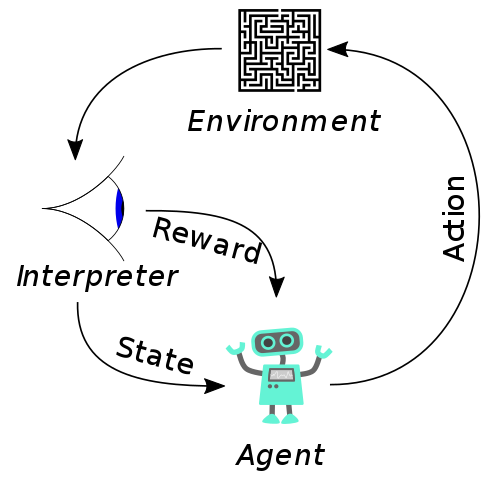
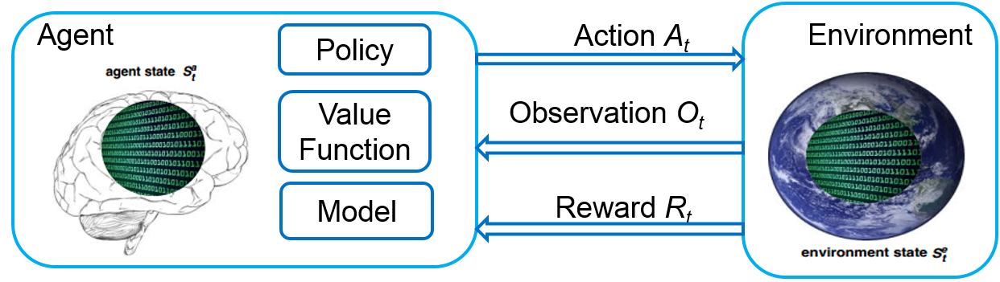
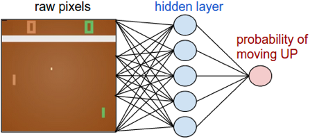
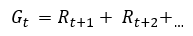
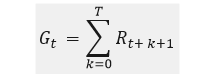
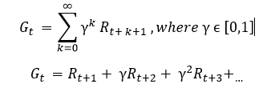
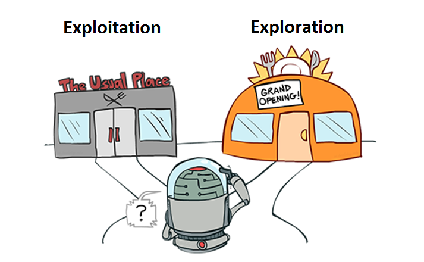
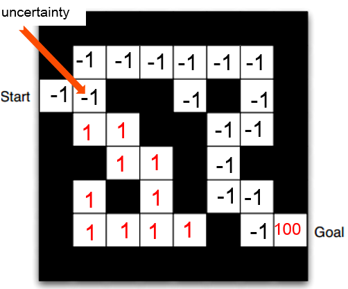

# 100% win rate?! A gentle introduction to (Deep) Reinforcement Learning

Wadim Sokołowski

<wlasek1412@gmail.com>

Pycon PL 2019

### Abstract

Machine Learning is so pervasive today that people use it dozens of times every day without even knowing it. Many researchers think that this is the best way to make progress towards human-level AI.

With this article I’m aiming to make the readers familiar with probably the least known, but in my opinion the most exciting area of Machine Learning - the Reinforcement Learning. I’m going to cover the basic concepts and ideas of Reinforcement Learning, explain how it can be used together with Deep Learning and discuss possible applications of such technique in the real life.

### Introduction

Recent boom in Machine Learning proved that artificial intelligence can have its applications in almost every area of today’s human life – education, health, finances, autonomous driving and many others.

While neural networks are responsible for latest breakthroughs in various areas like computer vision, machine translation and speech recognition, they can also be combined with Reinforcement Learning algorithms to create outstanding solutions. Examples may include DeepMind’s AlphaStar system beating the world’s best players at the StarCraft II game or Deep Q Network, an algorithm capable of competing with human experts in playing numerous Atari video games.

### Reinforcement Learning

Reinforcement Learning is a Machine Learning method having its roots in the early 1980's. It’s an approach where an agent learns how to behave in an environment by performing actions and seeing the results. Trial and error search and delayed reward are the most relevant characteristics of Reinforcement Learning. This method allows machines and software agents to automatically determine the ideal behavior within a specific context in order to maximize its performance. Simple feedback (usually called reward or reinforcement signal) is required for the agent to learn which action is best for the current state.

Learning from interaction with the environment comes from human’s natural life experiences – a robot will learn how to walk in the same way as the little child learns to take it first steps.

The basic idea behind Reinforcement Learning is visualized on below figure:

### Key components

Except for the agent and the environment, there are few other key sub-elements of Reinforcement Learning system:

 - Policy
 - Reward/reinforcement signal
 - Value function
 - Model

A **policy** defines the learning agent's way of behaving at a given time. In other words, a policy is a mapping from perceived states of the environment to actions to be taken when in those states. In easiest cases, the policy may be a simple function or lookup table, whereas in the more complicated ones it may involve extensive computation such as a search process. The policy is the core of a Reinforcement Learning agent in the sense that it alone is sufficient to determine agent’s behavior.

A **reward/reinforcement signal** defines the goal in a Reinforcement Learning problem. On each time step, the environment sends to the agent a single value called the reward. The agent's objective is to maximize the total reward it receives over the long run. The reward signal thus describes what the good and bad events are for the agent in specific environment. The reward signal is the primary basis for altering the policy - if an action selected by the policy is followed by low reward, then the policy may be changed to select some other action in that situation in the future.

Whereas the reward signal is a short-term indication of what is good in an immediate sense, a **value function** specifies what is good in the long run. In general, the value of a state is the total amount of reward an agent can expect to accumulate over the future, starting from that state. For example, a state might always yield a low immediate reward but still have a high value because it is regularly followed by other states that yield high rewards. Rewards are basically given directly by the environment, but values must be estimated and re-estimated from the sequences of observations an agent makes over its entire lifetime. In fact, the most important component of almost all Reinforcement Learning algorithms is a method for efficient values estimation. This is considered to be the hardest part of developing Reinforcement Learning solutions - researchers are struggling with finding most optimal solution for many decades.

The last element of Reinforcement Learning systems to mention is a **model** of the environment. This is a component allowing to make inferences about how the environment will behave. For example, given a state and action, the model might predict the resultant next state and next reward. Models are used for planning, which can be meant as a way of performing an action by considering possible future situations before they are actually experienced. Methods for solving Reinforcement Learning problems that use models and planning are called model-based methods. Opposed to them, researchers have distinguished simpler model-free methods that are explicitly trial-and-error approaches.

Above description of how in general the Reinforcement Learning methods work can be summarized with below sentence:

**At each step t, agent executes action At, receives reward Rt,  makes observation Ot, and infers state St.**  

### Combining Reinforcement Learning with Deep Learning

In Supervised Learning, Deep Learning is used to prevent hand-engineering of features for unstructured data such as images or text. In Reinforcement Learning, Deep Learning is used largely for the same reason. With neural networks, Reinforcement Learning problems can be tackled without need for much domain knowledge. To exemplify this, a well-known Atari 2600 Pong game can be considered.

#### Playing Pong with deep Reinforcement Learning

In traditional learning, there is a need to explicitly extract features from the game positions to gain meaningful information. Using neural networks allows feeding the raw game pixels into the algorithm and letting it create high-level non-linear representations of the data.

For doing this, a one can construct a policy network that is trained end-to-end, meaning that the model takes game states as an input and outputs a probability distribution over possible actions that the agent takes.

In case of playing Pong game, the action is either going UP or DOWN. An example setup for solving such task is presented on below figure:

At first glance above model might look like typical Supervised Learning setup, for example for image classification task, but the key difference here is that there aren’t any labels for game states given and thus the network cannot be trained in the same fashion.

##### Training process

The training process of an agent playing Pong game can be modeled as a loop of given steps:

 - Agent receives state S0 from the Environment (in this case it’s the first frame of the game (state) from Atari 2600 Pong (environment))
 - Based on that state S0, agent takes an action A0 (moves UP or DOWN)
 - Environment transitions to a new state S1 (new frame)
 - Environment gives reward R1 to the  agent (in case of Pong, the reward function can be designed as “+1   
   reward if the ball went past the opponent, a -1 reward if the ball   was missed, 0 otherwise”)

The above loop outputs a sequence of state, action and reward. The goal of the agent is to maximize the expected cumulative reward.

##### Reward discounting

The cumulative reward at each time step t can be written as:

Which is equivalent to:

However, in reality, rewards cannot be just added like that. The rewards that come sooner (in the beginning of the game) are more probable to happen, since they are more predictable than the long term future reward. Nevertheless, closer to the end of the episode, agent’s actions probably much harder affect the final result as they determine whether or not the paddle reaches the ball and how exactly it hits the ball. If an agent moved UP at the first frame of the episode, it probably had very little impact on whether or not he won the game.

To tackle the problem described above, the Pong agent ought to learn in a way that actions taken towards the end of an episode more heavily influence learning than actions taken at the beginning. This process is called **reward discounting**.

In order to discount the rewards, a one should define a discount rate _γ_ called gamma. It must be a real number between 0 and 1.

 - The larger the gamma, the smaller the discount. This means the learning agent cares more about the long term reward. A discount factor of 1 would make future rewards worth just as much as immediate rewards.
 - On the other hand, the smaller the gamma, the bigger the discount. This means the agent cares more about the short term reward.

The discounted cumulative expected rewards can be calculated as:

If _γ_ is 0.8, and there’s a reward of 10 points after 3 time steps, the present value of that reward will be equal 0.8³ x 10.

##### Exploration vs exploitation dilemma

The exploration-exploitation trade-off is a fundamental dilemma whenever a human learns about the world by trying things out. The dilemma is between choosing what he knows and getting something close to what he expects (‘exploitation’), and choosing something he isn’t sure about and possibly learning more (‘exploration’). The same dilemma can be applied to Reinforcement Learning area. In case of exploitation, the agent maximizes rewards through behavior that is known to be successful. As opposed to this approach, exploration allows agent to experiment with novel strategies that may improve rewards returned in the long run.

The first question one may ask is: why is exploration needed at all? The problem can be framed as one of obtaining representative training data for various Machine Learning setups (e.g., proper set of train and validation images used with deep convolutional neural network designed for image recognition). In order for an agent to learn how to deal optimally with all possible states in an environment, it must be exposed to as many of those states as possible. However, unlike in traditional Supervised Learning settings, the agent in a Reinforcement Learning only has access to the environment through its own actions.

When working with Reinforcement Learning algorithms, it's crucial to both explore and exploit the environment on which the agent is operating.

### Some code
With the below piece of Python code (and some additional modules like [keras-rl](https://github.com/keras-rl/keras-rl)) the agent can learn to solve CartPole task. The goal is to prevent the pendulum starting upright from falling over. For more details about the task, please refer to [official documentation of CartPole-v0](https://github.com/openai/gym/wiki/CartPole-v0) in official OpenAI Gym toolkit's repository.

    import numpy as np
    import gym
    
    from keras.models import Sequential
    from keras.layers import Dense, Activation, Flatten
    from keras.optimizers import Adam
    
    from Reinforcement Learning.agents.dqn import DQNAgent
    from Reinforcement Learning.policy import EpsGreedyQPolicy
    from Reinforcement Learning.memory import SequentialMemory
    
    # Define the environment (task)
    ENV_NAME = 'CartPole-v0'
    
    # Get the environment and extract the number of actions available in the Cartpole problem
    env = gym.make(ENV_NAME)
    np.random.seed(123)
    env.seed(123)
    nb_actions = env.action_space.n
    
    # Build neural network model
    
    model = Sequential()
    model.add(Flatten(input_shape=(1,) + env.observation_space.shape))
    model.add(Dense(24, activation='relu'))
    model.add(Dense(24, activation='relu'))
    model.add(Dense(nb_actions, activation='linear'))
    
    # Use random exploration strategy to enlarge the space explored
    policy = EpsGreedyQPolicy()
    
    # Create the buffer for storing the result of actions we performed and the rewards we get for each action
    memory = SequentialMemory(limit=50000, window_length=1)
    
    # Create Reinforcement Learning (in this case - Deep Q-Learning) agent
    dqn = DQNAgent(model=model, nb_actions=nb_actions, memory=memory, policy=policy, 
                   target_model_update=1e-2, nb_steps_warmup=100)
    dqn.compile(Adam(lr=1e-3), metrics=['mae'])
    
    # Run the training loop
    dqn.fit(env, nb_steps=1000, visualize=True, verbose=2)
    
    # Test the reinforcement learning model
    dqn.test(env, nb_episodes=20, visualize=True)

### Reinforcement Learning applications

Nowadays, Reinforcement Learning has a wide range of applications. Numerous solutions are being used in everyday life and many will be continuously introduced in upcoming years. Some major domains where Reinforcement Learning can be practically used are as follows:

**Robotics and industrial automation**

Applications of Reinforcement Learning in high-dimensional control problems, like robotics, have been the subject of research for many years and companies are beginning to use Reinforcement Learning to build products for industrial robotics. A common example is the use of AI for tuning machines and equipment where expert human operators are currently being used.

Robot trained with deep Reinforcement Learning approach can learn to pick a device from one box and put it in a container. Whether it succeeds or fails, it memorizes the object, gains knowledge and train’s itself to do this job with great speed and precision. Many warehousing facilities used by eCommerce sites and other supermarkets are using these intelligent robots for sorting millions of products every day and helping to deliver the right products to the right people.

**Education**

Online platforms are beginning to experiment with using Machine Learning to create personalized experiences. Researchers are investigating the use of Reinforcement Learning and other Machine Learning methods in tutoring systems and personalized learning. The use of Reinforcement Learning can lead to training systems that provide custom instruction and materials tuned to the needs of individual students.

**Text, speech and dialog systems**

Companies collect a lot of text and good tools that can help unlock unstructured data will cause revolutions in various industries. Deep Reinforcement Learning can be applied for abstractive text summarization - a technique for automatically generating summaries of original text documents.

Reinforcement Learning is also being used to allow dialog systems (i.e., chatbots) to learn from user interactions and thus help them improve over time. Socialbots need to rank possible responses and select the best by exploring the tradeoff between immediate satisfaction versus long-term reward of selecting a certain response.

**Media and advertising**

Reinforcement Learning, thanks to its adaptability to changing environments, can help with cross-channel marketing optimization and real time systems for online display advertising. Based on user’s behavior and preferences, a recommendation system agent can learn to guess user’s “mood” and adjust the advertisement in reasonable steps.

**Health and medicine**

The Reinforcement Learning setup of an agent interacting with an environment receiving feedback based on actions taken shares similarities with the problem of learning treatment policies in the medical sciences. Reinforcement Learning can be used to optimize medication dosing and medical equipment utilization.

**Autonomous driving**

The self-driving car is a hot topic in the automotive industry. Current AI solutions for determining appropriate stopping distance, distance from another vehicle and other data that dramatically decreases the chances of car accidents have proved to be successful.

The driving policy of autonomous car can be decomposed into two components:

 - hard code for  rule based “hard constraints”
 - Reinforcement Learning system that learns how to adapt to scenarios, balance between aggressive/defensive behavior, negotiate with other drivers

The Reinforcement Learning setting can be described as follows:

 - State: sensor input: lanes/cars/pedestrians
 - Action: steering wheel/throttle/brake petal
 - Reward:  drive toward goal without causing accident

Looking at the recent achievements in automotive driving industry, there is no doubt that mixture of Reinforcement Learning with Deep Learning will be the most promising approach to achieve human-level control for car driving.

**Games**

Games are great testbeds for Reinforcement Learning algorithms. Deep Learning can be used in conjunction with existing Reinforcement Learning techniques to play Atari games, beat a world-class player in the game of Go or solve complicated riddles. Deep Learning has been shown to be successful in extracting useful, nonlinear features from high-dimensional media such as images, text, video and audio.

The AlphaGo system created by artificial intelligence company Google DeepMind achieved super-human level in playing Go game, an abstract strategy board game for two players, where there are about 250^150 possible game states. The system uses Reinforcement Learning only, without any human knowledge.

The Reinforcement Learning setting for playing Go can be described as follows:

 - State: game board
 - Action: put stone
 - Reward: win or lose at the end

The exhaustive search is infeasible, as the search space is too big. Breadth of the search is reduced by sampling actions from a policy (possible best moves in current position), and depth of the search is reduced by value function (position evaluation).

Another interesting mention is OpenAI Dota-2 bot designed to play Multiplayer Online Battle Arena (MOBA) video game Dota 2. Usage of Reinforcement Learning techniques allowed the AI to discover physical skills like tackling, ducking, faking, kicking, catching, and diving, which resulted in beating the world’s top professionals at one versus one matches in August 2017.

### References

 -  Sutton, R. S. and Barto, A. G. Reinforcement Learning: An Introduction. MIT Press, Cambridge, MA, 2017.
 - „Playing Atari with Deep Reinforcement Learning”. arXiv:1312.5602 [cs], December 2013. arXiv.org, [http://arxiv.org/abs/1312.5602](http://arxiv.org/abs/1312.5602).
 - OpenAI Gym hompeage, URL: [https://gym.openai.com/](https://gym.openai.com/)
 - DeepMind, AlphaGo homepage, URL: [https://deepmind.com/research/alphago/](https://deepmind.com/research/alphago/)
