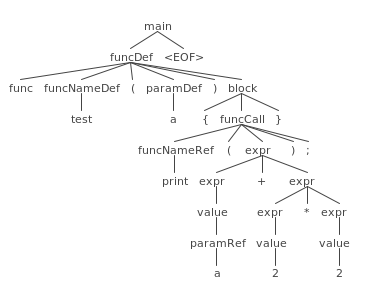

# Kompilator w Pythonie
Krzysztof Jura <<kisioj@gmail.com>>

## Wstęp
Zastanawiałeś się kiedyś jak działają kompilatory? A może myślałeś o tym, aby napisać swój własny kompilator, ale nie wiedziałeś od czego zacząć? W tym artykule przybliżę Ci temat kompilatorów, ich budowy oraz pokażę w jaki sposób można napisać je w Pythonie wykorzystując narzędzie ANTLR4.

## Kompilator
Na początku należy wyjaśnić czym w ogóle jest kompilator. Powołując się na polską Wikipedię, **kompilator** to *program służący do automatycznego tłumaczenia kodu napisanego w jednym języku (języku źródłowym) na równoważny kod w innym języku (języku wynikowym).*[1] 

Językiem wynikowym może być np.
kod asemblera lub kod maszynowy (dla języków **\***: C, C++), kod bajtowy (dla języków: Python, Java, C#), kod pośredni (np. C, LLVM IR) kompilowany do kodu maszynowego (dla języków: wczesny C++, Rust), a nawet kod wysokiego poziomu, będący na podobnym poziomie abstrakcji co kod źródłowy (np. kompilacja TypeScript -> JavaScript). W tym ostatnim przypadku zamiast używać terminów kompilator/kompilacja często używa się słów transpilator/transpilacja.

**\*** w tym jak i innych nawiasach zaczynających się od "***dla języków***" nie chodzi o języki, lecz o ich najpopularniejsze implementacje.

Kompilator wykonuje proces kompilacji składający się z kilku kroków. 
W zależności od kompilatora liczba kroków jak i same kroki mogą się diametralnie różnić. W teorii kompilatorów wyróżnia się kilka podstawowych kroków kompilacji **\***:
1. Analiza leksykalna (tokenizacja)
2. Analiza składniowa/syntaktyczna (parsowanie)
3. Analiza semantyczna
4. Wygenerowanie formy pośredniej
5. Wygenerowanie kodu wynikowego

**\*** Liczba kroków kompilacji, jak i sam ich podział może różnić się w zależności od źródła. W niektórych kompilatorach przed fazą analizy leksykalnej można spotkać krok "*przetwarzania wstępnego*" (ang. preprocessing), a fazy optymalizacji mogą występować nawet kilkukrotnie, między różnymi krokami. Krok generowania formy pośredniej jest w zasadzie możliwy do ominięcia - można razu wygenerować kod wynikowy. W przypadku kompilatorów generujących kod bajtowy czasami uznaje się, że kod wynikowy jest tożsamy z formą pośrednią, a więc kroki 4 i 5 są jednym i tym samym krokiem.

W dalszej części artykułu zrobimy kompilator prostego, wymyślonego języka. Nasz język nazwiemy **Conpy** (anagram słowa PyCon). Język będzie naprawdę minimalistyczny i wspierający tylko konstrukcje językowe występujące w tym przykładzie:

**test.conpy**

    func test(a) {
        if (a) {
            print(a);
        } else {
            print(2 + 2 * 2);
        }
    }
    test(5);

Jak widać, funkcje definiowane po słowie *func*, będą mogły mieć pojedynczy parametr (lub brak parametrów). Bloki kodu będą wyznaczane za pomocą nawiasów klamrowych. Oprócz tego w naszym języku istnieć będą instrukcje warunkowe `if` wraz z opcjonalnymi blokami `else`. Istnieć będzie też funkcja `print` wypisująca na ekran wyrażenie podane w argumencie. Wyrażenia będą składać się z pojedynczej wartości (literału całkowitoliczbowego lub parametru) lub z operacji matematycznych ( dodawanie / mnożenie). Dodatkowo, po każdym wywołaniu funkcji będziemy musieli stawiać średnik. 

## Zaczynamy!
Teoretycznie moglibyśmy kompilator naszego języka napisać w czystym Pythonie bez korzystania z żadnych bibliotek zewnętrznych, ale nie chodzi nam o to by na nowo wynaleźć koło, tylko o to, aby zrobić kompilator szybko, sprawnie i przyjemnie. Do tego celu wykorzystamy narzędzie **ANTLR4**, dzięki któremu będziemy mogli wygenerować kod Pythonowy obsługujący 2 pierwsze kroki kompilacji (analizę leksykalną i składniową) i udostępniający mechanizmy dzięki którym kolejne kroki kompilacji będą dużo łatwiejsze do zrealizowania. Minusem (bądź plusem w zależności od punktu widzenia) jest to, że będziemy musieli mieć zainstalowaną Javę, gdyż ANTLR4 jest właśnie w niej napisany. ANTLR4 instalujemy według instrukcji znajdujących się na początku dokumentacji, do której link znajdziemy na oficjalnej stronie projektu: [antlr.org](https://www.antlr.org). Po instalacji, gdy już będziemy mieli dostępną komendę **antlr4**, musimy jeszcze zainstalować Pythonowy pakiet **antlr4-python3-runtime** . Jeżeli już wszystko zainstalowałeś to możemy przejść do omówienia i implementacji kroków kompilacji.

## Analiza leksykalna
Jest to etap wykonywany przez część kompilatora zwaną *lekserem* lub *analizatorem leksykalnym*. Lekser dostaje na wejściu kod źródłowy i generuje z niego strumień *tokenów*. Tokeny są obiektami wygenerowanymi z fragmentów kodu źródłowego, posiadają one unikalne ID oraz informacje o tym z jakiego fragmentu kodu zostały wygenerowane i w którym miejscu w kodzie źródłowym ów fragment wystąpił. Przejdźmy teraz do przykładu działania leksera; chcielibyśmy, aby nasz kompilator z kodu:
    
    func test(a) {
        print(a + 2 * 2);
    }

wygenerował następujący strumień tokenów (tokeny dla czytelności zostały wypisane po przecinkach oraz w liniach odpowiadającym liniom kodu źródłowego, z których zostały one wygenerowane):
 
    FUNC, NAME, OPEN_PAREN, NAME, CLOSE_PAREN, OPEN_BRACKET
    NAME, OPEN_PAREN, NAME, PLUS, INT, STAR, INT, CLOSE_PAREN, SEMICOLON
    CLOSE_BRACKET

Wynikowy strumień tokenów można następnie przekazać do analizy składniowej, w której już nie będzie potrzeby zaglądać do kodu źródłowego ponieważ wszystkie potrzebne informacje zostały już z niego wyciągnięte i zapisane w przystępniejszej formie, czyli w strumieniu tokenów. Zanim przejdziemy dalej, warto jeszcze dodać, że z białych znaków oraz znaków nowej linii nie chcemy generować tokenów, gdyż znaki te nie mają żadnego znaczenia w naszym wymyślonym języku, a powyższy kod źródłowy równie dobrze można by rozbić na 10 linii lub zapisać w 1 linii, a wynik kompilacji (oraz wygenerowany strumień tokenów) nie powinien ulec zmianie.

## Analiza składniowa / syntaktyczna
Jest to etap wykonywany przez część kompilatora zwaną *parserem* lub *analizatorem składniowym*. Parser, według ściśle określonych reguł, z otrzymanego strumienia tokenów generuje drzewo wyprowadzenia (ang. Parse Tree/Concrete Syntax Tree). Drzewo to odzwierciedla strukturę naszego kodu; liśćmi w tym drzewie są tokeny dostarczone przez Lekser, a gałęziami zasady składniowe, o których jeszcze sobie powiemy. W tym etapie wykrywane są błędy składniowe (ang. syntax errors). Przejdźmy teraz do przykładu działania parsera; chcielibyśmy aby nasz kompilator z wyżej umieszczonego strumienia tokenów wygenerował następujące drzewo wyprowadzenia:

Na powyższym drzewie wyprowadzenia dobrze widać strukturę naszego programu; widać, które tokeny składają się na definicję funkcji (*funDef*), wywołanie funkcji (*funcCall*) oraz na operacje matematyczne dodawania i mnożenia. Co więcej, z tego drzewa można odczytać, że została zachowana poprawna kolejność wykonywania działań, czyli mnożenie ma w naszym języku pierwszeństwo przed dodawaniem.

Drzewo wyprowadzenia po utworzeniu przekazywane jest do kolejnego kroku kompilacji czyli analizy semantycznej. Podczas analizy semantycznej przechodzimy po drzewie wyciągając z niego wszystkie informacje potrzebne w dalszych krokach kompilacji.

Należy dodać, że wynikiem analizy składniowej bywa także dość często nieco inna struktura danych: *drzewo składniowe* (ang. Abstract Syntax Tree, w skrócie AST). Można powiedzieć, że drzewo składniowe jest uproszczoną wersją drzewa wyprowadzenia. Nie powinny występować w nim zbędne gałęzie i liście. W zasadzie zawiera ono tylko te informacje, które są potrzebne na dalszym etapie kompilacji, a więc pomijane są w nim np. informacje. o średnikach, klamerkach i nawiasach występujących w kodzie źródłowym. Dodatkowo do AST podczas analizy semantycznej mogą być dodawane nowe informacje. Drzewo wyprowadzenia można przekształcić do drzewa składniowego, jednak my nie będziemy tego robić w ramach tego artykułu. 

## Gramatyka języka
Na szczęście dla nas, ANTLR4 pozwala wygenerować kod Leksera i Parsera, czyli części odpowiedzialnych za dwa pierwsze, wymienione wyżej kroki kompilacji. Jednak najpierw musimy stworzyć plik z gramatyką naszego języka, a dopiero z tego pliku ANTLR4 wygeneruje nam gotowy kod Pythonowy. Plik z gramatyką naszego języka w zasadzie będzie zawierał 2 niżej wymienione gramatyki:
 - gramatyka leksykalna (zasady leksykalne czyli definicje tokenów), która jest swego rodzaju słownikiem naszego języka, ponieważ są w niej zapisane wszystkie słowa, których możemy w języku użyć
 
  - gramatyka składniowa (zasady składniowe), która definiuje składnię naszego języka, w niej opisana jest każda dozwolona w naszym języku konstrukcja, oraz np. to czy bloki kodu mają być wyznaczone wcięciami czy klamerkami, czy w naszym języku będą istnieć klasy, metody, funkcje, etc.
  
  Wróćmy do naszego pliku z gramatyką; powinien on nosić nazwę  "*nazwa_naszego_języka.g4*", a pierwsza linia musi wyglądać w następujący sposób: "*grammar nazwa_naszego_języka;*". W kolejnych liniach pliku znajdują się zasady gramatyki w formie:

    nazwa_zasady: opis_zasady;

Zasady, których nazwy zaczynają się wielką literą są definicjami tokenów, zaś pozostałe to zasady składniowe. Trzymając się dobrych praktyk, zasady leksykalne nie powinny mieszać się z zasadami składniowymi; natomiast mogą one znajdować się zarówno nad jak i pod nimi. Jeżeli chodzi o opis zasady to może on się składać z wielu linii i zawierać znane z wyrażeń regularnych konstrukcje takie jak grupowanie *( grupa )*, alternatywa *|*, kwantyfikatory wielkościowe *\**, *+*, *?* etc.  Co istotne, kolejność zasad leksykalnych (w przeciwieństwie do składniowych) ma duże znaczenie, co postaram się poniżej wyjaśnić. Zobacz teraz jak będzie wyglądał plik z gramatyką naszego wymyślonego języka:

**Conpy.g4**

    grammar Conpy;
    
    FUNC: 'func';
    IF: 'if';
    ELSE: 'else';
    INT: [0-9]+;
    NAME: [a-zA-Z_][a-zA-Z_0-9]*;
    WHITESPACE: [ \t]+ -> skip;
    NEWLINE: ('\r' '\n'? | '\n') -> skip;
    
    main: (funcDef | funcCall)* EOF;
    funcDef: FUNC funcNameDef '(' paramDef? ')' block;
    block: '{' (ifStmt | funcCall)* '}';
    ifStmt: IF '(' expr ')' block (ELSE block)?;
    funcCall: funcNameRef '(' expr? ')' ';';
    expr: expr '*' expr | expr '+' expr | value;
    value: paramRef | INT;
    paramDef: NAME;
    paramRef: NAME;
    funcNameDef: NAME;
    funcNameRef: NAME;

Na początku pliku znajdują się zasady leksykalne, a następnie zasady składniowe. Zaczniemy od omówienia zasad leksykalnych; każda z tych zasad w swoim opisie zawiera informacje o tym z jakiego fragmentu kodu źródłowego generuje token. Widzimy więc, że jeżeli w kodzie wystąpi słowo *func* to zostanie wygenerowany token `FUNC`, a jeżeli wystąpi np. słowo *PyConPL2019* to zostanie wygenerowany token `NAME`. Dodatkowo dzięki tekstowi `-> skip`, dopisanemu na końcach dwóch ostatnich definicji tokenów (`WHITESPACE`, `NEWLINE`), tokeny te nie zostaną dołączone do wynikowego strumienia tokenów. Jest to zachowanie pożądane, gdyż jak już wcześniej wspominałem, białe znaki oraz znaki nowej linii nie powinny mieć żadnego wpływu (w naszym języku) na działanie programu. Zastanówmy się teraz, jak będzie wyglądał strumień tokenów wygenerowany z poniższego kodu:

    func functest

Teoretyzując, w tym przypadku tokeny mogłyby się wygenerować na 2 różne sposoby: `FUNC`, `FUNC`, `NAME`(ze słowa *test*) albo `FUNC`, `NAME` (ze słowa *functest*). Zgadnij, które tokeny zostaną wygenerowane? Zostanie wygenerowany drugi strumień tokenów, czyli `FUNC`, `NAME`. Dlaczego? Podczas decyzji leksera o tym, który token utworzy, decydujące są 2 czynniki, poza oczywiście dopasowaniem fragmentu kodu do opisu zasady. Po pierwsze, priorytet mają zasady, których opis dopasowuje dłuższy fragment kodu źródłowego, a nie da się ukryć, że token `NAME` powstałby ze słowa dłuższego (*testfunc* - 8 znaków) od tokenu `FUNC` (*func* - 4 znaki). W przypadku gdy dopasowania do różnych zasad są równej długości, priorytet ma zasada, która znajduje się wyżej, a więc ze słowa *func* zostanie wygenerowany token `FUNC`, natomiast gdyby definicję tokena `FUNC` przenieść na sam dół pliku to nigdy nie zostałby on wygenerowany bo każde wystąpienie słowa *func* generowałoby token `NAME`.

Można jeszcze zauważyć, że liczba zasad leksykalnych wydaje się zbyt mała. W przykładzie działania leksera umieszczonym w sekcji *Analiza leksykalna* widzimy, że zostały wygenerowane jeszcze następujące tokeny, których definicji nie ma w naszej gramatyce: 
`OPEN_PAREN`, `CLOSE_PAREN`, `OPEN_BRACKET`, `CLOSE_BRACKET`, `PLUS`, `STAR`, `SEMICOLON`. Okazuje się, że te tokeny zostaną wygenerowane, mimo, że nie są jawnie zdefiniowane. Dlaczego tak się stanie powiemy sobie niżej, w trakcie wyjaśniania zasad gramatyki składniowej.

Zasady gramatyki składniowej zaczynają się małą literą, a w ich opisie możemy odwoływać się do zasad leksykalnych i składniowych oraz stosować konstrukcje znane z wyrażeń regularnych. Do zasad leksykalnych / tokenów można odwoływać się na dwa sposoby: przez nazwę albo przez opis. Odwoływanie się przez nazwę to po prostu wszelkie wystąpienia słów typu `EOF` (ang. end of file), `FUNC`, `IF`, `ELSE`, etc., natomiast odwoływanie się przez treść to np. wystąpienia: `'*'` `'+'`, `'{'`, `'}'`, `'('`, `')'`, `';'` - w tym przypadku tokeny nie muszą być jawnie zdefiniowane, gdyż zostaną one i tak automatycznie, niejawnie zdefiniowane. Jakie zalety ma takie podejście? Kwestia gustu, można by wszystkie możliwe tokeny zdefiniować jawnie i odwoływać się do nich przez nazwę (np. `OPEN_BRACE` zamiast `'{'`) jednak według mnie gramatyka składniowa jest czytelniejsza gdy do krótkich tokenów (jak np. operatory) odwołujemy się przez treść. 

No dobra, przejdźmy teraz do omówienia zasad leksykalnych naszej gramatyki, zasada po zasadzie.
 - `main` ma reprezentować kod źródłowy pojedynczego pliku, mówi o tym, że w pliku może wystąpić zero lub więcej (kwantyfikator `*`) definicji funkcji `funcDef` oraz wywołań funkcji `funcCall`, a wszystko to zakończone znakiem `EOF` (znak końca pliku). 
 - `funcDef` czyli definicja funkcji, składa się ze słowa kluczowego *func*, nazwy funkcji `funcNameDef`, nawiasu otwierającego, opcjonalnego (kwantyfikator `?`) parametru `paramDef`, nawiasu zamykającego oraz bloku kodu `block`. 
 - `block` reprezentujący blok kodu, składa się z klamerki otwierającej, następnie z zera lub więcej instrukcji `ifStmt` / `funcCall` oraz klamerki zamykającej.
 - `ifStmt` to instrukcja warunkowa if, składa się ze słowa *if*, nawiasu otwierającego, wyrażenia warunkowego `expr`, nawiasu zamykającego, bloku kodu `block`, oraz na końcu może wystąpić opcjonalnie słowo *else* i kolejny blok kodu `block`.
 - `funcCall` czyli wywołanie funkcji, składa się z nazwy funkcji `funcNameRef`, nawiasu otwierającego, argumentu w formie wyrażenia `expr`, nawiasu zamykającego oraz średnika.
 - `expr` czyli wyrażenie, może być iloczynem dwóch wyrażeń `expr '*' expr`, sumą dwóch wyrażeń `expr '+' expr` lub wartością `value`.
 - `value` to nazwa będąca odwołaniem do parametru funkcji `paramRef` lub liczbą całkowitą.
 - `paramDef`, `paramRef`, `funcNameDef`, `funcNameRef` oznaczają kolejno: parametr, odwołanie się do parametru, nazwę funkcji, odwołanie się do nazwy funkcji. Zasady te są nie są wymagane, można by je usunąć, a każdą z nich zastąpić odwołaniem do tokena `NAME`, natomiast mimo wszystko są przydatne, bo dzięki nim łatwiej nam będzie operować na wygenerowanym przez parser drzewie.

## Zaczynamy pisać w Pythonie!
Jak już mamy napisaną gramatykę to teraz wystarczy skorzystać z ANTLR4, aby wygenerować Lexer, Parser oraz dodatkowe klasy ułatwiające nam napisać kod wykonujący kolejne kroki kompilacji.

    antlr4 -Dlanguage=Python3 -visitor Conpy.g4
 
 Wykonujemy komendę `antlr4` wskazując, że językiem wynikowym ma być `Python3`, dodatkowo dodajemy flagę `-visitor` aby wygenerować klasę Visitora, a na koniec podajemy ścieżkę do pliku z gramatyką. Po wykonanej komendzie w katalogu roboczym powinno pojawić się kilka plików, z których istotne są w zasadzie tylko te z rozszerzeniem `.py`:
 
    ConpyLexer.py ConpyParser.py ConpyListener.py ConpyVisitor.py
 
`ConpyLexer.py` zawiera klasę Leksera, `ConpyParser.py` klasę Parsera, a `ConpyListener.py` i `ConpyVisitor.py` odpowiednio Lisenera i Visitora, czyli klasy, które możemy wykorzystać do łatwiejszego wyciągania danych z drzewa wyprowadzenia dostarczonego przez Parser. Klasy te reprezentują w zasadzie dwa różne podejścia korzystania z drzewa wyprowadzenia: Listener jak sama nazwa wskazuje pozwala nasłuchiwać, gdy domyślne mechanizmy ANTLR4 przechodzą po drzewie (za pomocą algorytmu BFS - przeszukiwania wszerz). Visitor zaś to klasa, za pomocą której sami możemy zdecydować w jaki sposób będziemy po drzewie chodzić. Klasa ta, dla każdej zasady gramatyki składniowej posiada automatycznie wygenerowaną metodę `visitNazwaZasady` (ból jest taki, że kod wygenerowany przez ANTLR4 stosuje konwencje nazewnictwa zaczerpnięte z Javy), która jest wołana podczas przechodzenia drzewa, w momencie wejścia do danej gałęzi. Metoda ta dostaje w argumencie *kontekst* w którym zawarte są wszelkie potrzebne informacje o danym węźle.  Początek wygenerowanej klasy `ConpyVisitor` prezentuje się następująco:

    class ConpyVisitor(ParseTreeVisitor):
        def visitMain(self, ctx: ConpyParser.MainContext):
            return self.visitChildren(ctx)
    
        def visitFuncDef(self, ctx: ConpyParser.FuncDefContext):
            return self.visitChildren(ctx)
    
        def visitBlock(self, ctx: ConpyParser.BlockContext):
            return self.visitChildren(ctx)
        ...

Domyślnie, każda z wygenerowanych dla zasad składniowych metod (`visitNazwaZasady`) przechodzi dalej po wszystkich swoich dzieci za pomocą metody `visitChildren` (która z kolei dla każdego dziecka wywołuje `visitNazwaZasady`), natomiast nic nie stoi na przeszkodzie, żeby zamiast tej metody *visit* wywołać jakąś inną. Generalnie, chcąc skorzystać z Visitora nie powinno się edytować klasy `ConpyVisitor`, a raczej stworzyć sobie własnego Visitora, który będzie po niej dziedziczył i nadpisywał metody, których potrzebujemy - i tak też zrobimy w dalszej części artykułu. Najpierw jednak zaczniemy od stworzenia szkieletu naszego programu do którego później będziemy dodawać kolejne fragmenty kodu:

    import subprocess
    import sys
    import antlr4
    from ConpyLexer import ConpyLexer
    from ConpyParser import ConpyParser
    from ConpyVisitor import ConpyVisitor as ConpyBaseVisitor
    
    FuncDefContext = ConpyParser.FuncDefContext
    FuncCallContext = ConpyParser.FuncCallContext
    
    class SyntaxErrorListener(antlr4.DiagnosticErrorListener):
        def __init__(self, *args, **kwargs):
            super().__init__(*args, **kwargs)
            self.errors_count = 0
    
        def syntaxError(self, *args, **kwargs):
            self.errors_count += 1
    
    def main():
        _, input_filename, output_filename = sys.argv
    
        input_stream = antlr4.FileStream(input_filename)
        lexer = ConpyLexer(input_stream)
        token_stream = antlr4.CommonTokenStream(lexer)
        parser = ConpyParser(token_stream)
    
        listener = SyntaxErrorListener()
        parser.addErrorListener(listener)
        parse_tree = parser.main()
        if listener.errors_count:
            msg = f"{listener.errors_count} syntax error generated"
            print(msg, file=sys.stderr)
            return
    
    if __name__ == '__main__':
        main()

Na początku importujemy wszystkie wymagane w tej i późniejszej chwili pakiety i moduły. Następnie tworzymy dwa krótsze aliasy długich nazw ze względu na to, że linie w których by one wystąpiły mogłyby przekroczyć dopuszczalną szerokość (mniej niż 70 znaków na linie) tego artykułu. Klasa `SyntaxErrorListener` to klasa dzięki której będziemy mogli zliczyć błędy składniowe znalezione przez parser, a następnie zakończyć program w przypadku ich wystąpienia. Przejdźmy teraz do funkcji `main` czyli głównej funkcji naszego programu. Na początku zakładam, że do programu są dostarczone dwie nazwy: pliku wejściowego z kodem w języku *Conpy* oraz pliku wyjściowego z kodem wynikowym. Na początku tworzymy Lekser do którego na wejściu przekazujemy zawartość pliku wejściowego. Następnie tworzymy strumień tokenów, który przekazujemy na wejściu do parsera. Następnie tworzymy nasz `SyntaxErrorListener` i podpinamy do parsera. Parser proces analizy składniowej / parsowania rozpoczyna dopiero w momencie wywołania metody `main` (`main` to po prostu nazwa zasady z gramatyki składniowej, równie dobrze moglibyśmy wywołać metodę `funcDef`), a wynikiem jest `parse_tree` czyli drzewo wyprowadzenia. W trakcie parsowania, na standardowy strumień błędów (stderr) zostają automatycznie wypisane błędy składniowe. Na koniec sprawdzamy czy wystąpiły jakieś błędy składniowe, a jeżeli tak to wypisujemy ile ich było i kończymy program. Kolejny kod do naszego programu będziemy dodawać w zasadzie w dwóch miejscach: nad funkcją `main` oraz na końcu funkcji `main`, ale to już w kolejnym rozdziale...

## Analiza semantyczna
Jest to etap wykonywany przez część kompilatora zwaną *analizatorem semantycznym*. Głównym zadaniem tego etapu jest znajdowanie błędów semantycznych, inaczej znaczeniowych. Są to takie błędy, o których nie możemy stwierdzić, czy są błędami czy nie (bo składnia kodu jest poprawna) bez znajomości szerszego kontekstu. Przykłady błędów semantycznych:
 - przypisanie wartości do niezdefiniowanej zmiennej
 - dwukrotne zadeklarowanie tej samej nazwy w obrębie jednego bloku
 - niezgodność typów obiektów biorących udział w operacji matematycznej (np. dodawanie inta do stringa)
 - odwoływanie się do nieistniejącej zmiennej / atrybutu
 - odwoływanie się do indeksu spoza tablicy
 
 Takie błędy są zwykle wyłapywane przez kompilator właśnie podczas analizy semantycznej. Python (CPython) jest tutaj swego rodzaju wyjątkiem, gdyż ze względu na swoją dynamiczną naturę, bardzo trudne bądź też niemożliwe byłoby wykrywanie tego typu błędów podczas kompilacji do kodu bajtowego (py -> pyc). W przypadku Pythona można jednak korzystać z adnotacji typów oraz narzędzi do statycznej analizy kodu takich jak *mypy*, dzięki czemu część błędów uda się wyłapać przed uruchomieniem programu. 
 
 Należy dodać, że podczas analizy semantycznej dane wyciągane z drzewa często zapisywane są w różnych bardziej przyjemnych formach, z których łatwiej można później wygenerować formę pośrednią lub kod wynikowy.
 
 Co więcej, Analiza semantyczna również może (ale nie musi) się składać z wielu kroków, przykładowe kroki takiej analizy to np. generowanie tablicy symboli, rozwiązywanie zależności (dziedziczenie, złożone typy zmiennych / atrybutów / funkcji), ewaluacja stałych, sprawdzanie zgodności typów, etc. W przypadku naszego kompilatora, ze względu na ograniczoną ilość miejsca przeznaczoną na ten artykuł, zdecydowałem, że będzie to forma bardzo okrojona oraz skondensowana. Nasz analizator składniowy będzie zaimplementowany w postaci Visitora oraz będzie potrafił znaleźć kilka podstawowych błędów semantycznych takich jak: liczba argumentów nie zgadzająca się z liczbą parametrów, podwójna definicja funkcji o takiej samej nazwie czy odwoływanie się do niezdefiniowanej wartości. Kod naszego analizatora składniowego umieszczam poniżej:
 
     class SemanticAnalysisVisitor(ConpyBaseVisitor):
        def __init__(self):
            self.symbols_table = {"print": None}
            self.func_ctx = None
            self.errors_count = 0
    
        def perror(self, token, message):
            print(f"{token.line}:{token.column}: error: {message}",
                  file=sys.stderr)
            self.errors_count += 1
    
        def visitFuncDef(self, ctx):
            self.func_ctx = ctx
            super().visitFuncDef(ctx)
            self.func_ctx = None
    
        def visitFuncNameDef(self, ctx):
            name, token = ctx.getText(), ctx.start
            if name in self.symbols_table:
                self.perror(token, f"redefined name '{name}'")
            else:
                self.symbols_table[name] = ctx.parentCtx
    
        def visitFuncNameRef(self, ctx):
            name, token = ctx.getText(), ctx.start
            if name not in self.symbols_table:
                self.perror(token, f"'{name}' undeclared")
    
        def visitParamDef(self, ctx):
            name = ctx.getText()
            func_name = self.func_ctx.funcNameDef().getText()
            self.symbols_table[f"{func_name}.{name}"] = ctx
    
        def visitParamRef(self, ctx):
            name, token = ctx.getText(), ctx.start
            if not self.func_ctx:
                self.perror(token, f"'{name}' undeclared")
                return
            func_name = self.func_ctx.funcNameDef().getText()
            param_name = f"{func_name}.{name}"
            if param_name not in self.symbols_table:
                self.perror(token, f"'{name}' undeclared")
    
        def visitFuncCall(self, ctx):
            super().visitFuncCall(ctx)
            name, token = ctx.start.text, ctx.start
            has_arg = bool(ctx.expr())
            if name not in self.symbols_table:
                return
            def_ctx, has_param = self.symbols_table[name], True
            if def_ctx:
                has_param = bool(def_ctx.paramDef().getText())
            if has_param is not has_arg:
                self.perror(token, "arguments count not match")

Spójrzmy najpierw do metody `__init__`, tworzymy tam tablice symboli `self.symbols_table` będącą słownikiem, w którym kluczami będą nazwy zdefiniowanych funkcji i ich parametrów, a wartościami *konteksty* gałęzi, z których one powstały. W idealnym scenariuszu wartościami powinny być obiekty oddzielnej klasy (o nazwie np. `Symbol`). Początkowo naszą tablicę symboli uzupełniłem nazwą `"print"` ponieważ jest to nazwa zarezerwowana i nie chciałbym, aby którykolwiek z symboli się tak nazywał. W zmiennej `self.func_ctx` przechowywana będzie informacja o kontekście funkcji, w której ciele aktualnie się znajdujemy (podczas przechodzenia drzewa). Oprócz tego mamy również licznik błędów, który wykorzystamy w funkcji `main` do zatrzymania programu jeżeli błędy wystąpiły. W metodach zaczynających się od `visit` następuje wykrywanie błędów semantycznych (oprócz `visitFuncDef`, która służy tylko do aktualizacji `self.func_ctx`). Można zauważyć, że z tych metod tylko w metodzie `visitFuncCall` wywołujemy bazową wersję metody, a to dlatego, że tylko w tym przypadku da ona jakikolwiek efekt, ponieważ gałęzie wygenerowane z zasad `funcNameDef`, `funcNameRef`, `paramDef`, `paramRef` nie mają podgałęzi które można odwiedzić.

Warto również zwrócić uwagę na metodę `getText` kontekstu, która zwraca połączony tekst ze wszystkich tokenów wchodzących w skład danej gałęzi drzewa. Atrybut `start` kontekstu to po prostu pierwszy token należący do węzła. Posiada on atrybuty takie jak `line` i `column`, dzięki którym możemy odczytać gdzie w kodzie źródłowym znajduje się fragment, z którego token został wygenerowany. Token ma również atrybut `text` równoważny metodzie `getText` kontekstu.

Aby skorzystać z naszego analizatora składniowego, do funkcji `main`, na samym jej końcu, powinniśmy dodać następujący kod:

        visitor = SemanticAnalysisVisitor()
        visitor.visit(parse_tree)
        if visitor.errors_count:
            msg = f"{visitor.errors_count} semantic error generated"
            print(msg, file=sys.stderr)
            return
            
## Wygenerowanie formy pośredniej
Kolejnym krokiem kompilacji jest generowanie formy pośredniej. Forma pośrednia to pewna reprezentacja naszego programu, zapisana w formie pewnych struktur danych lub częściej, w postaci języka programowania (wtedy mówimy o języku pośrednim). Celem istnienia formy pośredniej jest łatwiejsze wygenerowanie z niej kodu wynikowego. Językami pośrednimi mogą być np. język asemblera (dla prawdziwej maszyny lub wirtualnej), C, LLVM IR i wiele innych. W naszym kompilatorze ze względu na łatwość generowania i niewielki rozmiar implementacji, zdecydowałem, że formą pośrednią będzie kod języka C. Generator kodu, tak jak i analizator semantyczny, będzie zaimplementowany w postaci visitora. Jego kod możecie znaleźć poniżej i dodać nad funkcją `main`.

    MAIN_TEMPLATE = """#include <stdio.h>
    {} int main(void) {{ {} return 0; }}"""
    IF_TEMPLATE = "if ({}) {{ {} }} else {{ {} }}"
    FUNC_TEMPLATE = "void {} ({}) {{ {} }}"
    CALL_TEMPLATE = "{} ({});"
    PRINT_TEMPLATE = 'printf("%d\\n", {});'
    
    class IRGenerationVisitor(ConpyBaseVisitor):
        def visitMain(self, ctx):
            defs, calls = [], []
            for child in ctx.children:
                if isinstance(child, FuncDefContext):
                    defs.append(self.visitFuncDef(child))
                elif isinstance(child, FuncCallContext):
                    calls.append(self.visitFuncCall(child))
            defs_code = '\n'.join(defs)
            calls_code = '\n'.join(calls)
            return MAIN_TEMPLATE.format(defs_code, calls_code)
    
        def visitFuncDef(self, ctx):
            name = ctx.funcNameDef().getText()
            param_code = ""
            if ctx.paramDef():
                param_code = f"int {ctx.paramDef().getText()}"
            block_code = self.visitBlock(ctx.block())
            return FUNC_TEMPLATE.format(name, param_code, block_code)
    
        def visitBlock(self, ctx):
            code = []
            for child in ctx.children:
                if isinstance(child, antlr4.TerminalNode):
                    continue
                code.append(self.visit(child))
            return '\n'.join(code)
    
        def visitIfStmt(self, ctx):
            if_block, *else_block = ctx.block()
            if_code = self.visitBlock(if_block)
            else_code = ""
            if else_block:
                else_code = self.visitBlock(else_block[0])
            return IF_TEMPLATE.format(
                ctx.expr().getText(), if_code, else_code)
    
        def visitFuncCall(self, ctx):
            name_text = ctx.funcNameRef().getText()
            expr_text = ctx.expr().getText()
            if name_text == "print":
                return PRINT_TEMPLATE.format(expr_text)
            return CALL_TEMPLATE.format(name_text, expr_text)

Na samym początku pliku znajdują się tekstowe szablony, przy pomocy których będziemy generowali kod w języku C. W funkcji `visitMain` korzystamy z atrybutu `children` kontekstu, który jest listą kontekstów podrzędnych węzłów drzewa. Jako, że w języku C funkcje mogą być wywoływane tylko wewnątrz innych funkcji, zaś definicje funkcji nie mogą być zagnieżdżone (w naszym języku *Conpy* można mieszać wywołania funkcji z definicjami), to teraz musimy je rozgraniczyć: kod wygenerowany z wywołań funkcji dodajemy do jednej listy: `calls`, a z definicji funkcji do drugiej: `defs`. Na koniec wszystko łączymy, wrzucamy do szablonu `MAIN_TEMPLATE` i zwracamy.

Podobnie robimy w pozostałych metodach. Poruszę teraz jeszcze kwestie warte wyjaśnienia. Otóż runtime ANTLR4 działa tak, że kontekst parsera posiada metody o nazwach gałęzi podrzędnych danego węzła. Np. jako, że w gramatyce, w zasadzie `funcDef` odwołujemy się do zasady `block`, możemy w `visitFuncDef` wołać metodę `funcDef.block` która zwróci nam kontekst podgałęzi `block`. W przypadku jednak gdy w zasadzie składniowej odwołujemy się do innej zasady więcej niż raz, np. w `ifStmt` dwa razy odwołujemy się do zasady `block`, wtedy wywołanie `ctx.block` w metodzie `visitIfStmt` zwróci nam listę kontekstów (o długości 1 lub 2, w zależności czy wystąpił blok *else* czy nie).

Warto jeszcze przyjrzeć się zawartości metody `visitBlock`. Występuje w niej sprawdzanie, czy kontekst dziecko jest węzłem kończącym / liściem (`antlr4.TerminalNode`), jeżeli tak to nie chcemy go odwiedzać, gdyż odwiedzać można tylko gałęzie drzewa. Następnie, dla gałęzi, odwiedzamy je za pomocą metody `self.visit`, która w konsekwencji wykona odpowiednią metodę `visitNazwaZasady` w zależności od przekazanego argumentu.

Koniec końców naszą formę pośrednią chcemy gdzieś zapisać. Aby to zrobić na końcu funkcji `main` dodajemy następujący fragment kodu:

        visitor = IRGenerationVisitor()
        code = visitor.visit(parse_tree)
        filename_c = f"{input_filename}.c"
        with open(filename_c, "w") as file:
            file.write(code)

## Generowanie kodu wynikowego
W zasadzie, jeżeli naszą formą pośrednią jest język C to naszym kodem wynikowym będzie kod maszynowy **\***, którego wygenerowanie sprowadza się do wywołania kompilatora języka C, np. *gcc*, który jest domyślnie dostępny na systemie Linux. Aby to zrobić, na końcu funkcji `main` należy dodać poniższy kod:

        process = subprocess.Popen(["gcc", "-x", "c", filename_c, "-o", output_filename])
        process.wait()

Pełny kod programu można znaleźć pod adresem [github.com/Kisioj/ConpyCompiler](http://github.com/Kisioj/ConpyCompiler)[2]

**\*** Gdyby zaś naszą formą pośrednią był jakiś abstrakcyjny język asemblera, przeznaczony dla maszyny wirtualnej, to kodem wynikowym byłby kod bajtowy.

## Optymalizacja
Na koniec warto napisać o optymalizacji, czyli kroku kompilacji często wymienianym między *wygenerowaniem formy pośredniej*, a *wygenerowaniem kodu wynikowego*. Często jednak optymalizacja odbywa się na różnych etapach kompilacji. No dobra, ale co można zoptymalizować? Przede wszystkim można powycinać z naszego programu nieużywane funkcje i nieosiągalne fragmenty kodu (np. kod po return, albo kod w bloku *if*, w którym warunek jest zawsze fałszywy). Można wyliczyć wartości stałych oraz tych wyrażeń, które dadzą się wyliczyć na etapie kompilacji. Dla funkcji *inline* można wstawić ich treść w miejsce wywołania. Optymalizacje również często dotyczą kosztu operacji: dzielenie przez potęgi dwójki zastępowane jest przez przesunięcia bitowe. Więcej o optymalizacji można przeczytać na Wikipedii w artykule [Optymalizacja kodu wynikowego](https://pl.wikipedia.org/wiki/Optymalizacja_kodu_wynikowego)[3]

W przypadku naszego kompilatora optymalizacja kodu wynikowego jest robiona za nas przez kompilator *gcc*.

## Źródła
1. Wikipedia, "Kompilator", https://pl.wikipedia.org/wiki/Kompilator
2. Krzysztof Jura, "Conpy Compiler", https://github.com/Kisioj/ConpyCompiler
3. Wikipedia, "Optymalizacja kodu wynikowego", https://pl.wikipedia.org/wiki/Optymalizacja_kodu_wynikowego
4. Terrence Par, "The Definitive ANTLR4 Reference"
5. Federico Tomassetti, "The ANTLR Mega Tutorial", https://tomassetti.me/antlr-mega-tutorial/
6. Dzieje Khorinis, "Daedalus Compiler", https://github.com/dzieje-khorinis/DaedalusCompiler